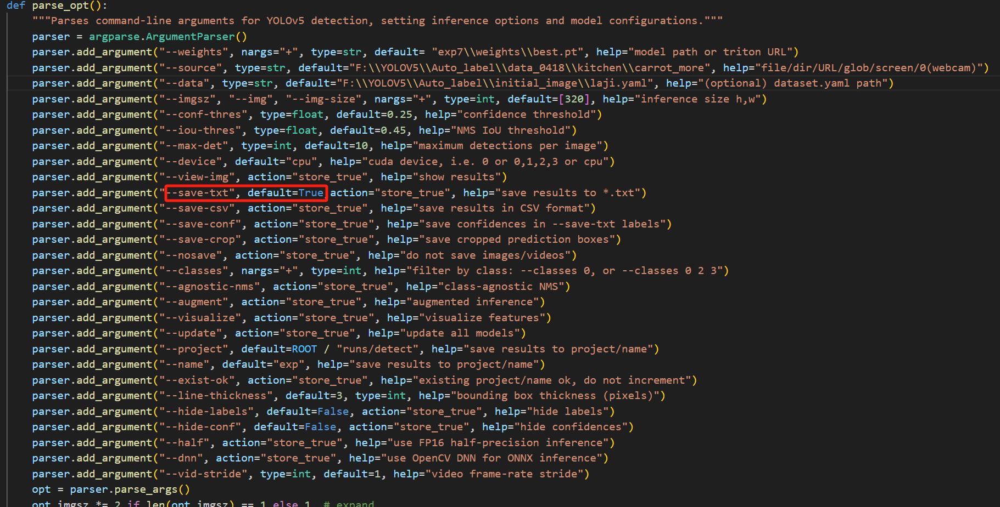
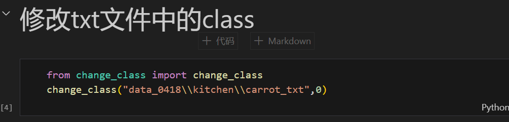
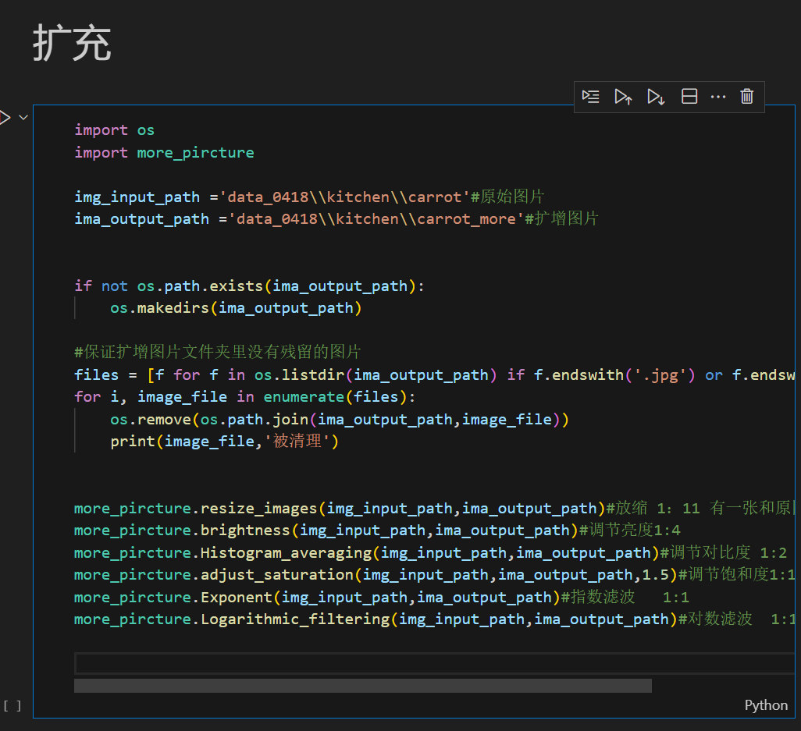
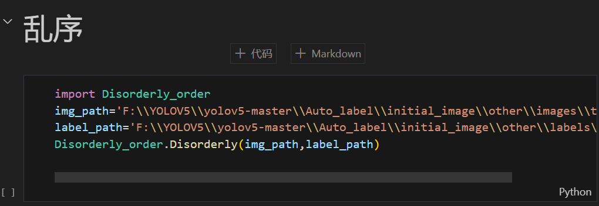
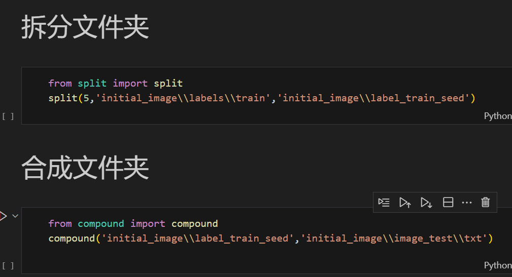

                                                                 HZMI-赫兹矩阵创新实验室
# 自动标注

# 总的来说
# 关于yolov5的自动标注最最核心的一点就是修改detect.py里的'save-txt'

# 关于自动标注的灵活性其实是十分的高的，比如我完可以标完后修改.txt文件里的类然后配合classes.txt文件组成新的类

## 第一个参数是输入地址，第二个参数是想修改到的类

# 常用代码我都打包在auto_label.ipynb里了(函数的参数看看源码一下就懂啦)
[auto_label.ipynb](auto_label.ipynb)

# 一般步骤
## step1 制作预训练集(可以扩增，提高数据集质量)

# step1.1 如果用了数据扩增，相似的图片因为名字相似隔的太近，需要分开

## 第一个参数是图片地址，第二个参数是标签地址

## step2 服务器训练(如果文件太大一次托不上去可以拆分文件夹，再在服务器里面整合文件夹)

## split()第一个参数是想拆分的文件夹数量，第二个参数是拆分的文件夹地址，第三个参数是拆分后输出的地址
## compound()第一个参数是拆分的文件夹地址，第二个参数是合并的文件夹输出地址

## step3 通过训练出的pt文件进行自动标注

# 然后就是一些小小的经验啦，我建议按类分开来自动标注，如果标注错了class还可以在auto_label.ipynb里一键修改。然后在整合所有类，但在整合数据集的时候，因为str(uuid.uuid4())不在一个项目里面有可能名字会重复，所以用change_name.py加标志位然后再整合，再Disorderly_order.py这样就能整合在一起了

