                                                             HZMI-赫兹矩阵创新实验室
# C语言基础教程
## 1 C语言的介绍
### 1.1 C语言是什么
- C语言是一种广泛使用的计算机编程语言，由贝尔实验室的丹尼斯·里奇（Dennis Ritchie）于1972年开发。C语言以其效率、表达能力和程序控制能力而受到广泛赞誉，它直接影响了后来的许多现代编程语言，包括C++、C#、Java和许多其他语言。
- C语言的应用非常广泛，从软件应用程序到硬件驱动程序，再到游戏开发和嵌入式系统编程，C语言几乎无处不在。虽然它是一种比较旧的语言，但由于其性能和灵活性，C语言仍然是学习计算机科学和编程的基石。
### 1.2 C语言的特点介绍，为什么学习C语言？
- 特点：
  - 简洁、紧凑和强大：C语言提供了一系列简洁的关键字和操作符，使得程序员能够编写各种类型的程序。

  - 过程化/结构化语言：C语言支持结构化编程，允许程序以一系列步骤来定义程序的执行流程。

  - 低级的内存访问：C语言提供了通过指针等手段直接访问和操作内存的能力。

  - 系统编程：C语言因其能够进行底层操作而被广泛用于系统编程，如操作系统、嵌入式系统等。

  - 跨平台：C语言编写的程序可以在多种类型的计算机和操作系统上编译和运行，只要有适合该平台的C语言编译器。

  - 标准库：C语言有一个标准库（如stdio.h, stdlib.h 等），提供了一系列实用的函数来进行输入/输出操作、内存分配、数学计算等。

### 1.3 C语言的常见用途
  - 操作系统开发：C语言几乎是所有现代操作系统开发的基石，包括Linux内核、Windows以及各种Unix系统的核心部分。

  - 嵌入式系统和微控制器编程：在微控制器和嵌入式系统领域，C语言因其接近硬件的能力、占用资源少和执行效率高而被广泛使用。

  - 系统软件：除了操作系统，系统软件如编译器、解释器、文件系统、数据库管理系统等也常用C语言编写。

  - 游戏开发：尽管现代游戏开发常使用更高级的语言和引擎，但C语言仍然用于性能关键部分的开发，或是用于开发游戏引擎中的底层系统。

  - 性能敏感的应用：对于要求高性能的应用程序，如图形处理、计算密集型任务（如数值分析、科学计算）或实时系统，C语言仍然是首选。

  - 硬件驱动程序：驱动程序通常需要直接与硬件通信，C语言提供了这种底层访问的能力。

  - 网络（如TCP/IP协议栈）和通信协议的开发：C语言常被用来实现网络通信协议和其他通信协议。

  - 数据库：诸如MySQL和PostgreSQL这样的流行数据库系统有相当一部分是用C语言编写的。

  - 实用工具和应用：许多常见的UNIX/Linux命令行工具和实用程序是用C语言编写的，如grep、awk。

  - 开源项目：有许多知名的开源项目用C语言编写，如Git版本控制系统。

## 2 C语言的语法
### 2.1 C语言的程序结构
>C 程序主要包括以下部分：
    
- 预处理器指令
- 函数
- 变量
- 语句 & 表达式
- 注释
    ```C
    #include <stdio.h>
    
    int main()
    {
    /* 我的第一个 C 程序 */
    printf("Hello, World! \n");
    
    return 0;
    }
    ```
- 输出
->Hello, World! 

解读：
  - 1.程序的第一行 #include <stdio.h> 是预处理器指令，告诉 C 编译器在实际编译之前要包含 stdio.h 文件。
  - 2.下一行 int main() 是主函数，程序从这里开始执行。
  - 3.下一行 /*...*/ 将会被编译器忽略，这里放置程序的注释内容。它们被称为程序的注释。
  - 4.下一行 printf(...) 是 C 中另一个可用的函数，会在屏幕上显示消息 "Hello, World!"。
  - 5.下一行 return 0; 终止 main() 函数，并返回值 0。


### 2.2 基本语法符号
#### 2.2.1 符号说明
##### 2.2.1.1 分号 ;
    - 在 C 程序中，分号是语句结束符。也就是说，每个语句必须以分号结束。它表明一个逻辑实体的结束。


##### 2.2.1.2 注释:
>单行注释

```C
// 单行注释
```

>多行注释

```C
/* 
 多行注释
 多行注释
 多行注释
 */
```

##### 2.2.1.3 标识符:
  - C 标识符是用来标识变量、函数，或任何其他用户自定义项目的名称。一个标识符以字母 A-Z 或 a-z 或下划线 _ 开始，后跟零个或多个字母、下划线和数字（0-9）。

  - C 标识符内不允许出现标点字符，比如 @、$ 和 %。C 是区分大小写的编程语言。因此，在 C 中，Manpower 和 manpower 是两个不同的标识符。下面列出几个有效的标识符： 

    ```C
    mohd       zara    abc   move_name  a_123
    myname50   _temp   j     a23b9      retVal
    ```

##### 2.2.1.4 关键字
  - 下表列出了 C 中的保留字。这些保留字不能作为常量名、变量名或其他标识符名称。

|关键字	|说明|
|------|----|
|auto	|声明自动变量|
|break	|跳出当前循环|
|case	|开关语句分支|
|char	|声明字符型变量或函数返回值类型|
|const	|定义常量，如果一个变量被 const 修饰，那么它的值就不能再被改变|
|continue	|结束当前循环，开始下一轮循环|
|default	|开关语句中的"其它"分支|
|do	|循环语句的循环体|
|double	|声明双精度浮点型变量或函数返回值类型|
|else	|条件语句否定分支（与 if 连用）|
|enum	|声明枚举类型|
|extern	|声明变量或函数是在其它文件或本文件的其他位置定义|
|float	|声明浮点型变量或函数返回值类型|
|for	|一种循环语句|
|goto	|无条件跳转语句|
|if	|条件语句|
|int	|声明整型变量或函数|
|long	|声明长整型变量或函数返回值类型|
|register	|声明寄存器变量|
|return	|子程序返回语句（可以带参数，也可不带参数）|
|short	|声明短整型变量或函数|
|signed	|声明有符号类型变量或函数|
|sizeof	|计算数据类型或变量长度（即所占字节数）|
|static	|声明静态变量|
|struct	|声明结构体类型|
|switch	|用于开关语句|
|typedef	|用以给数据类型取别名|
|unsigned	|声明无符号类型变量或函数|
|union	|声明共用体类型|
|void	|声明函数无返回值或无参数，声明无类型指针|
|volatile	|说明变量在程序执行中可被隐含地改变|
|while	|循环语句的循环条件|
|_Bool | |
|_Complex | |
|_Imaginary | |
|inline | | 
|restrict | |
|_Alignas | |
|_Ali_Atomic| |
|_Atomic | |
|_Generic| |
|_Noreturn | |
|_Static_assert| |
|_Thread_local | |                                    


##### 2.2.1.5 空格
  - 只包含空格的行，被称为空白行，可能带有注释，C 编译器会完全忽略它。

  - 在 C 中，空格用于描述空白符、制表符、换行符和注释。空格分隔语句的各个部分，让编译器能识别语句中的某个元素（比如 int）在哪里结束，下一个元素在哪里开始。
  
### 2.3  数据类型
>在 C 语言中，数据类型指的是用于声明不同类型的变量或函数的一个广泛的系统。变量的类型决定了变量存储占用的空间，以及如何解释存储的位模式。

|序号|	类型与描述|
|----|-----------|
|1	|基本数据类型:它们是算术类型，包括整型（int）、字符型（char）、浮点型（float）和双精度浮点型（double）。|
|2	|枚举类型：它们也是算术类型，被用来定义在程序中只能赋予其一定的离散整数值|的变量。
|3	|void 类型：类型说明符 void 表示没有值的数据类型，通常用于函数返回值。|
|4	|派生类型：包括数组类型、指针类型和结构体类型。|

#### 2.3.1 整数类型
- 下表列出了关于标准整数类型的存储大小和值范围的细节：

|类型	|存储大小	|值范围|
|-------|----------|------|
|char	|1 字节	|-128 到 127 或 0 到 255|
|unsigned char	|1 字节	|0 到 255|
|signed char	|1 字节	|-128 到 127|
|int	|2 或 4 字节	|-32,768 到 32,767 或 -2,147,483,648 到 2,147,483,647|
|unsigned int	|2 或 4 字节	|0 到 65,535 或 0 到 4,294,967,295|
|short	|2 字节	|-32,768 到 32,767|
|unsigned short	|2 字节	|0 到 65,535|
|long	|4 字节	|-2,147,483,648 到 2,147,483,647|
|unsigned long	|4 字节	|0 到 4,294,967,295|

- 为了得到某个类型或某个变量在特定平台上的准确大小，您可以使用 sizeof 运算符。表达式 sizeof(type) 得到对象或类型的存储字节大小。
    ```C
    #include <stdio.h>
    #include <limits.h>
    
    int main()
    {
    printf("int 存储大小 : %lu \n", sizeof(int));
    
    return 0;
    }
    ```

#### 2.3.2 浮点类型
- 下表列出了关于标准浮点类型的存储大小、值范围和精度的细节：

|类型	|存储大小	|值范围	|精度|
|-------|----------|-------|----|
|float	|4 字节	|1.2E-38 到 3.4E+38	|6 位有效位|
|double	|8 字节	|2.3E-308 到 1.7E+308	|15 位有效位|
|long double	|16 字节	|3.4E-4932 到 1.1E+4932	|19 位有效位|

- 头文件 float.h 定义了宏，在程序中可以使用这些值和其他有关实数二进制表示的细节。
```C
#include <stdio.h>
#include <float.h>
 
int main()
{
   printf("float 存储最大字节数 : %lu \n", sizeof(float));
   printf("float 最小值: %E\n", FLT_MIN );
   printf("float 最大值: %E\n", FLT_MAX );
   printf("精度值: %d\n", FLT_DIG );
   
   return 0;
}
```

#### 2.3.3 void 类型
- void 类型指定没有可用的值。它通常用于以下三种情况下：

|序号	|类型与描述|
|1	函数返回为空
C 中有各种函数都不返回值，或者您可以说它们返回空。不返回值的函数的返回类型为空。例如 void exit (int status);|
|2	|函数参数为空
C 中有各种函数不接受任何参数。不带参数的函数可以接受一个 void。例如 int rand(void);|
|3	|指针指向 void
类型为 void * 的指针代表对象的地址，而不是类型。例如，内存分配函数 void *malloc( size_t size ); 返回指向 void 的指针，可以转换为任何数据类型。|

#### 2.3.4 类型转换
- 类型转换是将一个数据类型的值转换为另一种数据类型的值。
  - 隐式类型转换：隐式类型转换是在表达式中自动发生的，无需进行任何明确的指令或函数调用。它通常是将一种较小的类型自动转换为较大的类型，例如，将int类型转换为long类型或float类型转换为double类型。隐式类型转换也可能会导致数据精度丢失或数据截断。

  - 显式类型转换：显式类型转换需要使用强制类型转换运算符（type casting operator），它可以将一个数据类型的值强制转换为另一种数据类型的值。强制类型转换可以使程序员在必要时对数据类型进行更精确的控制，但也可能会导致数据丢失或截断。

>隐式类型转换实例：

```C
int i = 10;
float f = 3.14;
double d = i + f; // 隐式将int类型转换为double类型
```

>显式类型转换实例：

```C
double d = 3.14159;
int i = (int)d; // 显式将double类型转换为int类型
```


#### 2.3.5 枚举类型
- 枚举是 C 语言中的一种基本数据类型，用于定义一组具有离散值的常量，它可以让数据更简洁，更易读。

- 枚举类型通常用于为程序中的一组相关的常量取名字，以便于程序的可读性和维护性。

- 定义一个枚举类型，需要使用 enum 关键字，后面跟着枚举类型的名称，以及用大括号 {} 括起来的一组枚举常量。
  
    ```C
    enum　枚举名　{枚举元素1,枚举元素2,……};
    ```

- 接下来我们举个例子，比如：一星期有 7 天，如果不用枚举，我们需要使用 #define 来为每个整数定义一个别名：

```C
#define MON  1
#define TUE  2
#define WED  3
#define THU  4
#define FRI  5
#define SAT  6
#define SUN  7
```

- 这个看起来代码量就比较多，接下来我们看看使用枚举的方式：
```C
enum DAY
{
      MON=1, TUE, WED, THU, FRI, SAT, SUN
};
```
这样看起来是不是更简洁了。

注意：第一个枚举成员的默认值为整型的 0，后续枚举成员的值在前一个成员上加 1。我们在这个实例中把第一个枚举成员的值定义为 1，第二个就为 2，以此类推。

可以在定义枚举类型时改变枚举元素的值：
```C
enum season {spring, summer=3, autumn, winter};
```
没有指定值的枚举元素，其值为前一元素加 1。也就说 spring 的值为 0，summer 的值为 3，autumn 的值为 4，winter 的值为 5

枚举变量的定义
前面我们只是声明了枚举类型，接下来我们看看如何定义枚举变量。

我们可以通过以下三种方式来定义枚举变量

1、先定义枚举类型，再定义枚举变量
```C
enum DAY
{
      MON=1, TUE, WED, THU, FRI, SAT, SUN
};
enum DAY day;
```
2、定义枚举类型的同时定义枚举变量
```C
enum DAY
{
      MON=1, TUE, WED, THU, FRI, SAT, SUN
} day;
```
3、省略枚举名称，直接定义枚举变量
```C
enum
{
      MON=1, TUE, WED, THU, FRI, SAT, SUN
} day;
```
实例
```C
#include <stdio.h>
 
enum DAY
{
      MON=1, TUE, WED, THU, FRI, SAT, SUN
};
 
int main()
{
    enum DAY day;
    day = WED;
    printf("%d",day);
    return 0;
}
```
>输出结果:
3
- 
    - 在C 语言中，枚举类型是被当做 int 或者 unsigned int 类型来处理的，所以按照 C 语言规范是没有办法遍历枚举类型的。

    - 不过在一些特殊的情况下，枚举类型必须连续是可以实现有条件的遍历。

- 以下实例使用 for 来遍历枚举的元素：

实例
```C
#include <stdio.h>
 
enum DAY
{
      MON=1, TUE, WED, THU, FRI, SAT, SUN
} day;
int main()
{
    // 遍历枚举元素
    for (day = MON; day <= SUN; day++) {
        printf("枚举元素：%d \n", day);
    }
}
```
>以上实例输出结果为：
- 枚举元素：1 
- 枚举元素：2 
- 枚举元素：3 
- 枚举元素：4 
- 枚举元素：5 
- 枚举元素：6 
- 枚举元素：7

- 以下枚举类型不连续，这种枚举无法遍历。
```C
enum
{
    ENUM_0,
    ENUM_10 = 10,
    ENUM_11
};
```

- 枚举在 switch 中的使用：

实例
```C
#include <stdio.h>
#include <stdlib.h>
int main()
{
 
    enum color { red=1, green, blue };
 
    enum  color favorite_color;
 
    /* 用户输入数字来选择颜色 */
    printf("请输入你喜欢的颜色: (1. red, 2. green, 3. blue): ");
    scanf("%u", &favorite_color);
 
    /* 输出结果 */
    switch (favorite_color)
    {
    case red:
        printf("你喜欢的颜色是红色");
        break;
    case green:
        printf("你喜欢的颜色是绿色");
        break;
    case blue:
        printf("你喜欢的颜色是蓝色");
        break;
    default:
        printf("你没有选择你喜欢的颜色");
    }
 
    return 0;
}
```

>输出结果为：
-
    - 请输入你喜欢的颜色: (1. red, 2. green, 3. blue): 1
    - 你喜欢的颜色是红色

- 将整数转换为枚举

- 以下实例将整数转换为枚举：

实例
```C
#include <stdio.h>
#include <stdlib.h>
 
int main()
{
 
    enum day
    {
        saturday,
        sunday,
        monday,
        tuesday,
        wednesday,
        thursday,
        friday
    } workday;
 
    int a = 1;
    enum day weekend;
    weekend = ( enum day ) a;  //类型转换
    //weekend = a; //错误
    printf("weekend:%d",weekend);
    return 0;
}
```

>输出结果为：
weekend:1


#### 2.3.6 数组类型
- C 语言支持数组数据结构，它可以存储一个固定大小的相同类型元素的顺序集合。数组是用来存储一系列数据，但它往往被认为是一系列相同类型的变量。

- 数组的声明并不是声明一个个单独的变量，比如 runoob0、runoob1、...、runoob99，而是声明一个数组变量，比如 runoob，然后使用 runoob[0]、runoob[1]、...、runoob[99] 来代表一个个单独的变量。

所有的数组都是由连续的内存位置组成。最低的地址对应第一个元素，最高的地址对应最后一个元素。

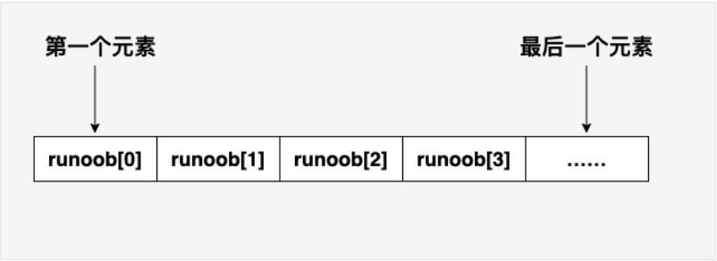

C 中的数组

数组中的特定元素可以通过索引访问，第一个索引值为 0。

C 语言还允许我们使用指针来处理数组，这使得对数组的操作更加灵活和高效。

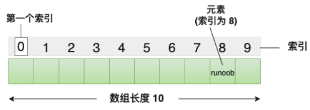


##### 2.3.6.1 声明数组
在 C 中要声明一个数组，需要指定元素的类型和元素的数量，如下所示：
```C
type arrayName [ arraySize ];
```
这叫做一维数组。arraySize 必须是一个大于零的整数常量，type 可以是任意有效的 C 数据类型。例如，要声明一个类型为 double 的包含 10 个元素的数组 balance，声明语句如下：
```C
double balance[10];
```
现在 balance 是一个可用的数组，可以容纳 10 个类型为 double 的数字。

##### 2.3.6.2 初始化数组
在 C 中，您可以逐个初始化数组，也可以使用一个初始化语句，如下所示：
```C
double balance[5] = {1000.0, 2.0, 3.4, 7.0, 50.0};
```
大括号 { } 之间的值的数目不能大于我们在数组声明时在方括号 [ ] 中指定的元素数目。

如果您省略掉了数组的大小，数组的大小则为初始化时元素的个数。因此，如果：
```C
double balance[] = {1000.0, 2.0, 3.4, 7.0, 50.0};
```
您将创建一个数组，它与前一个实例中所创建的数组是完全相同的。下面是一个为数组中某个元素赋值的实例：
```C
balance[4] = 50.0;
```
上述的语句把数组中第五个元素的值赋为 50.0。所有的数组都是以 0 作为它们第一个元素的索引，也被称为基索引，数组的最后一个索引是数组的总大小减去 1。以下是上面所讨论的数组的的图形表示：
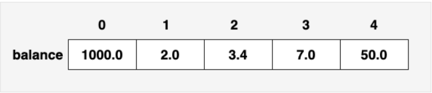


下图是一个长度为 10 的数组，第一个元素的索引值为 0，第九个元素 runoob 的索引值为 8:
数组表示

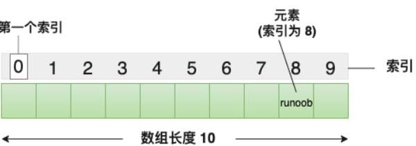

##### 2.3.6.3 访问数组元素

数组元素可以通过数组名称加索引进行访问。元素的索引是放在方括号内，跟在数组名称的后边。例如：

double salary = balance[9];
上面的语句将把数组中第 10 个元素的值赋给 salary 变量。下面的实例使用了上述的三个概念，即，声明数组、数组赋值、访问数组：

实例
```C
#include <stdio.h>
 
int main ()
{
   int n[ 10 ]; /* n 是一个包含 10 个整数的数组 */
   int i,j;
 
   /* 初始化数组元素 */         
   for ( i = 0; i < 10; i++ )
   {
      n[ i ] = i + 100; /* 设置元素 i 为 i + 100 */
   }
   
   /* 输出数组中每个元素的值 */
   for (j = 0; j < 10; j++ )
   {
      printf("Element[%d] = %d\n", j, n[j] );
   }
 
   return 0;
}
```

>当上面的代码被编译和执行时，它会产生下列结果：

- Element[0] = 100
- Element[1] = 101
- Element[2] = 102
- Element[3] = 103
- Element[4] = 104
- Element[5] = 105
- Element[6] = 106
- Element[7] = 107
- Element[8] = 108
- Element[9] = 109

##### 2.3.6.4 获取数组长度
数组长度可以使用 sizeof 运算符来获取数组的长度，例如：
```C
int numbers[] = {1, 2, 3, 4, 5};
int length = sizeof(numbers) / sizeof(numbers[0]);
```
实例
```C
#include <stdio.h>

int main() {
    int array[] = {1, 2, 3, 4, 5};
    int length = sizeof(array) / sizeof(array[0]);

    printf("数组长度为: %d\n", length);

    return 0;
}
```

使用宏定义：

实例
```C
#include <stdio.h>

#define LENGTH(array) (sizeof(array) / sizeof(array[0]))

int main() {
    int array[] = {1, 2, 3, 4, 5};
    int length = LENGTH(array);

    printf("数组长度为: %d\n", length);

    return 0;
}
```
>输出结果为：
数组长度为: 5

##### 2.3.6.5 数组名
在 C 语言中，数组名表示数组的地址，即数组首元素的地址。当我们在声明和定义一个数组时，该数组名就代表着该数组的地址。

例如，在以下代码中：
```C
int myArray[5] = {10, 20, 30, 40, 50};
```
在这里，myArray 是数组名，它表示整数类型的数组，包含 5 个元素。myArray 也代表着数组的地址，即第一个元素的地址。

数组名本身是一个常量指针，意味着它的值是不能被改变的，一旦确定，就不能再指向其他地方。

我们可以使用&运算符来获取数组的地址，如下所示：
```C
int myArray[5] = {10, 20, 30, 40, 50};
int *ptr = &myArray[0]; // 或者直接写作 int *ptr = myArray;
```
在上面的例子中，ptr 指针变量被初始化为 myArray 的地址，即数组的第一个元素的地址。

需要注意的是，虽然数组名表示数组的地址，但在大多数情况下，数组名会自动转换为指向数组首元素的指针。这意味着我们可以直接将数组名用于指针运算，例如在函数传递参数或遍历数组时：

实例
```C
void printArray(int arr[], int size) {
    for (int i = 0; i < size; i++) {
        printf("%d ", arr[i]); // 数组名arr被当作指针使用
    }
}

int main() {
    int myArray[5] = {10, 20, 30, 40, 50};
    printArray(myArray, 5); // 将数组名传递给函数
    return 0;
}
```
在上述代码中，printArray 函数接受一个整数数组和数组大小作为参数，我们将 myArray 数组名传递给函数，函数内部可以像使用指针一样使用 arr 数组名。

##### 2.3.6.6 C 中数组详解
在 C 中，数组是非常重要的，我们需要了解更多有关数组的细节。下面列出了 C 程序员必须清楚的一些与数组相关的重要概念：

|概念	|描述|
|-------|---|
|多维数组	|C 支持多维数组。多维数组最简单的形式是二维数组。|
|传递数组给函数	|您可以通过指定不带索引的数组名称来给函数传递一个指向数组的指针。|
|从函数返回数组	|C 允许从函数返回数组。|
|指向数组的指针	|您可以通过指定不带索引的数组名称来生成一个指向数组中第一个元素的指针。|
|静态数组与动态数组	|静态数组在编译时分配内存，大小固定，而动态数组在运行时手动分配内存，大小可变。|

##### 2.3.6.6.1 多维数组
C 语言支持多维数组。多维数组声明的一般形式如下：
```C
type name[size1][size2]...[sizeN];
```
例如，下面的声明创建了一个三维 5 . 10 . 4 整型数组：
```C
int threedim[5][10][4];
```
>二维数组
- 多维数组最简单的形式是二维数组。一个二维数组，在本质上，是一个一维数组的列表。声明一个 x 行 y 列的二维整型数组，形式如下：
```C
type arrayName [ x ][ y ];
```
- 其中，type 可以是任意有效的 C 数据类型，arrayName 是一个有效的 C 标识符。一个二维数组可以被认为是一个带有 x 行和 y 列的表格。下面是一个二维数组，包含 3 行和 4 列：
```C
int x[3][4];C 中的二维数组
```
因此，数组中的每个元素是使用形式为 a[ i , j ] 的元素名称来标识的，其中 a 是数组名称，i 和 j 是唯一标识 a 中每个元素的下标。

>初始化二维数组
多维数组可以通过在括号内为每行指定值来进行初始化。下面是一个带有 3 行 4 列的数组。
```C
int a[3][4] = {  
 {0, 1, 2, 3} ,   /*  初始化索引号为 0 的行 */
 {4, 5, 6, 7} ,   /*  初始化索引号为 1 的行 */
 {8, 9, 10, 11}   /*  初始化索引号为 2 的行 */
};
```
内部嵌套的括号是可选的，下面的初始化与上面是等同的：
```C
int a[3][4] = {0,1,2,3,4,5,6,7,8,9,10,11};
```
>访问二维数组元素
二维数组中的元素是通过使用下标（即数组的行索引和列索引）来访问的。例如：
```C
int val = a[2][3];
```
上面的语句将获取数组中第 3 行第 4 个元素。您可以通过上面的示意图来进行验证。让我们来看看下面的程序，我们将使用嵌套循环来处理二维数组：

实例
```C
#include <stdio.h>
 
int main ()
{
   /* 一个带有 5 行 2 列的数组 */
   int a[5][2] = { {0,0}, {1,2}, {2,4}, {3,6},{4,8}};
   int i, j;
 
   /* 输出数组中每个元素的值 */
   for ( i = 0; i < 5; i++ )
   {
      for ( j = 0; j < 2; j++ )
      {
         printf("a[%d][%d] = %d\n", i,j, a[i][j] );
      }
   }
   return 0;
}
```
>当上面的代码被编译和执行时，它会产生下列结果：
- a[0][0] = 0
- a[0][1] = 0
- a[1][0] = 1
- a[1][1] = 2
- a[2][0] = 2
- a[2][1] = 4
- a[3][0] = 3
- a[3][1] = 6
- a[4][0] = 4
- a[4][1] = 8

如上所述，您可以创建任意维度的数组，但是一般情况下，我们创建的数组是一维数组和二维数组。

##### 2.3.6.6.2 传递数组给函数
方式 1
形式参数是一个指针（您可以在下一章中学习到有关指针的知识）：
```C
void myFunction(int *param)
{
.
.
.
}
```
方式 2
形式参数是一个已定义大小的数组：
```
void myFunction(int param[10])
{
.
.
.
}
```
方式 3
形式参数是一个未定义大小的数组：
```C
void myFunction(int param[])
{
.
.
.
}
```
实例
现在，让我们来看下面这个函数，它把数组作为参数，同时还传递了另一个参数，根据所传的参数，会返回数组中元素的平均值：
```C
double getAverage(int arr[], int size)
{
  int    i;
  double avg;
  double sum;
 
  for (i = 0; i < size; ++i)
  {
    sum += arr[i];
  }
 
  avg = sum / size;
 
  return avg;
}
```
现在，让我们调用上面的函数，如下所示：

实例
```C
#include <stdio.h>
 
/* 函数声明 */
double getAverage(int arr[], int size);
 
int main ()
{
   /* 带有 5 个元素的整型数组 */
   int balance[5] = {1000, 2, 3, 17, 50};
   double avg;
 
   /* 传递一个指向数组的指针作为参数 */
   avg = getAverage( balance, 5 ) ;
 
   /* 输出返回值 */
   printf( "平均值是： %f ", avg );
    
   return 0;
}
 
double getAverage(int arr[], int size)
{
  int    i;
  double avg;
  double sum=0;
 
  for (i = 0; i < size; ++i)
  {
    sum += arr[i];
  }
 
  avg = sum / size;
 
  return avg;
}
```
>当上面的代码被编译和执行时，它会产生下列结果：

平均值是： 214.400000

##### 2.3.6.6.3 从函数返回数组
C 语言不允许返回一个完整的数组作为函数的参数。但是，您可以通过指定不带索引的数组名来返回一个指向数组的指针。我们将在下一章中讲解有关指针的知识，您可以先跳过本章，等了解了 C 指针的概念之后，再来学习本章的内容。

如果您想要从函数返回一个一维数组，您必须声明一个返回指针的函数，如下：
```C
int * myFunction()
{
.
.
.
}
```
另外，C 不支持在函数外返回局部变量的地址，除非定义局部变量为 static 变量。

现在，让我们来看下面的函数，它会生成 10 个随机数，并使用数组来返回它们，具体如下：

实例
```C
#include <stdio.h>
#include <stdlib.h>
#include <time.h>
 
/* 要生成和返回随机数的函数 */
int * getRandom( )
{
  static int  r[10];
  int i;
 
  /* 设置种子 */
  srand( (unsigned)time( NULL ) );
  for ( i = 0; i < 10; ++i)
  {
     r[i] = rand();
     printf( "r[%d] = %d\n", i, r[i]);
 
  }
 
  return r;
}
 
/* 要调用上面定义函数的主函数 */
int main ()
{
   /* 一个指向整数的指针 */
   int *p;
   int i;
 
   p = getRandom();
   for ( i = 0; i < 10; i++ )
   {
       printf( "*(p + %d) : %d\n", i, *(p + i));
   }
 
   return 0;
}
```

>当上面的代码被编译和执行时，它会产生下列结果：

  - r[0] = 313959809
  - r[1] = 1759055877
  - r[2] = 1113101911
  - r[3] = 2133832223
  - r[4] = 2073354073
  - r[5] = 167288147
  - r[6] = 1827471542
  - r[7] = 834791014
  - r[8] = 1901409888
  - r[9] = 1990469526
  - *(p + 0) : 313959809
  - *(p + 1) : 1759055877
  - *(p + 2) : 1113101911
  - *(p + 3) : 2133832223
  - *(p + 4) : 2073354073
  - *(p + 5) : 167288147
  - *(p + 6) : 1827471542
  - *(p + 7) : 834791014
  - *(p + 8) : 1901409888
  - *(p + 9) : 1990469526


##### 2.3.6.6.4 指向数组的指针
您可以先跳过本章，等了解了 C 指针的概念之后，再来学习本章的内容。

如果您对 C 语言中指针的概念有所了解，那么就可以开始本章的学习。

组名本身是一个常量指针，意味着它的值是不能被改变的，一旦确定，就不能再指向其他地方。

因此，在下面的声明中：
```C
double balance[50];
```
balance 是一个指向 &balance[0] 的指针，即数组 balance 的第一个元素的地址。因此，下面的程序片段把 p 赋值为 balance 的第一个元素的地址：
```C
double *p;
double balance[10];

p = balance;
```
使用数组名作为常量指针是合法的，反之亦然。因此，*(balance + 4) 是一种访问 balance[4] 数据的合法方式。

一旦您把第一个元素的地址存储在 p 中，您就可以使用 *p、*(p+1)、*(p+2) 等来访问数组元素。下面的实例演示了上面讨论到的这些概念：

实例
```C
#include <stdio.h>
 
int main ()
{
   /* 带有 5 个元素的整型数组 */
   double balance[5] = {1000.0, 2.0, 3.4, 17.0, 50.0};
   double *p;
   int i;
 
   p = balance;
 
   /* 输出数组中每个元素的值 */
   printf( "使用指针的数组值\n");
   for ( i = 0; i < 5; i++ )
   {
       printf("*(p + %d) : %f\n",  i, *(p + i) );
   }
 
   printf( "使用 balance 作为地址的数组值\n");
   for ( i = 0; i < 5; i++ )
   {
       printf("*(balance + %d) : %f\n",  i, *(balance + i) );
   }
 
   return 0;
}
```
>当上面的代码被编译和执行时，它会产生下列结果：

- 使用指针的数组值
  - *(p + 0) : 1000.000000
  - *(p + 1) : 2.000000
  - *(p + 2) : 3.400000
  - *(p + 3) : 17.000000
  - *(p + 4) : 50.000000
- 使用 balance 作为地址的数组值
  - *(balance + 0) : 1000.000000
  - *(balance + 1) : 2.000000
  - *(balance + 2) : 3.400000
  - *(balance + 3) : 17.000000
  - *(balance + 4) : 50.000000
在上面的实例中，p 是一个指向 double 型的指针，这意味着它可以存储一个 double 类型的变量。一旦我们有了 p 中的地址，*p 将给出存储在 p 中相应地址的值，正如上面实例中所演示的。


##### 2.3.6.6.5 语言静态数组与动态数组
在 C 语言中，有两种类型的数组：

静态数组：编译时分配内存，大小固定。
动态数组：运行时手动分配内存，大小可变。
静态数组的生命周期与作用域相关，而动态数组的生命周期由程序员控制。

在使用动态数组时，需要注意合理地分配和释放内存，以避免内存泄漏和访问无效内存的问题。

静态数组
静态数组是在编译时声明并分配内存空间的数组。

静态数组具有固定的大小，在声明数组时需要指定数组的长度。

静态数组的特点包括：

内存分配：在程序编译时，静态数组的内存空间就被分配好了，存储在栈上或者全局数据区。
大小固定：静态数组的大小在声明时确定，并且无法在运行时改变。
生命周期：静态数组的生命周期与其作用域相关。如果在函数内部声明静态数组，其生命周期为整个函数执行期间；如果在函数外部声明静态数组，其生命周期为整个程序的执行期间。
静态数组的声明和初始化示例：
```C
int staticArray[5]; // 静态数组声明
int staticArray[] = {1, 2, 3, 4, 5}; // 静态数组声明并初始化对于静态数组，可以使用 sizeof 运算符来获取数组长度，例如：
int array[] = {1, 2, 3, 4, 5};
int length = sizeof(array) / sizeof(array[0]);
```
以上代码中 sizeof(array) 返回整个数组所占用的字节数，而 sizeof(array[0]) 返回数组中单个元素的字节数，将两者相除，就得到了数组的长度。

以上是一个简单的静态数组实例：

实例
```C
#include <stdio.h>

int main() {
    int staticArray[] = {1, 2, 3, 4, 5}; // 静态数组声明并初始化
    int length = sizeof(staticArray) / sizeof(staticArray[0]);

    printf("静态数组: ");
    for (int i = 0; i < length; i++) {
        printf("%d ", staticArray[i]);
    }
    printf("\n");

    return 0;
}
```
以上实例中，我们声明并初始化了一个静态数组 staticArray，它包含了 5 个整数元素，然后我们通过 sizeof 运算符，我们计算了静态数组的长度，并使用循环遍历并打印数组的元素。

>输出结果：

静态数组: 1 2 3 4 5
动态数组
动态数组是在运行时通过动态内存分配函数（如 malloc 和 calloc）手动分配内存的数组。

动态数组特点如下：

内存分配：动态数组的内存空间在运行时通过动态内存分配函数手动分配，并存储在堆上。需要使用 malloc、calloc 等函数来申请内存，并使用 free 函数来释放内存。
大小可变：动态数组的大小在运行时可以根据需要进行调整。可以使用 realloc 函数来重新分配内存，并改变数组的大小。
生命周期：动态数组的生命周期由程序员控制。需要在使用完数组后手动释放内存，以避免内存泄漏。
动态数组的声明、内存分配和释放实例：
```C
int size = 5;
int *dynamicArray = (int *)malloc(size * sizeof(int)); // 动态数组内存分配
// 使用动态数组
free(dynamicArray); // 动态数组内存释放
动态分配的数组，可以在动态分配内存时保存数组长度，并在需要时使用该长度，例如：

int size = 5; // 数组长度
int *array = malloc(size * sizeof(int));

// 使用数组

free(array); // 释放内存
```
以上代码我们使用 malloc 函数动态分配了一个整型数组，并将长度保存在变量 size 中。然后可以根据需要使用这个长度进行操作，在使用完数组后，使用 free 函数释放内存。

注意：动态数组的使用需要注意内存管理的问题，确保在不再需要使用数组时释放内存，避免内存泄漏和访问无效的内存位置。

以上是一个简单的动态数组使用实例：

实例
```C
#include <stdio.h>
#include <stdlib.h>

int main() {
    int size = 5;
    int *dynamicArray = (int *)malloc(size * sizeof(int)); // 动态数组内存分配

    if (dynamicArray == NULL) {
        printf("Memory allocation failed.\n");
        return 1;
    }

    printf("Enter %d elements: ", size);
    for (int i = 0; i < size; i++) {
        scanf("%d", &dynamicArray[i]);
    }

    printf("Dynamic Array: ");
    for (int i = 0; i < size; i++) {
        printf("%d ", dynamicArray[i]);
    }
    printf("\n");

    free(dynamicArray); // 动态数组内存释放

    return 0;
}
```
以上实例中，我们首先声明了一个变量 size 来指定动态数组的大小。

然后使用 malloc 函数为动态数组分配内存，并通过 sizeof 运算符计算所需的内存大小。

接下来，通过循环和 scanf 函数，从用户输入中读取元素值并存储到动态数组中。

最后，使用循环遍历并打印动态数组的元素。在程序结束时，使用 free 函数释放动态数组所占用的内存。


#### 2.3.7 指针类型

学习 C 语言的指针既简单又有趣。通过指针，可以简化一些 C 编程任务的执行，还有一些任务，如动态内存分配，没有指针是无法执行的。所以，想要成为一名优秀的 C 程序员，学习指针是很有必要的。

正如您所知道的，每一个变量都有一个内存位置，每一个内存位置都定义了可使用 & 运算符访问的地址，它表示了在内存中的一个地址。

请看下面的实例，它将输出定义的变量地址：

实例
```C
#include <stdio.h>
 
int main ()
{
    int var_runoob = 10;
    int *p;              // 定义指针变量
    p = &var_runoob;
 
   printf("var_runoob 变量的地址： %p\n", p);
   return 0;
}
```
>当上面的代码被编译和执行时，它会产生下列结果：

var_runoob 变量的地址： 0x7ffeeaae08d8

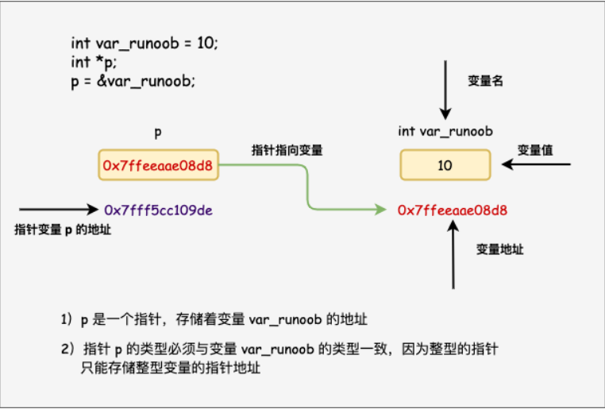
通过上面的实例，我们了解了什么是内存地址以及如何访问它。接下来让我们看看什么是指针。

##### 2.3.7.1 什么是指针？
指针也就是内存地址，指针变量是用来存放内存地址的变量。就像其他变量或常量一样，您必须在使用指针存储其他变量地址之前，对其进行声明。指针变量声明的一般形式为：
```C
type *var_name;
```
在这里，type 是指针的基类型，它必须是一个有效的 C 数据类型，var_name 是指针变量的名称。用来声明指针的星号 * 与乘法中使用的星号是相同的。但是，在这个语句中，星号是用来指定一个变量是指针。以下是有效的指针声明：
```C
int    *ip;    /* 一个整型的指针 */
double *dp;    /* 一个 double 型的指针 */
float  *fp;    /* 一个浮点型的指针 */
char   *ch;    /* 一个字符型的指针 */
```
所有实际数据类型，不管是整型、浮点型、字符型，还是其他的数据类型，对应指针的值的类型都是一样的，都是一个代表内存地址的长的十六进制数。

不同数据类型的指针之间唯一的不同是，指针所指向的变量或常量的数据类型不同。

##### 2.3.7.2 如何使用指针？
使用指针时会频繁进行以下几个操作：定义一个指针变量、把变量地址赋值给指针、访问指针变量中可用地址的值。这些是通过使用一元运算符 * 来返回位于操作数所指定地址的变量的值。下面的实例涉及到了这些操作：

实例
```C
#include <stdio.h>
 
int main ()
{
   int  var = 20;   /* 实际变量的声明 */
   int  *ip;        /* 指针变量的声明 */
 
   ip = &var;  /* 在指针变量中存储 var 的地址 */
 
   printf("var 变量的地址: %p\n", &var  );
 
   /* 在指针变量中存储的地址 */
   printf("ip 变量存储的地址: %p\n", ip );
 
   /* 使用指针访问值 */
   printf("*ip 变量的值: %d\n", *ip );
 
   return 0;
}
```
>当上面的代码被编译和执行时，它会产生下列结果：

var 变量的地址: 0x7ffeeef168d8
ip 变量存储的地址: 0x7ffeeef168d8
*ip 变量的值: 20

##### 2.3.7.3 C 中的 NULL 指针
在变量声明的时候，如果没有确切的地址可以赋值，为指针变量赋一个 NULL 值是一个良好的编程习惯。赋为 NULL 值的指针被称为空指针。

NULL 指针是一个定义在标准库中的值为零的常量。请看下面的程序：

实例
#include <stdio.h>
 
int main ()
{
   int  *ptr = NULL;
 
   printf("ptr 的地址是 %p\n", ptr  );
 
   return 0;
}
当上面的代码被编译和执行时，它会产生下列结果：

ptr 的地址是 0x0
在大多数的操作系统上，程序不允许访问地址为 0 的内存，因为该内存是操作系统保留的。然而，内存地址 0 有特别重要的意义，它表明该指针不指向一个可访问的内存位置。但按照惯例，如果指针包含空值（零值），则假定它不指向任何东西。

如需检查一个空指针，您可以使用 if 语句，如下所示：

if(ptr)     /* 如果 p 非空，则完成 */
if(!ptr)    /* 如果 p 为空，则完成 */
##### 2.3.7.4 C 指针详解
在 C 中，有很多指针相关的概念，这些概念都很简单，但是都很重要。下面列出了 C 程序员必须清楚的一些与指针相关的重要概念：

|概念	|描述|
|-------|----|
|指针的算术运算	|可以对指针进行四种算术运算：++、--、+、-|
|指针数组	|可以定义用来存储指针的数组。|
|指向指针的指针	|C 允许指向指针的指针。|
|传递指针给函数	|通过引用或地址传递参数，使传递的参数在调|用函数中被改变。|
|从函数返回指针	|C 允许函数返回指针到局部变量、静态变量和动态内存分配。|

##### 2.3.7.4.1 指针的算术运算
C 指针是一个用数值表示的地址。因此，您可以对指针执行算术运算。可以对指针进行四种算术运算：++、--、+、-。

假设 ptr 是一个指向地址 1000 的整型指针，是一个 32 位的整数，让我们对该指针执行下列的算术运算：

ptr++

在执行完上述的运算之后，ptr 将指向位置 1004，因为 ptr 每增加一次，它都将指向下一个整数位置，即当前位置往后移 4 字节。这个运算会在不影响内存位置中实际值的情况下，移动指针到下一个内存位置。如果 ptr 指向一个地址为 1000 的字符，上面的运算会导致指针指向位置 1001，因为下一个字符位置是在 1001。

我们概括一下：

指针的每一次递增，它其实会指向下一个元素的存储单元。
指针的每一次递减，它都会指向前一个元素的存储单元。
指针在递增和递减时跳跃的字节数取决于指针所指向变量数据类型长度，比如 int 就是 4 个字节。
>递增一个指针

我们喜欢在程序中使用指针代替数组，因为变量指针可以递增，而数组不能递增，数组可以看成一个指针常量。下面的程序递增变量指针，以便顺序访问数组中的每一个元素：

实例
```C
#include <stdio.h>
 
const int MAX = 3;
 
int main ()
{
   int  var[] = {10, 100, 200};
   int  i, *ptr;
 
   /* 指针中的数组地址 */
   ptr = var;
   for ( i = 0; i < MAX; i++)
   {
 
      printf("存储地址：var[%d] = %p\n", i, ptr );
      printf("存储值：var[%d] = %d\n", i, *ptr );
 
      /* 指向下一个位置 */
      ptr++;
   }
   return 0;
}
```
>>当上面的代码被编译和执行时，它会产生下列结果：

- 存储地址：var[0] = e4a298cc
- 存储值：var[0] = 10
- 存储地址：var[1] = e4a298d0
- 存储值：var[1] = 100
- 存储地址：var[2] = e4a298d4
- 存储值：var[2] = 200

>递减一个指针
- 同样地，对指针进行递减运算，即把值减去其数据类型的字节数，如下所示：

实例
```C
#include <stdio.h>
 
const int MAX = 3;
 
int main ()
{
   int  var[] = {10, 100, 200};
   int  i, *ptr;
 
   /* 指针中最后一个元素的地址 */
   ptr = &var[MAX-1];
   for ( i = MAX; i > 0; i--)
   {
 
      printf("存储地址：var[%d] = %p\n", i-1, ptr );
      printf("存储值：var[%d] = %d\n", i-1, *ptr );
 
      /* 指向下一个位置 */
      ptr--;
   }
   return 0;
}
```
>当上面的代码被编译和执行时，它会产生下列结果：

- 存储地址：var[2] = 518a0ae4
- 存储值：var[2] = 200
- 存储地址：var[1] = 518a0ae0
- 存储值：var[1] = 100
- 存储地址：var[0] = 518a0adc
- 存储值：var[0] = 10

>指针的比较
- 指针可以用关系运算符进行比较，如 ==、< 和 >。如果 p1 和 p2 指向两个相关的变量，比如同一个数组中的不同元素，则可对 p1 和 p2 进行大小比较。

下面的程序修改了上面的实例，只要变量指针所指向的地址小于或等于数组的最后一个元素的地址 &var[MAX - 1]，则把变量指针进行递增：

实例
```C
#include <stdio.h>
 
const int MAX = 3;
 
int main ()
{
   int  var[] = {10, 100, 200};
   int  i, *ptr;
 
   /* 指针中第一个元素的地址 */
   ptr = var;
   i = 0;
   while ( ptr <= &var[MAX - 1] )
   {
 
      printf("存储地址：var[%d] = %p\n", i, ptr );
      printf("存储值：var[%d] = %d\n", i, *ptr );
 
      /* 指向上一个位置 */
      ptr++;
      i++;
   }
   return 0;
}
```
>当上面的代码被编译和执行时，它会产生下列结果：

- 存储地址：var[0] = 0x7ffeee2368cc
- 存储值：var[0] = 10
- 存储地址：var[1] = 0x7ffeee2368d0
- 存储值：var[1] = 100
- 存储地址：var[2] = 0x7ffeee2368d4
- 存储值：var[2] = 200


##### 2.3.7.4.2 指针数组
C 指针数组是一个数组，其中的每个元素都是指向某种数据类型的指针。

指针数组存储了一组指针，每个指针可以指向不同的数据对象。

指针数组通常用于处理多个数据对象，例如字符串数组或其他复杂数据结构的数组。

让我们来看一个实例，它用到了一个由 3 个整数组成的数组：

实例
```C
#include <stdio.h>
 
const int MAX = 3;
 
int main ()
{
   int  var[] = {10, 100, 200};
   int i;
 
   for (i = 0; i < MAX; i++)
   {
      printf("Value of var[%d] = %d\n", i, var[i] );
   }
   return 0;
}
```
>当上面的代码被编译和执行时，它会产生下列结果：

- Value of var[0] = 10
- Value of var[1] = 100
- Value of var[2] = 200

- 可能有一种情况，我们想要让数组存储指向 int 或 char 或其他数据类型的指针。

下面是一个指向整数的指针数组的声明：
```c
int *ptr[MAX];
```

- 在这里，把 ptr 声明为一个数组，由 MAX 个整数指针组成。因此，ptr 中的每个元素，都是一个指向 int 值的指针。下面的实例用到了三个整数，它们将存储在一个指针数组中，如下所示：

实例
```C
#include <stdio.h>
 
const int MAX = 3;
 
int main ()
{
   int  var[] = {10, 100, 200};
   int i, *ptr[MAX];
 
   for ( i = 0; i < MAX; i++)
   {
      ptr[i] = &var[i]; /* 赋值为整数的地址 */
   }
   for ( i = 0; i < MAX; i++)
   {
      printf("Value of var[%d] = %d\n", i, *ptr[i] );
   }
   return 0;
}
```

>当上面的代码被编译和执行时，它会产生下列结果：

- Value of var[0] = 10
- Value of var[1] = 100
- Value of var[2] = 200

您也可以用一个指向字符的指针数组来存储一个字符串列表，如下：

实例
```C
#include <stdio.h>
 
const int MAX = 4;
 
int main ()
{
   const char *names[] = {
                   "Zara Ali",
                   "Hina Ali",
                   "Nuha Ali",
                   "Sara Ali",
   };
   int i = 0;
 
   for ( i = 0; i < MAX; i++)
   {
      printf("Value of names[%d] = %s\n", i, names[i] );
   }
   return 0;
}
```
>当上面的代码被编译和执行时，它会产生下列结果：

- Value of names[0] = Zara Ali
- Value of names[1] = Hina Ali
- Value of names[2] = Nuha Ali
- Value of names[3] = Sara Ali

再看一个简单实例，我们首先声明了一个包含三个整数指针的指针数组 ptrArray，然后，我们将这些指针分别指向不同的整数变量 num1、num2 和 num3，最后，我们使用指针数组访问这些整数变量的值。

实例
```C
#include <stdio.h>
 
int main() {
    int num1 = 10, num2 = 20, num3 = 30;
    
    // 声明一个整数指针数组，包含三个指针
    int *ptrArray[3];
    
    // 将指针指向不同的整数变量
    ptrArray[0] = &num1;
    ptrArray[1] = &num2;
    ptrArray[2] = &num3;
    
    // 使用指针数组访问这些整数变量的值
    printf("Value at index 0: %d\n", *ptrArray[0]);
    printf("Value at index 1: %d\n", *ptrArray[1]);
    printf("Value at index 2: %d\n", *ptrArray[2]);
    
    return 0;
}
```
>当上面的代码被编译和执行时，它会产生下列结果：

- Value at index 0: 10
- Value at index 1: 20
- Value at index 2: 30

指针数组在C中非常有用，特别是在处理具有不定数量元素的数据结构时，如动态分配的字符串数组或动态创建的结构体数组。


##### 2.3.7.4.3 指向指针的指针
指向指针的指针是一种多级间接寻址的形式，或者说是一个指针链。通常，一个指针包含一个变量的地址。当我们定义一个指向指针的指针时，第一个指针包含了第二个指针的地址，第二个指针指向包含实际值的位置。

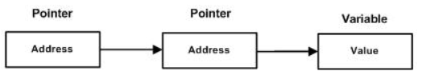

一个指向指针的指针变量必须如下声明，即在变量名前放置两个星号。例如，下面声明了一个指向 int 类型指针的指针：
```C
int **var;
```
当一个目标值被一个指针间接指向到另一个指针时，访问这个值需要使用两个星号运算符，如下面实例所示：
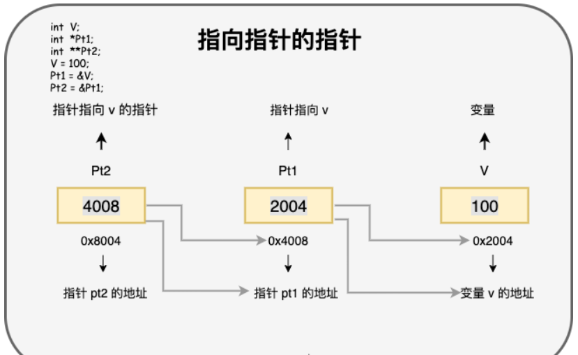

实例
```C
#include <stdio.h>
 
int main ()
{
   int  V;
   int  *Pt1;
   int  **Pt2;
 
   V = 100;
 
   /* 获取 V 的地址 */
   Pt1 = &V;
 
   /* 使用运算符 & 获取 Pt1 的地址 */
   Pt2 = &Pt1;
 
   /* 使用 pptr 获取值 */
   printf("var = %d\n", V );
   printf("Pt1 = %p\n", Pt1 );
   printf("*Pt1 = %d\n", *Pt1 );
    printf("Pt2 = %p\n", Pt2 );
   printf("**Pt2 = %d\n", **Pt2);
 
   return 0;
}
```
>当上面的代码被编译和执行时，它会产生下列结果：

- var = 100
- Pt1 = 0x7ffee2d5e8d8
- *Pt1 = 100
- Pt2 = 0x7ffee2d5e8d0
- **Pt2 = 100

##### 2.3.7.4.4 传递指针给函数
C 语言允许您传递指针给函数，只需要简单地声明函数参数为指针类型即可。

下面的实例中，我们传递一个无符号的 long 型指针给函数，并在函数内改变这个值：

实例
```C
#include <stdio.h>
#include <time.h>
 
void getSeconds(unsigned long *par);

int main ()
{
   unsigned long sec;


   getSeconds( &sec );

   /* 输出实际值 */
   printf("Number of seconds: %ld\n", sec );

   return 0;
}

void getSeconds(unsigned long *par)
{
   /* 获取当前的秒数 */
   *par = time( NULL );
   return;
}
```
>当上面的代码被编译和执行时，它会产生下列结果：

- Number of seconds :1294450468

能接受指针作为参数的函数，也能接受数组作为参数，如下所示：

实例
```C
#include <stdio.h>
 
/* 函数声明 */
double getAverage(int *arr, int size);
 
int main ()
{
   /* 带有 5 个元素的整型数组  */
   int balance[5] = {1000, 2, 3, 17, 50};
   double avg;
 
   /* 传递一个指向数组的指针作为参数 */
   avg = getAverage( balance, 5 ) ;
 
   /* 输出返回值  */
   printf("Average value is: %f\n", avg );
   
   return 0;
}

double getAverage(int *arr, int size)
{
  int    i, sum = 0;      
  double avg;          
 
  for (i = 0; i < size; ++i)
  {
    sum += arr[i];
  }
 
  avg = (double)sum / size;
 
  return avg;
}
```
>当上面的代码被编译和执行时，它会产生下列结果：

- Average value is: 214.40000
  
##### 2.3.7.4.5 从函数返回指针
在上一章中，我们已经了解了 C 语言中如何从函数返回数组，类似地，C 允许您从函数返回指针。为了做到这点，您必须声明一个返回指针的函数，如下所示：
```C
int * myFunction()
{
.
.
.
}
```
另外，C 语言不支持在调用函数时返回局部变量的地址，除非定义局部变量为 static 变量。

现在，让我们来看下面的函数，它会生成 10 个随机数，并使用表示指针的数组名（即第一个数组元素的地址）来返回它们，具体如下：

实例
```C
#include <stdio.h>
#include <time.h>
#include <stdlib.h> 
 
/* 要生成和返回随机数的函数 */
int * getRandom( )
{
   static int  r[10];
   int i;
 
   /* 设置种子 */
   srand( (unsigned)time( NULL ) );
   for ( i = 0; i < 10; ++i)
   {
      r[i] = rand();
      printf("%d\n", r[i] );
   }
 
   return r;
}
 
/* 要调用上面定义函数的主函数 */
int main ()
{
   /* 一个指向整数的指针 */
   int *p;
   int i;
 
   p = getRandom();
   for ( i = 0; i < 10; i++ )
   {
       printf("*(p + [%d]) : %d\n", i, *(p + i) );
   }
 
   return 0;
}
```
>当上面的代码被编译和执行时，它会产生下列结果：

- 1523198053
- 1187214107
- 1108300978
- 430494959
- 1421301276
- 930971084
- 123250484
- 106932140
- 1604461820
- 149169022
- *(p + [0]) : 1523198053
- *(p + [1]) : 1187214107
- *(p + [2]) : 1108300978
- *(p + [3]) : 430494959
- *(p + [4]) : 1421301276
- *(p + [5]) : 930971084
- *(p + [6]) : 123250484
- *(p + [7]) : 106932140
- *(p + [8]) : 1604461820
- *(p + [9]) : 149169022

#### 2.3.8 结构体类型
C 数组允许定义可存储相同类型数据项的变量，结构是 C 编程中另一种用户自定义的可用的数据类型，它允许您存储不同类型的数据项。

结构体中的数据成员可以是基本数据类型（如 int、float、char 等），也可以是其他结构体类型、指针类型等。

结构用于表示一条记录，假设您想要跟踪图书馆中书本的动态，您可能需要跟踪每本书的下列属性：

- Title
- Author
- Subject
- Book ID

##### 2.3.8.1 定义结构
  - 结构体定义由关键字 struct 和结构体名组成，结构体名可以根据需要自行定义。

struct 语句定义了一个包含多个成员的新的数据类型，struct 语句的格式如下：
```C
struct tag {
    member-list
    member-list
    member-list  
    ...
} variable-list ;
```

- tag 是结构体标签。

- member-list 是标准的变量定义，比如 int i; 或者 float f;，或者其他有效的变量定义。

- variable-list 结构变量，定义在结构的末尾，最后一个分号之前，您可以指定一个或多个结构变量。下面是声明 Book 结构的方式：

```C
struct Books
{
   char  title[50];
   char  author[50];
   char  subject[100];
   int   book_id;
} book;

- 在一般情况下，tag、member-list、variable-list 这 3 部分至少要出现 2 个。以下为实例：
```C
//此声明声明了拥有3个成员的结构体，分别为整型的a，字符型的b和双精度的c
//同时又声明了结构体变量s1
//这个结构体并没有标明其标签
struct
{
    int a;
    char b;
    double c;
} s1;

//此声明声明了拥有3个成员的结构体，分别为整型的a，字符型的b和双精度的c
//结构体的标签被命名为SIMPLE,没有声明变量
struct SIMPLE
{
    int a;
    char b;
    double c;
};
//用SIMPLE标签的结构体，另外声明了变量t1、t2、t3
struct SIMPLE t1, t2[20], *t3;

//也可以用typedef创建新类型
typedef struct
{
    int a;
    char b;
    double c;
} Simple2;
//现在可以用Simple2作为类型声明新的结构体变量
Simple2 u1, u2[20], *u3;
```

- 在上面的声明中，第一个和第二声明被编译器当作两个完全不同的类型，即使他们的成员列表是一样的，如果令 t3=&s1，则是非法的。

- 结构体的成员可以包含其他结构体，也可以包含指向自己结构体类型的指针，而通常这种指针的应用是为了实现一些更高级的数据结构如链表和树等。

```C
//此结构体的声明包含了其他的结构体
struct COMPLEX
{
    char string[100];
    struct SIMPLE a;
};

//此结构体的声明包含了指向自己类型的指针
struct NODE
{
    char string[100];
    struct NODE *next_node;
};
```
- 如果两个结构体互相包含，则需要对其中一个结构体进行不完整声明，如下所示：

```C
struct B;    //对结构体B进行不完整声明

//结构体A中包含指向结构体B的指针
struct A
{
    struct B *partner;
    //other members;
};

//结构体B中包含指向结构体A的指针，在A声明完后，B也随之进行声明
struct B
{
    struct A *partner;
    //other members;
};
```

##### 2.3.8.2 结构体变量的初始化
和其它类型变量一样，对结构体变量可以在定义时指定初始值。

实例
```C
#include <stdio.h>

struct Books
{
   char  title[50];
   char  author[50];
   char  subject[100];
   int   book_id;
} book = {"C 语言", "RUNOOB", "编程语言", 123456};

int main()
{
    printf("title : %s\nauthor: %s\nsubject: %s\nbook_id: %d\n", book.title, book.author, book.subject, book.book_id);
}
```
>执行输出结果为：

- title : C 语言
- author: RUNOOB
- subject: 编程语言
- book_id: 123456

##### 2.3.8.3 访问结构成员

- 为了访问结构的成员，我们使用成员访问运算符（.）。成员访问运算符是结构变量名称和我们要访问的结构成员之间的一个句号。您可以使用 struct 关键字来定义结构类型的变量。下面的实例演示了结构的用法：

实例
```C
#include <stdio.h>
#include <string.h>
 
struct Books
{
   char  title[50];
   char  author[50];
   char  subject[100];
   int   book_id;
};
 
int main( )
{
   struct Books Book1;        /* 声明 Book1，类型为 Books */
   struct Books Book2;        /* 声明 Book2，类型为 Books */
 
   /* Book1 详述 */
   strcpy( Book1.title, "C Programming");
   strcpy( Book1.author, "Nuha Ali");
   strcpy( Book1.subject, "C Programming Tutorial");
   Book1.book_id = 6495407;

   /* Book2 详述 */
   strcpy( Book2.title, "Telecom Billing");
   strcpy( Book2.author, "Zara Ali");
   strcpy( Book2.subject, "Telecom Billing Tutorial");
   Book2.book_id = 6495700;
 
   /* 输出 Book1 信息 */
   printf( "Book 1 title : %s\n", Book1.title);
   printf( "Book 1 author : %s\n", Book1.author);
   printf( "Book 1 subject : %s\n", Book1.subject);
   printf( "Book 1 book_id : %d\n", Book1.book_id);

   /* 输出 Book2 信息 */
   printf( "Book 2 title : %s\n", Book2.title);
   printf( "Book 2 author : %s\n", Book2.author);
   printf( "Book 2 subject : %s\n", Book2.subject);
   printf( "Book 2 book_id : %d\n", Book2.book_id);

   return 0;
}
```

>当上面的代码被编译和执行时，它会产生下列结果：

- Book 1 title : C Programming
- Book 1 author : Nuha Ali
- Book 1 subject : C Programming Tutorial
- Book 1 book_id : 6495407
- Book 2 title : Telecom Billing
- Book 2 author : Zara Ali
- Book 2 subject : Telecom Billing Tutorial
- Book 2 book_id : 6495700

##### 2.3.8.4 结构作为函数参数

您可以把结构作为函数参数，传参方式与其他类型的变量或指针类似。您可以使用上面实例中的方式来访问结构变量：

实例
```C
#include <stdio.h>
#include <string.h>
 
struct Books
{
   char  title[50];
   char  author[50];
   char  subject[100];
   int   book_id;
};

/* 函数声明 */
void printBook( struct Books book );
int main( )
{
   struct Books Book1;        /* 声明 Book1，类型为 Books */
   struct Books Book2;        /* 声明 Book2，类型为 Books */
 
   /* Book1 详述 */
   strcpy( Book1.title, "C Programming");
   strcpy( Book1.author, "Nuha Ali");
   strcpy( Book1.subject, "C Programming Tutorial");
   Book1.book_id = 6495407;

   /* Book2 详述 */
   strcpy( Book2.title, "Telecom Billing");
   strcpy( Book2.author, "Zara Ali");
   strcpy( Book2.subject, "Telecom Billing Tutorial");
   Book2.book_id = 6495700;
 
   /* 输出 Book1 信息 */
   printBook( Book1 );

   /* 输出 Book2 信息 */
   printBook( Book2 );

   return 0;
}
void printBook( struct Books book )
{
   printf( "Book title : %s\n", book.title);
   printf( "Book author : %s\n", book.author);
   printf( "Book subject : %s\n", book.subject);
   printf( "Book book_id : %d\n", book.book_id);
}
```

>当上面的代码被编译和执行时，它会产生下列结果：

- Book title : C Programming
- Book author : Nuha Ali
- Book subject : C Programming Tutorial
- Book book_id : 6495407
- Book title : Telecom Billing
- Book author : Zara Ali
- Book subject : Telecom Billing Tutorial
- Book book_id : 6495700

##### 2.3.8.5 指向结构的指针
您可以定义指向结构的指针，方式与定义指向其他类型变量的指针相似，如下所示：

```C
struct Books *struct_pointer;
```

现在，您可以在上述定义的指针变量中存储结构变量的地址。为了查找结构变量的地址，请把 & 运算符放在结构名称的前面，如下所示：

```C
struct_pointer = &Book1;
```

为了使用指向该结构的指针访问结构的成员，您必须使用 -> 运算符，如下所示：
```C
struct_pointer->title;
```
让我们使用结构指针来重写上面的实例，这将有助于您理解结构指针的概念：

实例
```C
#include <stdio.h>
#include <string.h>
 
struct Books
{
   char  title[50];
   char  author[50];
   char  subject[100];
   int   book_id;
};

/* 函数声明 */
void printBook( struct Books *book );
int main( )
{
   struct Books Book1;        /* 声明 Book1，类型为 Books */
   struct Books Book2;        /* 声明 Book2，类型为 Books */
 
   /* Book1 详述 */
   strcpy( Book1.title, "C Programming");
   strcpy( Book1.author, "Nuha Ali");
   strcpy( Book1.subject, "C Programming Tutorial");
   Book1.book_id = 6495407;

   /* Book2 详述 */
   strcpy( Book2.title, "Telecom Billing");
   strcpy( Book2.author, "Zara Ali");
   strcpy( Book2.subject, "Telecom Billing Tutorial");
   Book2.book_id = 6495700;
 
   /* 通过传 Book1 的地址来输出 Book1 信息 */
   printBook( &Book1 );

   /* 通过传 Book2 的地址来输出 Book2 信息 */
   printBook( &Book2 );

   return 0;
}
void printBook( struct Books *book )
{
   printf( "Book title : %s\n", book->title);
   printf( "Book author : %s\n", book->author);
   printf( "Book subject : %s\n", book->subject);
   printf( "Book book_id : %d\n", book->book_id);
}
```
>当上面的代码被编译和执行时，它会产生下列结果：

- Book title : C Programming
- Book author : Nuha Ali
- Book subject : C Programming Tutorial
- Book book_id : 6495407
- Book title : Telecom Billing
- Book author : Zara Ali
- Book subject : Telecom Billing Tutorial
- Book book_id : 6495700

##### 2.3.8.6 结构体大小的计算
C 语言中，我们可以使用 sizeof 运算符来计算结构体的大小，sizeof 返回的是给定类型或变量的字节大小。

对于结构体，sizeof 将返回结构体的总字节数，包括所有成员变量的大小以及可能的填充字节。

以下实例演示了如何计算结构体的大小：

实例
```C
#include <stdio.h>

struct Person {
    char name[20];
    int age;
    float height;
};

int main() {
    struct Person person;
    printf("结构体 Person 大小为: %zu 字节\n", sizeof(person));
    return 0;
}
```
- 以上实例中，我们定义了一个名为 Person 的结构体，它包含了一个字符数组 name、一个整数 age 和一个浮点数 height。

- 在 main 函数中，我们声明了一个 Person 类型的变量 person，然后使用 sizeof 运算符来获取 person 结构体的大小。

- 最后，我们使用 printf 函数打印出结构体的大小。
>输出结果如下：

- 结构体 Person 大小为: 28 字节

- 注意，结构体的大小可能会受到编译器的优化和对齐规则的影响，编译器可能会在结构体中插入一些额外的填充字节以对齐结构体的成员变量，以提高内存访问效率。因此，结构体的实际大小可能会大于成员变量大小的总和，如果你需要确切地了解结构体的内存布局和对齐方式，可以使用 offsetof 宏和 __attribute__((packed)) 属性等进一步控制和查询结构的大小和对齐方式。


### 2.4 作用域规则
- 任何一种编程中，作用域是程序中定义的变量所存在的区域，超过该区域变量就不能被访问。C 语言中有三个地方可以声明变量：

  - 在函数或块内部的局部变量
  - 在所有函数外部的全局变量
  - 在形式参数的函数参数定义中


#### 2.4.1 局部变量
在某个函数或块的内部声明的变量称为局部变量。它们只能被该函数或该代码块内部的语句使用。局部变量在函数外部是不可知的。下面是使用局部变量的实例。在这里，所有的变量 a、b 和 c 是 main() 函数的局部变量。

实例
```C
#include <stdio.h>
 
int main ()
{
  /* 局部变量声明 */
  int a, b;
  int c;
 
  /* 实际初始化 */
  a = 10;
  b = 20;
  c = a + b;
 
  printf ("value of a = %d, b = %d and c = %d\n", a, b, c);
 
  return 0;
}
```

#### 2.4.2 全局变量
全局变量是定义在函数外部，通常是在程序的顶部。全局变量在整个程序生命周期内都是有效的，在任意的函数内部能访问全局变量。

全局变量可以被任何函数访问。也就是说，全局变量在声明后整个程序中都是可用的。下面是使用全局变量和局部变量的实例：

实例
```C
#include <stdio.h>
 
/* 全局变量声明 */
int g;
 
int main ()
{
  /* 局部变量声明 */
  int a, b;
 
  /* 实际初始化 */
  a = 10;
  b = 20;
  g = a + b;
 
  printf ("value of a = %d, b = %d and g = %d\n", a, b, g);
 
  return 0;
}
```
在程序中，局部变量和全局变量的名称可以相同，但是在函数内，如果两个名字相同，会使用局部变量值，全局变量不会被使用。

在程序中，局部变量和全局变量的实例
```C
#include <stdio.h>
 
/* 全局变量声明 */
int g = 20;
 
int main ()
{
  /* 局部变量声明 */
  int g = 10;
 
  printf ("value of g = %d\n",  g);
 
  return 0;
}
```
>当上面的代码被编译和执行时，它会产生下列结果：

- value of g = 10

#### 2.4.3 形式参数
函数的参数，形式参数，被当作该函数内的局部变量，如果与全局变量同名它们会优先使用。下面是一个实例：

实例
```C
#include <stdio.h>
 
/* 全局变量声明 */
int a = 20;
 
int main ()
{
  /* 在主函数中的局部变量声明 */
  int a = 10;
  int b = 20;
  int c = 0;
  int sum(int, int);
 
  printf ("value of a in main() = %d\n",  a);
  c = sum( a, b);
  printf ("value of c in main() = %d\n",  c);
 
  return 0;
}
 
/* 添加两个整数的函数 */
int sum(int a, int b)
{
    printf ("value of a in sum() = %d\n",  a);
    printf ("value of b in sum() = %d\n",  b);
 
    return a + b;
}
```

>当上面的代码被编译和执行时，它会产生下列结果：

- value of a in main() = 10
- value of a in sum() = 10
- value of b in sum() = 20
- value of c in main() = 30

- 全局变量与局部变量在内存中的区别：

  - 全局变量保存在内存的全局存储区中，占用静态的存储单元；
  - 局部变量保存在栈中，只有在所在函数被调用时才动态地为变量分配存储单元。


#### 2.4.4 初始化局部变量和全局变量
- 当局部变量被定义时，系统不会对其初始化，您必须自行对其初始化。定义全局变量时，系统会自动对其初始化，如下所示：

|数据类型	|初始化默认值|
|----------|---------|
|int	|0|
|char	|'\0|'
|float	|0|
|double	|0|
|pointer	|NULL|

- 正确地初始化变量是一个良好的编程习惯，否则有时候程序可能会产生意想不到的结果，因为未初始化的变量会导致一些在内存位置中已经可用的垃圾值。

### 2.5 运算符
运算符是一种告诉编译器执行特定的数学或逻辑操作的符号。C 语言内置了丰富的运算符，并提供了以下类型的运算符：

  - 算术运算符
  - 关系运算符
  - 逻辑运算符
  - 位运算符
  - 赋值运算符
  - 杂项运算符

本章将逐一介绍算术运算符、关系运算符、逻辑运算符、位运算符、赋值运算符和其他运算符。

#### 2.5.1 算术运算符
下表显示了 C 语言支持的所有算术运算符。假设变量 A 的值为 10，变量 B 的值为 20，则：

|运算符	|描述	|实例|
|-------|------|----|
|+	|把两个操作数相加	|A + B 将得到 30|
|-	|从第一个操作数中减去第二个操作数	|A - B 将得到 -10|
|*	|把两个操作数相乘	|A * B 将得到 200|
|/	|分子除以分母	|B / A 将得到 2|
|%	|取模运算符，整除后的余数	|B % A 将得到 0|
|++	|自增运算符，整数值增加1	|A++ 将得到 11|
|--	|自减运算符，整数值减少1	|A-- 将得到 9|

实例

请看下面的实例，了解 C 语言中所有可用的算术运算符：
```C
#include <stdio.h>
 
int main()
{
   int a = 21;
   int b = 10;
   int c ;
 
   c = a + b;
   printf("Line 1 - c 的值是 %d\n", c );
   c = a - b;
   printf("Line 2 - c 的值是 %d\n", c );
   c = a * b;
   printf("Line 3 - c 的值是 %d\n", c );
   c = a / b;
   printf("Line 4 - c 的值是 %d\n", c );
   c = a % b;
   printf("Line 5 - c 的值是 %d\n", c );
   c = a++;  // 赋值后再加 1 ，c 为 21，a 为 22
   printf("Line 6 - c 的值是 %d\n", c );
   c = a--;  // 赋值后再减 1 ，c 为 22 ，a 为 21
   printf("Line 7 - c 的值是 %d\n", c );
 
}
```
>当上面的代码被编译和执行时，它会产生下列结果：

  - Line 1 - c 的值是 31
  - Line 2 - c 的值是 11
  - Line 3 - c 的值是 210
  - Line 4 - c 的值是 2
  - Line 5 - c 的值是 1
  - Line 6 - c 的值是 21
  - Line 7 - c 的值是 22

实例
以下实例演示了 a++ 与 ++a 的区别：
```C
#include <stdio.h>
 
int main()
{
   int c;
   int a = 10;
   c = a++; 
   printf("先赋值后运算：\n");
   printf("Line 1 - c 的值是 %d\n", c );
   printf("Line 2 - a 的值是 %d\n", a );
   a = 10;
   c = a--; 
   printf("Line 3 - c 的值是 %d\n", c );
   printf("Line 4 - a 的值是 %d\n", a );
 
   printf("先运算后赋值：\n");
   a = 10;
   c = ++a; 
   printf("Line 5 - c 的值是 %d\n", c );
   printf("Line 6 - a 的值是 %d\n", a );
   a = 10;
   c = --a; 
   printf("Line 7 - c 的值是 %d\n", c );
   printf("Line 8 - a 的值是 %d\n", a );
 
}
```

>以上程序执行输出结果为：

- 先赋值后运算：
  - Line 1 - c 的值是 10
  - Line 2 - a 的值是 11
  - Line 3 - c 的值是 10
  - Line 4 - a 的值是 9
- 先运算后赋值：
  - Line 5 - c 的值是 11
  - Line 6 - a 的值是 11
  - Line 7 - c 的值是 9
  - Line 8 - a 的值是 9

#### 2.5.2 关系运算符
下表显示了 C 语言支持的所有关系运算符。假设变量 A 的值为 10，变量 B 的值为 20，则：

|运算符	|描述	|实例|
|-------|------|----|
|==	|检查两个操作数的值是否相等，如果相等则条件为真。	|(A == B) 为假。|
|!=	|检查两个操作数的值是否相等，如果不相等则条件为真。	|(A != B) 为真。|
|>	|检查左操作数的值是否大于右操作数的值，如果是则条件为真。	|(A > B) 为假。|
|<	|检查左操作数的值是否小于右操作数的值，如果是则条件为真。	|(A < B) 为真。|
|>=	|检查左操作数的值是否大于或等于右操作数的值，如果是则条件为真。	|(A >= B) 为假。|
|<=	|检查左操作数的值是否小于或等于右操作数的值，如果是则条件为真。	|(A <= B) 为真。|

实例
请看下面的实例，了解 C 语言中所有可用的关系运算符：
```C
#include <stdio.h>
 
int main()
{
   int a = 21;
   int b = 10;
   int c ;
 
   if( a == b )
   {
      printf("Line 1 - a 等于 b\n" );
   }
   else
   {
      printf("Line 1 - a 不等于 b\n" );
   }
   if ( a < b )
   {
      printf("Line 2 - a 小于 b\n" );
   }
   else
   {
      printf("Line 2 - a 不小于 b\n" );
   }
   if ( a > b )
   {
      printf("Line 3 - a 大于 b\n" );
   }
   else
   {
      printf("Line 3 - a 不大于 b\n" );
   }
   /* 改变 a 和 b 的值 */
   a = 5;
   b = 20;
   if ( a <= b )
   {
      printf("Line 4 - a 小于或等于 b\n" );
   }
   if ( b >= a )
   {
      printf("Line 5 - b 大于或等于 a\n" );
   }
}
```
>当上面的代码被编译和执行时，它会产生下列结果：
  - Line 1 - a 不等于 b
  - Line 2 - a 不小于 b
  - Line 3 - a 大于 b
  - Line 4 - a 小于或等于 b
  - Line 5 - b 大于或等于 a

                           ||


#### 2.5.3 逻辑运算符
下表显示了 C 语言支持的所有关系逻辑运算符。假设变量 A 的值为 1，变量 B 的值为 0，则：

|运算符	|描述	|实例|
|-------|-------|---|
|&&	|称为逻辑与运算符。如果两个操作数都非零，则条件为真。	|(A && B) 为假。|
| 	| 称为逻辑或运算符。如果两个操作数中有任意一个非零，则条件为真。	|(A  B) 为真。|
|!	|称为逻辑非运算符。用来逆转操作数的逻辑状态。如果条件为真则逻辑非运算符将使其为假。	|!(A && B) 为真。|

实例
请看下面的实例，了解 C 语言中所有可用的逻辑运算符：
```C
#include <stdio.h>
 
int main()
{
   int a = 5;
   int b = 20;
   int c ;
 
   if ( a && b )
   {
      printf("Line 1 - 条件为真\n" );
   }
   if ( a || b )
   {
      printf("Line 2 - 条件为真\n" );
   }
   /* 改变 a 和 b 的值 */
   a = 0;
   b = 10;
   if ( a && b )
   {
      printf("Line 3 - 条件为真\n" );
   }
   else
   {
      printf("Line 3 - 条件为假\n" );
   }
   if ( !(a && b) )
   {
      printf("Line 4 - 条件为真\n" );
   }
}
```
>当上面的代码被编译和执行时，它会产生下列结果：

- Line 1 - 条件为真
- Line 2 - 条件为真
- Line 3 - 条件为假
- Line 4 - 条件为真

#### 2.5.4 位运算符
位运算符作用于位，并逐位执行操作。&、 | 和 ^ 的真值表如下所示：
|     
|p	|q	|p & q	|p  q	|p ^ q|
|----|---|------|-------|-----|
|0	|0	|0	|0	|0|
|0	|1	|0	|1	|1|
|1	|1	|1	|1	|0|
|1	|0	|0	|1	|1|

- 假设如果 A = 60，且 B = 13，现在以二进制格式表示，它们如下所示：

- A = 0011 1100

- B = 0000 1101

-----------------

- A&B = 0000 1100

- A|B = 0011 1101

- A^B = 0011 0001

- ~A  = 1100 0011

下表显示了 C 语言支持的位运算符。假设变量 A 的值为 60，变量 B 的值为 13，则：

|运算符	|描述	|实例|
|-------|------|----|
|&	|对两个操作数的每一位执行逻辑与操作，如果两个相应的位都为 1，则结果为 1，否则为 0。按位与操作，按二进制位进行"与"运算。运算规则：   0&0=0;   0&1=0;    1&0=0;     1&1=1;|	(A & B) 将得到 12，即为 0000 1100|
|| 对两个操作数的每一位执行逻辑或操作，如果两个相应的位都为 0，则结果为 0，否则为 1。按位或运算符，按二进制位进行"或"运算。运算规则：00=0;   01=1;   10=1;    11=1;	| (A  B) 将得到 61，即为 0011 1101|
|^	|对两个操作数的每一位执行逻辑异或操作，如果两个相应的位值相同，则结果为 0，否则为 1。异或运算符，按二进制位进行"异或"运算。运算规则：0^0=0;   0^1=1;   1^0=1;  1^1=0;	|(A ^ B) 将得到 49，即为 0011 0001|
|~	|对操作数的每一位执行逻辑取反操作，即将每一位的 0 变为 1，1 变为 0。取反运算符，按二进制位进行"取反"运算。运算规则：~1=-2;   ~0=-1;	|(~A ) 将得到 -61，即为 1100 0011，一个有符号二进制数的补码形式。
|<<	|将操作数的所有位向左移动指定的位数。左移 n 位相当于乘以 2 的 n 次方。二进制左移运算符。将一个运算对象的各二进制位全部左移若干位（左边的二进制位丢弃，右边补0）。|A << 2 将得到 240，即为 1111 0000|
|>>	|将操作数的所有位向右移动指定的位数。右移n位相当于除以 2 的 n 次方。二进制右移运算符。将一个数的各二进制位全部右移若干位，正数左补 0，负数左补 1，右边丢弃。|A >> 2 将得到 15，即为 0000 1111|

实例
请看下面的实例，了解 C 语言中所有可用的位运算符：
```C
#include <stdio.h>
 
int main()
{
 
   unsigned int a = 60;    /* 60 = 0011 1100 */  
   unsigned int b = 13;    /* 13 = 0000 1101 */
   int c = 0;           
 
   c = a & b;       /* 12 = 0000 1100 */ 
   printf("Line 1 - c 的值是 %d\n", c );
 
   c = a | b;       /* 61 = 0011 1101 */
   printf("Line 2 - c 的值是 %d\n", c );
 
   c = a ^ b;       /* 49 = 0011 0001 */
   printf("Line 3 - c 的值是 %d\n", c );
 
   c = ~a;          /*-61 = 1100 0011 */
   printf("Line 4 - c 的值是 %d\n", c );
 
   c = a << 2;     /* 240 = 1111 0000 */
   printf("Line 5 - c 的值是 %d\n", c );
 
   c = a >> 2;     /* 15 = 0000 1111 */
   printf("Line 6 - c 的值是 %d\n", c );
}
```
>当上面的代码被编译和执行时，它会产生下列结果：
- Line 1 - c 的值是 12
- Line 2 - c 的值是 61
- Line 3 - c 的值是 49
- Line 4 - c 的值是 -61
- Line 5 - c 的值是 240
- Line 6 - c 的值是 15

#### 2.5.5 赋值运算符
下表列出了 C 语言支持的赋值运算符：

|运算符	|描述	|实例|
|-------|------|----|
|=	|简单的赋值运算符，把右边操作数的值赋给左边操作数	|C = A + B 将把 A + B 的值赋给 C|
|+=	|加且赋值运算符，把右边操作数加上左边操作数的结果赋值给左边操作数	|C += A 相当于 C = C + A|
|-=	|减且赋值运算符，把左边操作数减去右边操作数的结果赋值给左边操作数	|C -= A 相当于 C = C - A|
|*=	|乘且赋值运算符，把右边操作数乘以左边操作数的结果赋值给左边操作数	|C *= A 相当于 C = C * A|
|/=	|除且赋值运算符，把左边操作数除以右边操作数的结果赋值给左边操作数	|C /= A 相当于 C = C / A|
|%=	|求模且赋值运算符，求两个操作数的模赋值给左边操作数	|C %= A 相当于 C = C % A|
|<<=	|左移且赋值运算符	|C <<= 2 等同于 C = C << 2|
|>>=	|右移且赋值运算符	|C >>= 2 等同于 C = C >> 2|
|&=	|按位与且赋值运算符	|C &= 2 等同于 C = C & 2|
|^=	|按位异或且赋值运算符	|C ^= 2 等同于 C = C ^ 2|
|=	|按位或且赋值运算符	C = 2 等同于 C = C  2|

实例
请看下面的实例，了解 C 语言中所有可用的赋值运算符：
```C
#include <stdio.h>
 
int main()
{
   int a = 21;
   int c ;
 
   c =  a;
   printf("Line 1 - =  运算符实例，c 的值 = %d\n", c );
 
   c +=  a;
   printf("Line 2 - += 运算符实例，c 的值 = %d\n", c );
 
   c -=  a;
   printf("Line 3 - -= 运算符实例，c 的值 = %d\n", c );
 
   c *=  a;
   printf("Line 4 - *= 运算符实例，c 的值 = %d\n", c );
 
   c /=  a;
   printf("Line 5 - /= 运算符实例，c 的值 = %d\n", c );
 
   c  = 200;
   c %=  a;
   printf("Line 6 - %%= 运算符实例，c 的值 = %d\n", c );
 
   c <<=  2;
   printf("Line 7 - <<= 运算符实例，c 的值 = %d\n", c );
 
   c >>=  2;
   printf("Line 8 - >>= 运算符实例，c 的值 = %d\n", c );
 
   c &=  2;
   printf("Line 9 - &= 运算符实例，c 的值 = %d\n", c );
 
   c ^=  2;
   printf("Line 10 - ^= 运算符实例，c 的值 = %d\n", c );
 
   c |=  2;
   printf("Line 11 - |= 运算符实例，c 的值 = %d\n", c );
 
}
```
>当上面的代码被编译和执行时，它会产生下列结果：

  - Line 1 - =  运算符实例，c 的值 = 21
  - Line 2 - += 运算符实例，c 的值 = 42
  - Line 3 - -= 运算符实例，c 的值 = 21
  - Line 4 - *= 运算符实例，c 的值 = 441
  - Line 5 - /= 运算符实例，c 的值 = 21
  - Line 6 - %= 运算符实例，c 的值 = 11
  - Line 7 - <<= 运算符实例，c 的值 = 44
  - Line 8 - >>= 运算符实例，c 的值 = 11
  - Line 9 - &= 运算符实例，c 的值 = 2
  - Line 10 - ^= 运算符实例，c 的值 = 0
  - Line 11 - |= 运算符实例，c 的值 = 2

#### 2.5.6 杂项运算符 ↦ sizeof & 三元
下表列出了 C 语言支持的其他一些重要的运算符，包括 sizeof 和 ? :。

|运算符	|描述	|实例|
|sizeof()	|返回变量的大小。	|sizeof(a) 将返回 4，其中 a 是整数。|
|&	|返回变量的地址。	|&a; 将给出变量的实际地址。|
|*	|指向一个变量。	|*a; 将指向一个变量。|
|? :	|条件表达式	|如果条件为真 ? 则值为 X : 否则值为 Y|

实例
请看下面的实例，了解 C 语言中所有可用的杂项运算符：
```C
#include <stdio.h>
 
int main()
{
   int a = 4;
   short b;
   double c;
   int* ptr;
 
   /* sizeof 运算符实例 */
   printf("Line 1 - 变量 a 的大小 = %lu\n", sizeof(a) );
   printf("Line 2 - 变量 b 的大小 = %lu\n", sizeof(b) );
   printf("Line 3 - 变量 c 的大小 = %lu\n", sizeof(c) );
 
   /* & 和 * 运算符实例 */
   ptr = &a;    /* 'ptr' 现在包含 'a' 的地址 */
   printf("a 的值是 %d\n", a);
   printf("*ptr 是 %d\n", *ptr);
 
   /* 三元运算符实例 */
   a = 10;
   b = (a == 1) ? 20: 30;
   printf( "b 的值是 %d\n", b );
 
   b = (a == 10) ? 20: 30;
   printf( "b 的值是 %d\n", b );
}
```
>当上面的代码被编译和执行时，它会产生下列结果：

  - Line 1 - 变量 a 的大小 = 4
  - Line 2 - 变量 b 的大小 = 2
  - Line 3 - 变量 c 的大小 = 8
  - a 的值是 4
  - *ptr 是 4
  - b 的值是 30
  - b 的值是 20

#### 2.5.7 C 中的运算符优先级
- 运算符的优先级确定表达式中项的组合。这会影响到一个表达式如何计算。某些运算符比其他运算符有更高的优先级，例如，乘除运算符具有比加减运算符更高的优先级。

- 例如 x = 7 + 3 * 2，在这里，x 被赋值为 13，而不是 20，因为运算符 * 具有比 + 更高的优先级，所以首先计算乘法 3*2，然后再加上 7。

- 下表将按运算符优先级从高到低列出各个运算符，具有较高优先级的运算符出现在表格的上面，具有较低优先级的运算符出现在表格的下面。在表达式中，较高优先级的运算符会优先被计算。

|类别 	|运算符 	|结合性| 
|-------|----------|-----|
|后缀 	|() [] -> . ++ - -  	|从左到右 |
|一元 	|+ - ! ~ ++ - - (type)* & sizeof 	|从右到左| 
|乘除 	|* / % 	|从左到右 |
|加减 	|+ - 	|从左到右 |
|移位 	|<< >> 	|从左到右 |
|关系 	|< <= > >= 	|从左到右| 
|相等 	|== != 	|从左到右 |
|位与 AND 	|& 	|从左到右| 
|位异或 XOR 	|^ 	|从左到右| 
|位或 OR 	| 	|从左到右| 
|逻辑与 AND 	|&& 	|从左到右| 
|逻辑或 OR 	| 	|从左到右| 
|条件 	|?: 	|从右到左| 
|赋值 	|= += -= *= /= %=>>= <<= &= ^= = 	|从右到左| 
|逗号 	|, 	|从左到右 |

实例
请看下面的实例，了解 C 语言中运算符的优先级：
```C
#include <stdio.h>
 
int main()
{
   int a = 20;
   int b = 10;
   int c = 15;
   int d = 5;
   int e;
 
   e = (a + b) * c / d;      // ( 30 * 15 ) / 5
   printf("(a + b) * c / d 的值是 %d\n",  e );
 
   e = ((a + b) * c) / d;    // (30 * 15 ) / 5
   printf("((a + b) * c) / d 的值是 %d\n" ,  e );
 
   e = (a + b) * (c / d);   // (30) * (15/5)
   printf("(a + b) * (c / d) 的值是 %d\n",  e );
 
   e = a + (b * c) / d;     //  20 + (150/5)
   printf("a + (b * c) / d 的值是 %d\n" ,  e );
  
   return 0;
}
```
>当上面的代码被编译和执行时，它会产生下列结果：

  - (a + b) * c / d 的值是 90
  - ((a + b) * c) / d 的值是 90
  - (a + b) * (c / d) 的值是 90
  - a + (b * c) / d 的值是 50

### 2.6  判断&循环&函数
#### 2.6.1 判断
- 判断结构要求程序员指定一个或多个要评估或测试的条件，以及条件为真时要执行的语句（必需的）和条件为假时要执行的语句（可选的）。

C 语言把任何非零和非空的值假定为 true，把零或 null 假定为 false。

下面是大多数编程语言中典型的判断结构的一般形式：


#### 2.6.2 判断语句
C 语言提供了以下类型的判断语句。点击链接查看每个语句的细节。

|语句	|描述|
|-------|---|
|if 语句	|一个 if 语句 由一个布尔表达式后跟一个或多个语句组成。|
|if...else 语句	|一个 if 语句 后可跟一个可选的 else 语句，else 语句在布尔表达式为假时执行。|
|嵌套 if 语句	|您可以在一个 if 或 else if 语句内使用另一个 if 或 else if 语句。|
|switch 语句	|一个 switch 语句允许测试一个变量等于多个值时的情况。|
|嵌套 switch 语句	|您可以在一个 switch 语句内使用另一个 switch 语句。|

* ? : 运算符(三元运算符)
我们已经在前面的章节中讲解了 条件运算符 ? :，可以用来替代 if...else 语句。它的一般形式如下：
  - Exp1 ? Exp2 : Exp3;
  - 其中，Exp1、Exp2 和 Exp3 是表达式。请注意，冒号的使用和位置。

- ? 表达式的值是由 Exp1 决定的。如果 Exp1 为真，则计算 Exp2 的值，结果即为整个表达式的值。如果 Exp1 为假，则计算 Exp3 的值，结果即为整个表达式的值。


实例
以下实例通过输入一个数字来判断它是否为奇数或偶数
```C
#include<stdio.h>
 
int main()
{
    int num;
 
    printf("输入一个数字 : ");
    scanf("%d",&num);
 
    (num%2==0)?printf("偶数"):printf("奇数");
}
```

##### 2.6.2.1 if 语句
一个 if 语句 由一个布尔表达式后跟一个或多个语句组成。

>语法
>C 语言中 if 语句的语法：
```C
if(boolean_expression)
{
   /* 如果布尔表达式为真将执行的语句 */
}
```
如果布尔表达式为 true，则 if 语句内的代码块将被执行。如果布尔表达式为 false，则 if 语句结束后的第一组代码（闭括号后）将被执行。

C 语言把任何非零和非空的值假定为 true，把零或 null 假定为 false。

>流程图

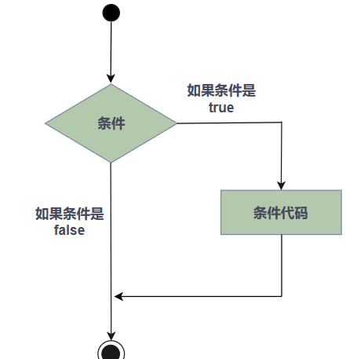

>C 中的 if 语句
实例
```C
#include <stdio.h>
 
int main ()
{
   /* 局部变量定义 */
   int a = 10;
 
   /* 使用 if 语句检查布尔条件 */
   if( a < 20 )
   {
       /* 如果条件为真，则输出下面的语句 */
       printf("a 小于 20\n" );
   }
   printf("a 的值是 %d\n", a);
 
   return 0;
}
```
>当上面的代码被编译和执行时，它会产生下列结果：
- a 小于 20
- a 的值是 10


##### 2.6.2.1 if...else 语句
一个 if 语句 后可跟一个可选的 else 语句，else 语句在布尔表达式为 false 时执行。

>语法
>C 语言中 if...else 语句的语法：
```C
if(boolean_expression)
{
   /* 如果布尔表达式为真将执行的语句 */
}
else
{
   /* 如果布尔表达式为假将执行的语句 */
}
```
如果布尔表达式为 true，则执行 if 块内的代码。如果布尔表达式为 false，则执行 else 块内的代码。

C 语言把任何非零和非空的值假定为 true，把零或 null 假定为 false。

流程图

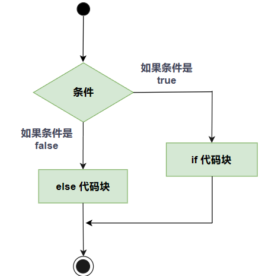

>C 中的 if...else 语句
实例
```C
#include <stdio.h>
 
int main ()
{
   /* 局部变量定义 */
   int a = 100;
 
   /* 检查布尔条件 */
   if( a < 20 )
   {
       /* 如果条件为真，则输出下面的语句 */
       printf("a 小于 20\n" );
   }
   else
   {
       /* 如果条件为假，则输出下面的语句 */
       printf("a 大于 20\n" );
   }
   printf("a 的值是 %d\n", a);
 
   return 0;
}
```
>当上面的代码被编译和执行时，它会产生下列结果：

- a 大于 20
- a 的值是 100

>if...else if...else 语句
一个 if 语句后可跟一个可选的 else if...else 语句，这可用于测试多种条件。

当使用 if...else if...else 语句时，以下几点需要注意：

一个 if 后可跟零个或一个 else，else 必须在所有 else if 之后。
一个 if 后可跟零个或多个 else if，else if 必须在 else 之前。
一旦某个 else if 匹配成功，其他的 else if 或 else 将不会被测试。

>语法
>C 语言中的 if...else if...else 语句的语法：
```C
if(boolean_expression 1)
{
   /* 当布尔表达式 1 为真时执行 */
}
else if( boolean_expression 2)
{
   /* 当布尔表达式 2 为真时执行 */
}
else if( boolean_expression 3)
{
   /* 当布尔表达式 3 为真时执行 */
}
else 
{
   /* 当上面条件都不为真时执行 */
}
```
实例
```C
#include <stdio.h>
 
int main ()
{
   /* 局部变量定义 */
   int a = 100;
 
   /* 检查布尔条件 */
   if( a == 10 )
   {
       /* 如果 if 条件为真，则输出下面的语句 */
       printf("a 的值是 10\n" );
   }
   else if( a == 20 )
   {
       /* 如果 else if 条件为真，则输出下面的语句 */
       printf("a 的值是 20\n" );
   }
   else if( a == 30 )
   {
       /* 如果 else if 条件为真，则输出下面的语句 */
       printf("a 的值是 30\n" );
   }
   else
   {
       /* 如果上面条件都不为真，则输出下面的语句 */
       printf("没有匹配的值\n" );
   }
   printf("a 的准确值是 %d\n", a );
 
   return 0;
}
```
>当上面的代码被编译和执行时，它会产生下列结果：

- 没有匹配的值
- a 的准确值是 100

##### 2.6.2.2 嵌套 if 语句
在 C 语言中，嵌套 if-else 语句是合法的，这意味着您可以在一个 if 或 else if 语句内使用另一个 if 或 else if 语句。

>语法
C 语言中 嵌套 if 语句的语法：
```
if( boolean_expression 1)
{
   /* 当布尔表达式 1 为真时执行 */
   if(boolean_expression 2)
   {
      /* 当布尔表达式 2 为真时执行 */
   }
}
```
- 您可以嵌套 else if...else，方式与嵌套 if 语句相似。

实例
```C
#include <stdio.h>
 
int main ()
{
   /* 局部变量定义 */
   int a = 100;
   int b = 200;
 
   /* 检查布尔条件 */
   if( a == 100 )
   {
       /* 如果条件为真，则检查下面的条件 */
       if( b == 200 )
       {
          /* 如果条件为真，则输出下面的语句 */
          printf("a 的值是 100，且 b 的值是 200\n" );
       }
   }
   printf("a 的准确值是 %d\n", a );
   printf("b 的准确值是 %d\n", b );
 
   return 0;
}
```
>当上面的代码被编译和执行时，它会产生下列结果：

- a 的值是 100，且 b 的值是 200
- a 的准确值是 100
- b 的准确值是 200

##### 2.6.2.3 switch 语句
一个 switch 语句允许测试一个变量等于多个值时的情况。每个值称为一个 case，且被测试的变量会对每个 switch case 进行检查。

>语法
C 语言中 switch 语句的语法：
```C
switch(expression){
    case constant-expression  :
       statement(s);
       break; /* 可选的 */
    case constant-expression  :
       statement(s);
       break; /* 可选的 */
  
    /* 您可以有任意数量的 case 语句 */
    default : /* 可选的 */
       statement(s);
}
```
switch 语句必须遵循下面的规则：

switch 语句中的 expression 是一个常量表达式，必须是一个整型或枚举类型。
在一个 switch 中可以有任意数量的 case 语句。每个 case 后跟一个要比较的值和一个冒号。
case 的 constant-expression 必须与 switch 中的变量具有相同的数据类型，且必须是一个常量或字面量。
当被测试的变量等于 case 中的常量时，case 后跟的语句将被执行，直到遇到 break 语句为止。
当遇到 break 语句时，switch 终止，控制流将跳转到 switch 语句后的下一行。
不是每一个 case 都需要包含 break。如果 case 语句不包含 break，控制流将会 继续 后续的 case，直到遇到 break 为止。
一个 switch 语句可以有一个可选的 default case，出现在 switch 的结尾。default case 可用于在上面所有 case 都不为真时执行一个任务。default case 中的 break 语句不是必需的。

>流程图

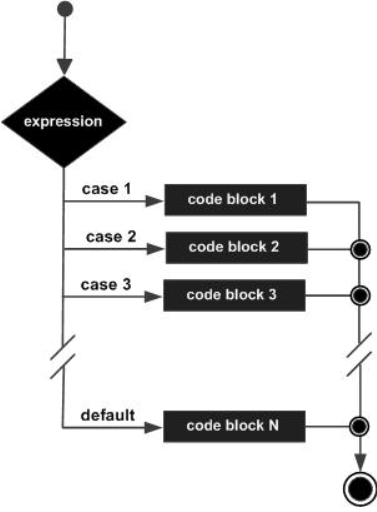

>C 中的 switch 语句
实例
```C
#include <stdio.h>
 
int main ()
{
   /* 局部变量定义 */
   char grade = 'B';
 
   switch(grade)
   {
   case 'A' :
      printf("很棒！\n" );
      break;
   case 'B' :
   case 'C' :
      printf("做得好\n" );
      break;
   case 'D' :
      printf("您通过了\n" );
      break;
   case 'F' :
      printf("最好再试一下\n" );
      break;
   default :
      printf("无效的成绩\n" );
   }
   printf("您的成绩是 %c\n", grade );
 
   return 0;
}
```
>当上面的代码被编译和执行时，它会产生下列结果：
  - 做得好
  - 您的成绩是 B

##### 2.6.2.4 嵌套 switch 语句
- 您可以把一个 switch 作为一个外部 switch 的语句序列的一部分，即可以在一个 switch 语句内使用另一个 switch 语句。即使内部和外部 switch 的 case 常量包含共同的值，也没有矛盾。

>语法
C 语言中 嵌套 switch 语句的语法：
```C
switch(ch1) {
   case 'A': 
      printf("这个 A 是外部 switch 的一部分" );
      switch(ch2) {
         case 'A':
            printf("这个 A 是内部 switch 的一部分" );
            break;
         case 'B': /* 内部 B case 代码 */
      }
      break;
   case 'B': /* 外部 B case 代码 */
}
```
实例
```C
#include <stdio.h>
 
int main ()
{
   /* 局部变量定义 */
   int a = 100;
   int b = 200;
 
   switch(a) {
      case 100: 
         printf("这是外部 switch 的一部分\n");
         switch(b) {
            case 200:
               printf("这是内部 switch 的一部分\n");
         }
   }
   printf("a 的准确值是 %d\n", a );
   printf("b 的准确值是 %d\n", b );
 
   return 0;
}
```
>当上面的代码被编译和执行时，它会产生下列结果：
  - 这是外部 switch 的一部分
  - 这是内部 switch 的一部分
  - a 的准确值是 100
  - b 的准确值是 200

##### 2.6.3 循环
有的时候，我们可能需要多次执行同一块代码。一般情况下，语句是按顺序执行的：函数中的第一个语句先执行，接着是第二个语句，依此类推。

编程语言提供了更为复杂执行路径的多种控制结构。

循环语句允许我们多次执行一个语句或语句组，下面是大多数编程语言中循环语句的
流程图：

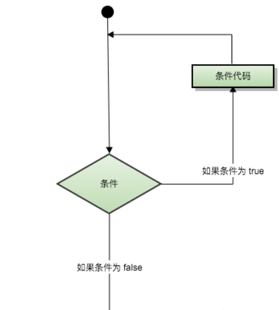

##### 2.6.3.1 循环类型
C 语言提供了以下几种循环类型。点击链接查看每个类型的细节。

|循环类型	|描述|
|----------|----|
|while 循环	|当给定条件为真时，重复语句或语句组。它会在执行循环主体之前测试条件。|
|for 循环	|多次执行一个语句序列，简化管理循环变量的代码。|
|do...while 循环	|除了它是在循环主体结尾测试条件外，其他与 while 语句类似。|
|嵌套循环	|您可以在 while、for 或 do..while 循环内使用一个或多个循环。|

##### 2.6.3.1.1 while 循环
只要给定的条件为真，C 语言中的 while 循环语句会重复执行一个目标语句。

>语法

C 语言中 while 循环的语法：
```C
while(condition)
{
   statement(s);
}
```
在这里，statement(s) 可以是一个单独的语句，也可以是几个语句组成的代码块。

condition 可以是任意的表达式，当为任意非零值时都为 true。当条件为 true 时执行循环。 当条件为 false 时，退出循环，程序流将继续执行紧接着循环的下一条语句。

>流程图


C 中的 while 循环
在这里，while 循环的关键点是循环可能一次都不会执行。当条件为 false 时，会跳过循环主体，直接执行紧接着 while 循环的下一条语句。

实例
```C
#include <stdio.h>
 
int main ()
{
   /* 局部变量定义 */
   int a = 10;

   /* while 循环执行 */
   while( a < 20 )
   {
      printf("a 的值： %d\n", a);
      a++;
   }
 
   return 0;
}
```
>当上面的代码被编译和执行时，它会产生下列结果：

  - a 的值： 10
  - a 的值： 11
  - a 的值： 12
  - a 的值： 13
  - a 的值： 14
  - a 的值： 15
  - a 的值： 16
  - a 的值： 17
  - a 的值： 18
  - a 的值： 19

##### 2.6.3.1.2 for 循环
for 循环允许您编写一个执行指定次数的循环控制结构。

语法
C 语言中 for 循环的语法：
```C
for ( init; condition; increment )
{
   statement(s);
}
```

- 下面是 for 循环的控制流：
  - init 会首先被执行，且只会执行一次。这一步允许您声明并初始化任何循环控制变量。您也可以不在这里写任何语句，只要有一个分号出现即可。
  - 接下来，会判断 condition。如果为真，则执行循环主体。如果为假，则不执行循环主体，且控制流会跳转到紧接着 for 循环的下一条语句。
  - 在执行完 for 循环主体后，控制流会跳回上面的 increment 语句。该语句允许您更新循环控制变量。该语句可以留空，只要在条件后有一个分号出现即可。
  - 条件再次被判断。如果为真，则执行循环，这个过程会不断重复（循环主体，然后增加步值，再然后重新判断条件）。在条件变为假时，for 循环终止。

流程图

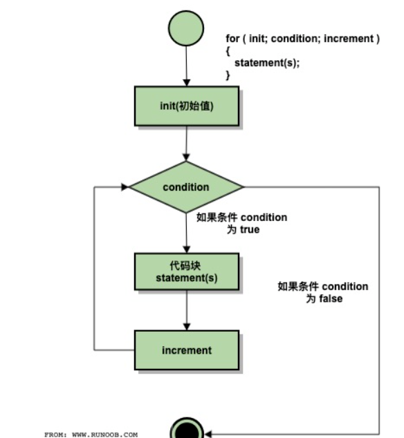

C 中的 for 循环
实例
```C
#include <stdio.h>
 
int main ()
{
   /* for 循环执行 */
   for( int a = 10; a < 20; a = a + 1 )
   {
      printf("a 的值： %d\n", a);
   }
 
   return 0;
}
```
>当上面的代码被编译和执行时，它会产生下列结果：
  - a 的值： 10
  - a 的值： 11
  - a 的值： 12
  - a 的值： 13
  - a 的值： 14
  - a 的值： 15
  - a 的值： 16
  - a 的值： 17
  - a 的值： 18
  - a 的值： 19

##### 2.6.3.1.3 do...while 循环
不像 for 和 while 循环，它们是在循环头部测试循环条件。在 C 语言中，do...while 循环是在循环的尾部检查它的条件。

- do...while 循环与 while 循环类似，但是 do...while 循环会确保至少执行一次循环。

语法
C 语言中 do...while 循环的语法：
```C
do
{
   statement(s);

}while( condition );
```
请注意，条件表达式出现在循环的尾部，所以循环中的 statement(s) 会在条件被测试之前至少执行一次。

如果条件为真，控制流会跳转回上面的 do，然后重新执行循环中的 statement(s)。这个过程会不断重复，直到给定条件变为假为止。

流程图

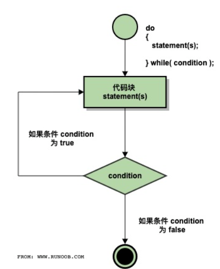
C 中的 do...while 循环
实例
```C
#include <stdio.h>
 
int main ()
{
   /* 局部变量定义 */
   int a = 10;

   /* do 循环执行，在条件被测试之前至少执行一次 */
   do
   {
       printf("a 的值： %d\n", a);
       a = a + 1;
   }while( a < 20 );
 
   return 0;
}
```
>当上面的代码被编译和执行时，它会产生下列结果：

  - a 的值： 10
  - a 的值： 11
  - a 的值： 12
  - a 的值： 13
  - a 的值： 14
  - a 的值： 15
  - a 的值： 16
  - a 的值： 17
  - a 的值： 18
  - a 的值： 19

##### 2.6.3.1.4 嵌套循环

C 语言允许在一个循环内使用另一个循环，下面演示几个实例来说明这个概念。

语法
C 语言中 嵌套 for 循环 语句的语法：
```C
for (initialization; condition; increment/decrement)
{
    statement(s);
    for (initialization; condition; increment/decrement)
    {
        statement(s);
        ... ... ...
    }
    ... ... ...
}
```
流程图：
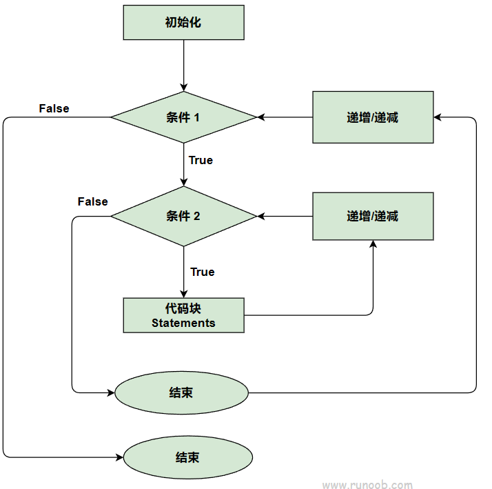


C 语言中 嵌套 while 循环 语句的语法：
```C
while (condition1)
{
    statement(s);
    while (condition2)
    {
        statement(s);
        ... ... ...
    }
    ... ... ...
}
```
流程图：

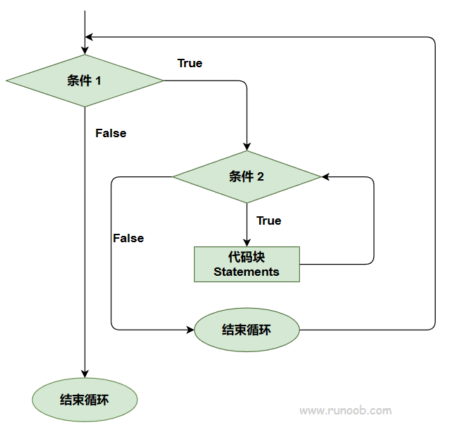


C 语言中 嵌套 do...while 循环 语句的语法：
```C
do
{
    statement(s);
    do
    {
        statement(s);
        ... ... ...
    }while (condition2);
    ... ... ...
}while (condition1);
```
流程图：
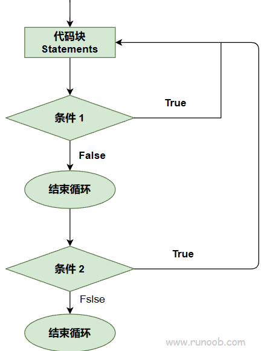


关于嵌套循环有一点值得注意，您可以在任何类型的循环内嵌套其他任何类型的循环。比如，一个 for 循环可以嵌套在一个 while 循环内，反之亦然。

实例
下面的程序使用了一个嵌套的 for 循环来查找 2 到 100 中的质数：

>for 嵌套实例
```C
#include <stdio.h>
 
int main ()
{
   /* 局部变量定义 */
   int i, j;
   
   for(i=2; i<100; i++) {
      for(j=2; j <= (i/j); j++)
        if(!(i%j)) break; // 如果找到，则不是质数
      if(j > (i/j)) printf("%d 是质数\n", i);
   }
 
   return 0;
}
```
>当上面的代码被编译和执行时，它会产生下列结果：

- 2 是质数
- 3 是质数
- 5 是质数
- 7 是质数
- 11 是质数
- 13 是质数
- 17 是质数
- 19 是质数
- 23 是质数
- 29 是质数
- 31 是质数
- 37 是质数
- 41 是质数
- 43 是质数
- 47 是质数
- 53 是质数
- 59 是质数
- 61 是质数
- 67 是质数
- 71 是质数
- 73 是质数
- 79 是质数
- 83 是质数
- 89 是质数
- 97 是质数

>while 嵌套实例
```C
#include <stdio.h>
int main()
{
    int i=1,j;
    while (i <= 5)
    {
        j=1;
        while (j <= i )
        {
            printf("%d ",j);
            j++;
        }
        printf("\n");
        i++;
    }
    return 0;
}
```
>当上面的代码被编译和执行时，它会产生下列结果：

        1
        1 2
        1 2 3
        1 2 3 4
        1 2 3 4 5

> do-while 嵌套实例
```C
#include <stdio.h>
int main()
{
    int i=1,j;
    do
    {
        j=1;
        do
        {
            printf("*");
            j++;
        }while(j <= i);
        i++;
        printf("\n");
    }while(i <= 5);
    return 0;
}
```
>当上面的代码被编译和执行时，它会产生下列结果：

        *
        **
        ***
        ****
        *****


##### 2.6.3.2 循环控制语句
循环控制语句改变你代码的执行顺序。通过它你可以实现代码的跳转。

C 提供了下列的循环控制语句。点击链接查看每个语句的细节。

|控制语句	|描述|
|----------|----|
|break 语句	|终止循环或 switch 语句，程序流将继续执行紧接着循环或 switch 的下一条语句。|
|continue 语句	|告诉一个循环体立刻停止本次循环迭代，重新开始下次循环迭代。|
|goto 语句	|将控制转移到被标记的语句。但是不建议在程序中使用 goto 语句。|

##### 2.6.3.2.1 break 语句
C 语言中 break 语句有以下两种用法：

当 break 语句出现在一个循环内时，循环会立即终止，且程序流将继续执行紧接着循环的下一条语句。
它可用于终止 switch 语句中的一个 case。
如果您使用的是嵌套循环（即一个循环内嵌套另一个循环），break 语句会停止执行最内层的循环，然后开始执行该块之后的下一行代码。

语法
C 语言中 break 语句的语法：
```C
break;
```
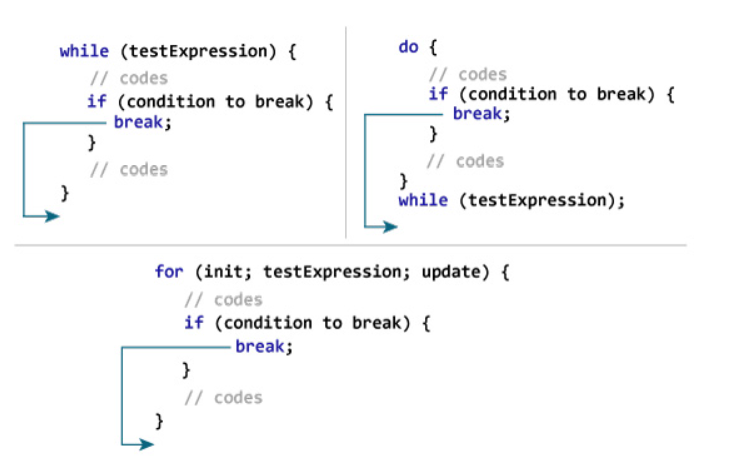

流程图

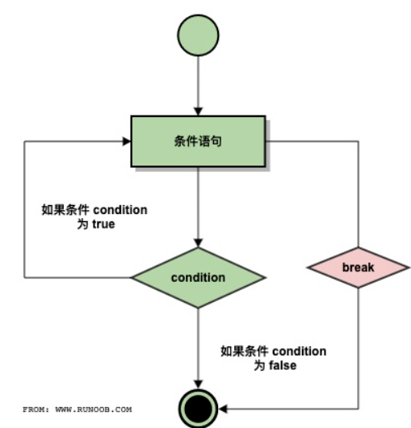

实例
```C
#include <stdio.h>
 
int main ()
{
   /* 局部变量定义 */
   int a = 10;

   /* while 循环执行 */
   while( a < 20 )
   {
      printf("a 的值： %d\n", a);
      a++;
      if( a > 15)
      {
         /* 使用 break 语句终止循环 */
          break;
      }
   }
 
   return 0;
}
```
>当上面的代码被编译和执行时，它会产生下列结果：

  - a 的值： 10
  - a 的值： 11
  - a 的值： 12
  - a 的值： 13
  - a 的值： 14
  - a 的值： 15

##### 2.6.3.2.2 continue 语句
C 语言中的 continue 语句有点像 break 语句。但它不是强制终止，continue 会跳过当前循环中的代码，强迫开始下一次循环。

对于 for 循环，continue 语句执行后自增语句仍然会执行。对于 while 和 do...while 循环，continue 语句重新执行条件判断语句。

语法
C 语言中 continue 语句的语法：
```C
continue;
```
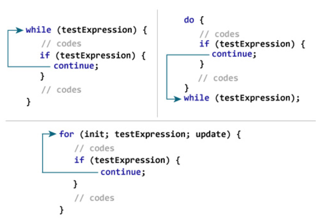

流程图

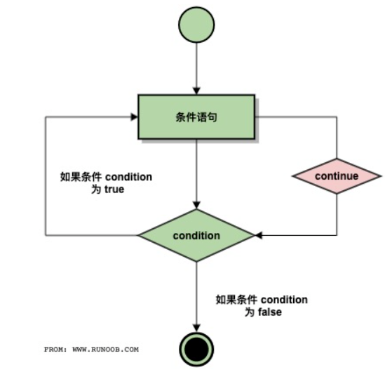

实例
```C
#include <stdio.h>
 
int main ()
{
   /* 局部变量定义 */
   int a = 10;

   /* do 循环执行 */
   do
   {
      if( a == 15)
      {
         /* 跳过迭代 */
         a = a + 1;
         continue;
      }
      printf("a 的值： %d\n", a);
      a++;
     
   }while( a < 20 );
 
   return 0;
}
```
>当上面的代码被编译和执行时，它会产生下列结果：
  - a 的值： 10
  - a 的值： 11
  - a 的值： 12
  - a 的值： 13
  - a 的值： 14
  - a 的值： 16
  - a 的值： 17
  - a 的值： 18
  - a 的值： 19

##### 2.6.3.2.3 goto 语句
C 语言中的 goto 语句允许把控制无条件转移到同一函数内的被标记的语句。

注意：在任何编程语言中，都不建议使用 goto 语句。因为它使得程序的控制流难以跟踪，使程序难以理解和难以修改。任何使用 goto 语句的程序可以改写成不需要使用 goto 语句的写法。

语法
C 语言中 goto 语句的语法：
```C
goto label;
..
.
label: statement;
```
在这里，label 可以是任何除 C 关键字以外的纯文本，它可以设置在 C 程序中 goto 语句的前面或者后面。
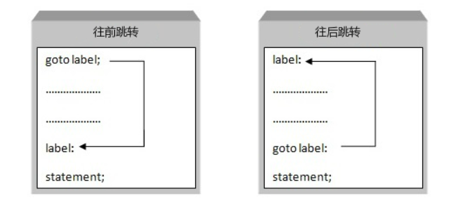


流程图


实例
```C
#include <stdio.h>
 
int main ()
{
   /* 局部变量定义 */
   int a = 10;
 
   /* do 循环执行 */
   LOOP:do
   {
      if( a == 15)
      {
         /* 跳过迭代 */
         a = a + 1;
         goto LOOP;
      }
      printf("a 的值： %d\n", a);
      a++;
     
   }while( a < 20 );
 
   return 0;
}
```
>当上面的代码被编译和执行时，它会产生下列结果：

- a 的值： 10
- a 的值： 11
- a 的值： 12
- a 的值： 13
- a 的值： 14
- a 的值： 16
- a 的值： 17
- a 的值： 18
- a 的值： 19


##### 2.6.3.3 无限循环
如果条件永远不为假，则循环将变成无限循环。for 循环在传统意义上可用于实现无限循环。由于构成循环的三个表达式中任何一个都不是必需的，您可以将某些条件表达式留空来构成一个无限循环。

实例

```C
#include <stdio.h>
 
int main ()
{
   for( ; ; )
   {
      printf("该循环会永远执行下去！\n");
   }
   return 0;
}
```
当条件表达式不存在时，它被假设为真。您也可以设置一个初始值和增量表达式，但是一般情况下，C 程序员偏向于使用 for(;;) 结构来表示一个无限循环。

注意：您可以按 Ctrl + C 键终止一个无限循环。


### 2.7 函数指针与回调函数
##### 2.7.1 函数指针
函数指针是指向函数的指针变量。

通常我们说的指针变量是指向一个整型、字符型或数组等变量，而函数指针是指向函数。

函数指针可以像一般函数一样，用于调用函数、传递参数。

函数指针类型的声明：

typedef int (*fun_ptr)(int,int); // 声明一个指向同样参数、返回值的函数指针类型
实例
以下实例声明了函数指针变量 p，指向函数 max：

实例
#include <stdio.h>
 
int max(int x, int y)
{
    return x > y ? x : y;
}
 
int main(void)
{
    /* p 是函数指针 */
    int (* p)(int, int) = & max; // &可以省略
    int a, b, c, d;
 
    printf("请输入三个数字:");
    scanf("%d %d %d", & a, & b, & c);
 
    /* 与直接调用函数等价，d = max(max(a, b), c) */
    d = p(p(a, b), c); 
 
    printf("最大的数字是: %d\n", d);
 
    return 0;
}
编译执行，输出结果如下：

请输入三个数字:1 2 3
最大的数字是: 3
回调函数
函数指针作为某个函数的参数
函数指针变量可以作为某个函数的参数来使用的，回调函数就是一个通过函数指针调用的函数。

简单讲：回调函数是由别人的函数执行时调用你实现的函数。

以下是来自知乎作者常溪玲的解说：

你到一个商店买东西，刚好你要的东西没有货，于是你在店员那里留下了你的电话，过了几天店里有货了，店员就打了你的电话，然后你接到电话后就到店里去取了货。在这个例子里，你的电话号码就叫回调函数，你把电话留给店员就叫登记回调函数，店里后来有货了叫做触发了回调关联的事件，店员给你打电话叫做调用回调函数，你到店里去取货叫做响应回调事件。

实例
实例中 populate_array() 函数定义了三个参数，其中第三个参数是函数的指针，通过该函数来设置数组的值。

实例中我们定义了回调函数 getNextRandomValue()，它返回一个随机值，它作为一个函数指针传递给 populate_array() 函数。

populate_array() 将调用 10 次回调函数，并将回调函数的返回值赋值给数组。

实例
#include <stdlib.h>  
#include <stdio.h>
 
void populate_array(int *array, size_t arraySize, int (*getNextValue)(void))
{
    for (size_t i=0; i<arraySize; i++)
        array[i] = getNextValue();
}
 
// 获取随机值
int getNextRandomValue(void)
{
    return rand();
}
 
int main(void)
{
    int myarray[10];
    /* getNextRandomValue 不能加括号，否则无法编译，因为加上括号之后相当于传入此参数时传入了 int , 而不是函数指针*/
    populate_array(myarray, 10, getNextRandomValue);
    for(int i = 0; i < 10; i++) {
        printf("%d ", myarray[i]);
    }
    printf("\n");
    return 0;
}
编译执行，输出结果如下：

16807 282475249 1622650073 984943658 1144108930 470211272 101027544 1457850878 1458777923 2007237709 

## 3致谢
本文参考了菜鸟教程以及部分大佬文档仅供学习
