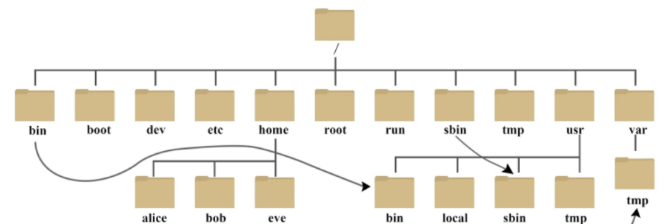
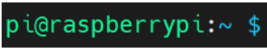
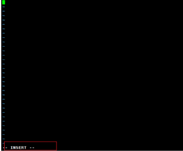
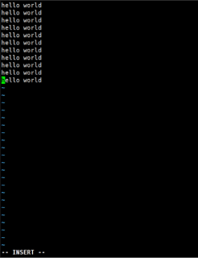
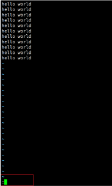
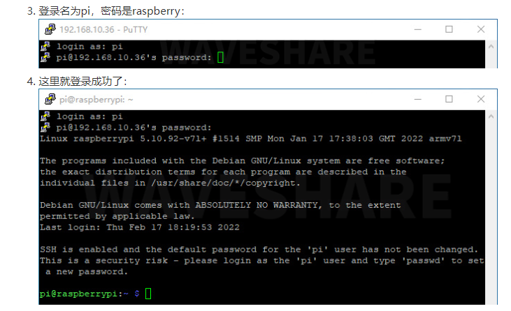
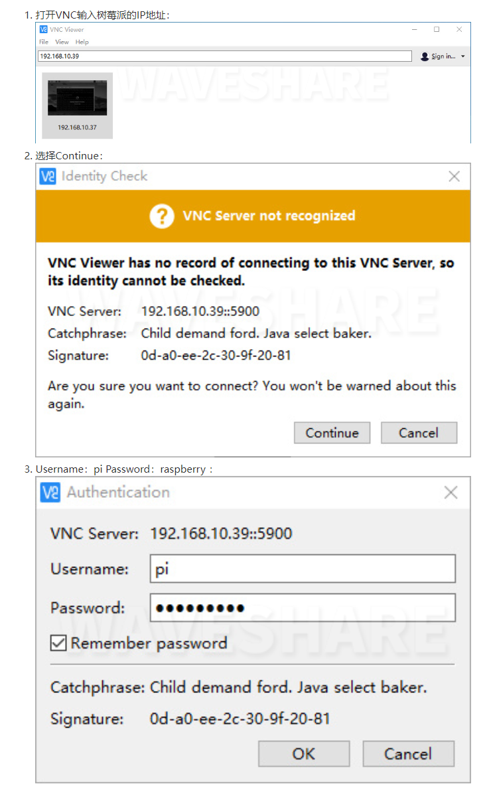
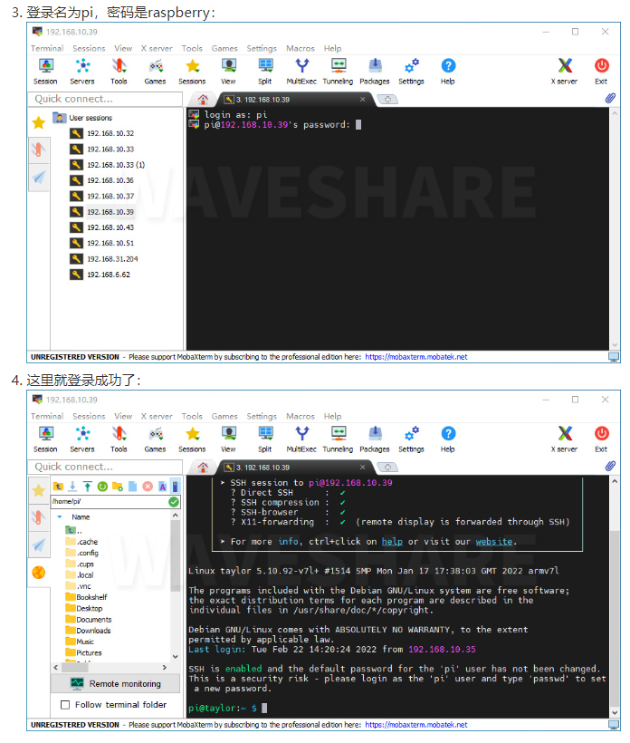

                                                                  HZMI-赫兹矩阵创新实验室
# Linux基础教学

## 1 简介

### 1.1 什么是Linux
- 历史背景
    - Linux的创始人是林纳斯·托瓦兹，一个芬兰的计算机科学家。在1991年，当时还是赫尔辛基大学学生的托瓦兹开始编写自己的操作系统内核，他的目标是创建一个基于Minix（一个小型的UNIX系统）的免费和开放源代码的操作系统。Linux最初是作为一个个人项目开始的，但很快吸引了全球范围内的开发者和用户的兴趣。

- 核心组件
    - 内核（Kernel）：Linux内核是操作系统的心脏，负责处理系统的核心功能，如进程管理、内存管理、设备驱动程序、文件系统和网络功能。它作为硬件和应用程序之间的桥梁。
    - 系统库（System Libraries）：这些特殊的函数或程序使用内核的功能，并提供应用程序开发人员不必重复编写的代码。
    - 系统工具（System Tools）：这些是完成系统管理和配置的程序和实用程序。

- 发行版
    - Linux发行版将Linux内核与一套软件和应用程序捆绑在一起，提供给用户一个完整的操作系统。每个发行版可能针对特定的用户群体，如企业用户、桌面用户或嵌入式系统开发者。不同的发行版提供不同的软件包管理系统、桌面环境（如GNOME、KDE、XFCE）和默认应用程序。

- 特点
    - 开放源代码：Linux的源代码可以被任何人自由查看、修改和分发。这鼓励了社区参与和软件创新。
    - 多用户、多任务：Linux支持多用户登录和同时运行多个任务。
    - 安全性：Linux提供了许多内置的安全机制，如SELinux，以及广泛的网络协议支持，使其成为服务器和关键任务应用的理想选择。
    - 可定制性：用户可以根据需要定制操作系统，包括内核的重新编译以优化特定硬件。
    - 免费和社区支持：大多数Linux发行版是免费提供的。强大的社区支持和大量的文档可以帮助解决问题和改进系统。

- 应用领域
    - Linux广泛应用于各个领域，包括：

        - 服务器和超级计算机：大多数互联网服务器和世界上最快的超级计算机运行Linux。
        - 桌面系统：虽然桌面市场占有率较小，但Linux仍然是许多技术爱好者和专业用户的首选。
        - 嵌入式系统：Linux在智能手机（如Android）、家用电器、汽车信息娱乐系统等嵌入式系统中广泛使用。
        - 云计算：Linux是大多数云服务提供商的首选操作系统，包括Amazon Web Services、Google Cloud Platform和Microsoft Azure。
        - Linux的成功在很大程度上归功于其开源模型，这促进了一个全球性的开发者社区的形成，他们不断地改进和增强操作系统的功能。随着技术的发展，Linux继续在新的领域扩展其影响力，成为计算技术不可或缺的一部分

### 1.2 Linux与其他操作系统如(Windows)的区别
- 开源VS闭源：Linux是开源的系统，其内核和大部分的软件的代码都是公开的，任何人都可以进行修改、查看。而windows操作系统则是闭源的商业操作系统，其源代码是不公开的，只有微软公司才能够进行修改等操作。
- 发行模式：Linux以发行版的形式进行发布，如Ubuntu、CentOS等，每个发行版都有自己的特点和目标用户群，而windows则是以单一的官方版本进行发布的，只不过是用户可以选择自己想要的版本，如windows10，windows11等。
- 用户界面：windows操作系统采用的图形化界面作为主要的交互方式，提供了直观的操作和良好的用户体验，Linux也提供了多种桌面的环境，但是Linux在图形化方面，还是比windows要落后一点。
应用程序和兼容性：Windows拥有庞大的应用程序生态系统，有许多商业软件和游戏专门为Windows开发。而Linux虽然也有许多优秀的开源和免费软件，但在商业软件和某些特定应用领域的支持上相对较少。此外，Windows在硬件和驱动程序的兼容性方面较为广泛，因为大多数硬件供应商更倾向于为Windows提供驱动程序。
- 安全性和稳定性：由于开源性质，Linux操作系统受到广泛的审查和贡献，具有良好的安全性和稳定性。相比之下，Windows由于其广泛的用户群和闭源性质，更常受到恶意软件的攻击，并可能面临一些安全和稳定性挑战。
- 部署和管理：Linux在服务器领域广泛应用，因其稳定性和灵活性。它通常被认为更适合于技术专业人员和系统管理员，需要一些命令行操作和配置知识。而Windows在桌面和家庭用户领域占据主导地位，提供了更简化和易用的界面和工具。
总体而言，Windows和Linux是两种不同的操作系统，各自有其优点和适用场景。选择哪个操作系统取决于用户的需求、技术背景和使用场景。


### 2.1 Linux目录结构
- 在Windows中每一个分区都是一个树形结构，有多少个分区就有多少个树形结构，而Linux中只有一个树形结构，所有的文件、分区都是存在于一个树形结构中。在这个结构中,最上层的是根目录，其他所有的目录、文件、分区都是在根目录下建立的。读者可以通过ls /命令来查看整个根目录的文档,如图所示。

- 在Linux的目录结构中，没有盘符的概念，有的只是一个根目录 / ，在根目录下存放的就是一些具体的文件，在Linux中，会把一些硬件设备给抽象成文件的形式存放在硬盘上，于是在Linux系统中有这样的一句话，一切皆文件.

#### 2.1.1 常用目录
- /home：用户目录。
除了root用户外，其他所有的使用者的数据都存放在这个目录下，在树莓派的系统中，/home目录中有一个pi的子目录,这个就是pi用户的默认目录。

- /bin： 主要放置系统的必备执行文件目录。
放置与Linux系统有关(包括运行图形界面所需的)的二进制可执行文件,如ls、mkdir、rm等。

- /boot：引导目录。
用于存放系统引导程序，如linux内核以及启动配置文件，里面的config.txt也是用户配置使用频率最高的文件。

- /etc： 系统配置文件存放目录。
在这个目录中存放了几乎所有的Linux系统软件所需的配置文件，如果需要对这个目录中的文本进行修改,那么最好是先将需要修改的文件进行备份，以保证在修改之后还可以回到原来的状态。

#### 2.1.2 其它目录
- /dev ：设备目录。在Linux系统中，所有设备都视为文件，而在这个目录中存放了所有设备，例如第一个SATA硬盘或U盘会被识别为sda文件，而SATA硬盘或U盘第一个分区会被识别为sda1文件。
 
- /lib：基本系统的动态链接库存放位置，在这个目录中存放了可以维持一个基本系统启动所需要的库文件。如果没有这个目录，系统程序根本就无法工作。
  
- /lost + found/分区系统的目录。系统非正常关机而产生的文件通常都存放在这里，另外由fsck等程序进行硬盘修复后产生的文件也存放在这里。
  
- /media：linux 系统会自动识别一些设备，例如U盘、光驱等等，当识别后，Linux会把识别的设备挂载到这个目录下。
  
- /mnt：传统的外部设备挂载点。在早期的时候，除了系统分区外的其他分 区，如U盘等设备，都会被挂载到这个目录下以供用户读写。不过现在已经被 /media/取代。
  
- /proc：proc是一个虚拟文件系统。这个目录是存放在内存中的，因此不会占用硬盘空间，系统或用户通过读取这些设备来了解它们的信息。例如，可以使用cat /proc/cpuinfo命令来査看CPU信息。
  
- /root：该目录为系统管理员，也称作超级权限者的用户主目录。
  
- /srv：该目录存放一些服务启动之后需要提取的数据。
  
- /sys：与/proc目录一样，也是一个虚拟目录，是由内核中的sysfs系统来实现的，其作用与proc有些类似，但除了与proc具有相同的查看和设定内核参数功能之外，还有为Linux统一设备模型作为管理之用。
  
- /tmp：临时目录。由程序所产生的临时文件都会存放在该目录下，不用担心这个目录会占用太多的空间，因为每次系统启动都会清除这个目录的内容；同时这也是系统为数不多的拥有所有用户可读写属性的目录。
  
- /usr：Linux系统所安装的程序都是存放在该目录中的，如非必要请不要修改这个目录的内容。类似于windows下的program files 目录。
  
- /usr/src：内核源代码默认的放置目录。
  
- /run：用于存放系统启动时描述系统信息的文件。这个目录最初是在/var/目录下的，但是现在被提升到根目录下。
  

#### 2.1.3 重要目录
- 在 Linux 系统中，有几个目录是比较重要的，平时需要注意不要误删除或者随意更改内部文件。
  
- /etc：这个是系统中的配置文件，如果你更改了该目录下的某个文件可能会导致系统不能启动。
  
- /bin, /sbin, /usr/bin, /usr/sbin: 这是系统预设的执行文件的放置目录，比如ls就是在/bin/ls目录下的。
  
- /bin, /usr/bin是给系统用户使用的指令（除root外的普通用户），而/sbin,/usr/sbin则是给root使用的指令。
  
- /var： 这是一个非常重要的目录，系统上跑了很多程序，那么每个程序都会有相应的日志产生，而这些日志就被记录到这个目录下，具体在/var/log目录下。
  
### 2.2 Linux终端
- 计算机上的终端允许用户对其系统进行大量控制。Windows的用户可能已经接触过Command Promptor Powershell，而mac OS的用户可能已经熟悉了Terminal。所有这些工具都允许用户通过使用命令直接操作他们的系统

- 由于早期并没有鼠标，所以Linux终端完全是由键盘和显示器完成工作的，这个做法一直沿用至今。可以使用键盘的Ctrl+Alt+t打开树莓派终端。
    - 以树莓派中linux系统终端为例 
    
    

- pi 当前用户名/登录名
- raspberrypi 主机名
- ~ 当前用户所在的目录是/home/pi
- "$" 字符表示当前登录的是普通用户啊
- "#" 字符表示登录的是root用户
- 在终端窗口中键入命令，然后按键盘上的回车键运行命令。
  

### 2.3 Linux命令提示符
- 文件系统
#### sudo
- sudo命令以系统管理者的身份执行指令。
- (以树莓派为例)
- 初次使用树莓派系统时，默认用户是pi ，密码为raspberry。
- 要想使用root帐号，或者说开启root用户，可使用pi用户登录，执行下面命令（此命令是给root账户设置密码的，当切换到root管理员后，此命令无效）

    ```bash
    sudo su  #切换为超级用户
    su pi    #切换普通用户
    ```
    
#### ls
- ls命令用于显示指定工作目录下之内容（列出目前工作目录所含之文件及子目录)。
    ```bash
    ls
    ls -a   #显示所有文件及目录 (. 开头的隐藏文件也会列出)
    ls -l   #除文件名称外，亦将文件型态、权限、拥有者、文件大小等资讯详细列出
    ls -lh  #文件大小以容易理解的格式列出
    ls -lah #全部列出
    ```
- 想要学习了解指令更多参数,可以使用help指令来查看：
    ```bash
    ls --help
    ```

#### chmod
- chmod命令是控制用户对文件的权限的命令。
- Linux/Unix 的文件调用权限分为三级 : 文件所有者（Owner）、用户组（Group）、其它用户（Other Users）。
- Linux的文件属性可以分为三种：只读（r）、写（w）和可执行（x）。但是上面的文件属性却分为10小格，这是因为除了第一格显示目录外，另外三组每组三格分别表示文件所有者权限、同一组内的权限以及其他用户权限。
    - 第一栏中如果显示d,则表示这是一个目录；如果是链接文件，则在这里显示l;如果是设备文件，则显示c。
    - 第一个rwx栏位:-rwx------ 表示文件拥有者所拥有的权限。
    - 第二个rwx栏位:---rwx--- 表示同一工作组内用户权限。
    - 第三个rwx栏位：------rwx 表示其他用户权限。
    - 例如：
    - -rwx rwx rwx 表示无论哪个用户都可以对这个文件读写与执行。
    - -rw- --- --- 表示只有文件拥有者有读写权限，但是没有执行权限。
    - -rw -rw -rw 表示所有用户都有读写权。 
    
- 符号模式
 
|who         |用户类型     |说明                  |
|------------|------------|----------------------|
|u	         |user	      |文件所有者             |
|g	         |group	      |文件所有者所在组        |
|o	         |others	  |所有其他用户           |
|a	         |all	      |所用用户, 相当于 ugo   |

- operator(符号模式表)
  
|Operator	|说明|
|-----------|--------|
|+	|为指定的用户类型增加权限|	
|-	|去除指定用户类型的权限	|
|=	|设置指定用户权限的设置，即将用户类型的所有权限重新设置|

- permission 的符号模式表
  
|模式	|名字	|说明|
|-------|----------------------|-------------|
|r	    |读	                    |设置为可读权限|
|w	    |写	                    |设置为可写权限|
|x	    |执行权限	           |设置为可执行权限|
|X	    |特殊执行权限	        |只有当文件为目录文件，或者其他类型的用户有可执行权限时，才将文件权限设置可执行|
|s	    |setuid/gid	            |当文件被执行时，根据who参数指定的用户类型设置文件的setuid或者setgid权限|
|t	    |粘贴位	                |设置粘贴位，只有超级用户可以设置该位，只有文件所有者u可以使用该位|

- 符号模式实例
    - 给file的所有用户增加读权限
    ```bash 
    chmod a+r file
    ```
    - 删除file的所有用户的执行权限
    ``` bash
    chmod a-x file
    ```
    - 给file的所有用户增加读写权限
    ```bash
    chmod a+rw file
    ```
    - 给file的所有用户增加读写执行权限
    ```bash
    chmod +rwx file 
    ```
    - 对file的所有者设置读写权限，清空该用户组和其他用户对file的所有权限（空格代表无权限）
    ```bash
    chmod u=rw,go= file
    ```
    - 对目录dir和其子目录层次结构中的所有文件给用户增加读权限，而对用户组和其他用户删除读权限
    ```bash
    chmod -R u+r,go-r dir
    ```

- 八进制语法
- chmod命令可以使用八进制数来指定权限。文件或目录的权限位是由9个权限位来控制，每三位为一组，它们分别是文件所有者（User）的读、写、执行，用户组（Group）的读、写、执行以及其它用户（Other）的读、写、执行。
  
|#	|权限	|rwx	|二进制|
|---|-------|-------|------|    
|7	|读 + 写 + 执行|	rwx|	111|
|6	|读 + 写	|rw-	|110|
|5	|读 + 执行	|r-x	|101|
|4	|只读	|r--	|100|
|3	|写 + 执行	|-wx	|011|
|2	|只写	|-w-	|010|
|1	|只执行	|--x	|001|
|0	|无	|---	|000|

- 例如：765的解释如下：
- 所有者的权限用数字表达：属主的那三个权限位的数字加起来的总和。如 rwx ，也就是 4+2+1 ，应该是 7。
- 用户组的权限用数字表达：属组的那个权限位数字的相加的总和。如 rw- ，也就是 4+2+0 ，应该是 6。
- 其它用户的权限数字表达：其它用户权限位的数字相加的总和。如 r-x ，也就是 4+0+1 ，应该是 5。
- 常用的数字权限
    ```bash
    400 -r-------- 拥有者能够读，其他任何人不能进行任何操作；
    ```
    ```bash
    644 -rw-r–r-- 拥有者都能够读，但只有拥有者可以编辑；
    ```
    ```bash
    660 -rw-rw---- 拥有者和组用户都可读和写，其他人不能进行任何操作；
    ```
    ```bash
    664 -rw-rw-r-- 所有人都可读，但只有拥有者和组用户可编辑；
    ```
    ```bash
    700 -rwx------ 拥有者能够读、写和执行，其他用户不能任何操作；
    ```
    ```bash
    744 -rwxr–r-- 所有人都能读，但只有拥有者才能编辑和执行；
    ```
    ```bash
    755 -rwxr-xr-x 所有人都能读和执行，但只有拥有者才能编辑；
    ```
    ```bash
    777 -rwxrwxrwx 所有人都能读、写和执行（该设置不建议使用）。
    ```
- 实例
- 给file的所有用户增加读权限,拥有者和组用户可编辑权限
    ```bash
    sudo chmod 777 file
    #自己开发中一般给满777即可
    ```

#### mkdir
- mkdir命令用于创建目录。
- 语法
    ```bash
    mkdir [-p] dirName
    #-p 确保目录名称存在，不存在的就建一个。
    ```
- 实例
- 在工作目录下，建立一个名为binbin的子目录:
    ```bash
    sudo mkdir binbin
    ```
- 在工作目录下的binbin目录中，建立一个名为test的子目录。
    ```bash
    sudo mkdir -p binbin/test
    若binbin目录原本不存在，则建立一个。（注：本例若不加 -p 参数，且原本 binbin 目录不存在，则产生错误。
    ```

#### cd
- 切换当前工作目录。cd命令是最常用的Linux命令之一，用于切换用户当前的工作目录。如果需要快速回到登录用户的家目录，可以直接使用不带参数的cd命令来返回。
- 语法:
```bash
cd [dirName]
#dirName：要切换的目标目录。
```
```bash
cd..    返回上一层目录
cd /home  进入/home目录
cd        返回用户目录
```

#### touch
- touch命令用于修改文件或者目录的时间属性，包括存取时间和更改时间。若文件不存在，系统会建立一个新的文件。
    - 使用指令"touch"时，如果指定的文件不存在，则将创建一个新的空白文件。例如，在当前目录下，使用该指令创建一个空白文件"file"，输入如下命令：
    ```bash
    sudo touch file
    ```

#### cp
- cp命令主要用于复制文件或目录。
- 语法:
    ```bash
    cp [options] source dest
    #或
    cp [options] source... directory
    ```
- 参数:
    - -a：此选项通常在复制目录时使用，它保留链接、文件属性，并复制目录下的所有内容。其作用等于dpR参数组合。
    - -d：复制时保留链接。这里所说的链接相当于 Windows 系统中的快捷方式。
    - -f：覆盖已经存在的目标文件而不给出提示。
    - -i：与 -f 选项相反，在覆盖目标文件之前给出提示，要求用户确认是否覆盖，回答y时目标文件将被覆盖。
    - -p：除复制文件的内容外，还把修改时间和访问权限也复制到新文件中。
    - -r：若给出的源文件是一个目录文件，此时将复制该目录下所有的子目录和文件。
    - -l：不复制文件，只是生成链接文件。
- 使用指令cp将当前目录test/下的所有文件复制到新目录 newtest 下，输入如下命令：
    ```bash
    sudo cp –r test/ newtest     
    ```

#### mv
- mv命令用来为文件或目录改名、或将文件或目录移入其它位置。
- 语法:
    ```bash
    mv [options] source dest
    mv [options] source... directory
    ```

- 参数:
    - -b: 当目标文件或目录存在时，在执行覆盖前，会为其创建一个备份。
    - -i: 如果指定移动的源目录或文件与目标的目录或文件同名，则会先询问是否覆盖旧文件，输入y表示直接覆盖，输入n表示取消该操作。
    - -f: 如果指定移动的源目录或文件与目标的目录或文件同名，不会询问，直接覆盖旧文件。
    - -n: 不要覆盖任何已存在的文件或目录。
    - -u：当源文件比目标文件新或者目标文件不存在时，才执行移动操作。
- 使用指令mv将当前目录test/下的file1文件复制到新目录/home/user下，输入如下命令：
    ```bash
    sudo mv file1 /home/user
    ```

#### rm
- rm命令用于删除一个文件或者目录。
- 语法:
  
    ```bash
    rm [options] name...
    ```

    - 参数:
    - -i 删除前逐一询问确认。
    - -f 即使原档案属性设为唯读，亦直接删除，无需逐一确认。
    - -r 将目录及以下之档案亦逐一删除。
    - 删除文件可以直接使用rm命令，若删除目录则必须配合选项"-r"，例如：
    ```bash
    sudo rm  test.txt 
    ```
    - rm：是否删除 一般文件 "test.txt"? y
    ```bash
    sudo rm  homework  
    ```
    - rm: 无法删除目录"homework": 是一个目录
    ```bash
    sudo rm  -r  homework  
    ```
    - rm：是否删除 目录 "homework"? y


#### reboot
- reboot命令用于用来重新启动计算机,更改树莓派的配置经常需要重启。
- 语法:
    ```bash
    reboot [-n] [-w] [-d] [-f] [-i]
    ```
    - 参数:
    - -n : 在重开机前不做将记忆体资料写回硬盘的动作
    - -w : 并不会真的重开机，只是把记录写到 /var/log/wtmp 档案里
    - -d : 不把记录写到 /var/log/wtmp 档案里（-n 这个参数包含了 -d）
    - -f : 强迫重开机，不呼叫 shutdown 这个指令
    - -i : 在重开机之前先把所有网络相关的装置先停止
    - 重新启动
    ```bash
    sudo reboot
    ```


#### shutdown
- 系统的关机是不能直接拔掉电源线的,因为系统会将内存作为暂存区,如果直接拔掉电源线会使一些在内存中的数据没有来得及写入SD卡中，从而造成数据的丢失或是损坏SD卡上的数据,造成系统无法启动。
- 语法
    ```bash
    shutdown [-t seconds] [-rkhncfF] time [message]
    ```
    - 参数
    - -t seconds : 设定在几秒钟之后进行关机程序。
    - -k : 并不会真的关机，只是将警告讯息传送给所有使用者。
    - -r : 关机后重新开机。
    - -h : 关机后停机。
    - -n : 不采用正常程序来关机，用强迫的方式杀掉所有执行中的程序后自行关机。
    - -c : 取消目前已经进行中的关机动作。
    - -f : 关机时，不做 fsck 动作(检查 Linux 档系统)。
    - -F : 关机时，强迫进行 fsck 动作。
    - time : 设定关机的时间。
    - message : 传送给所有使用者的警告讯息。
    - 实例
    ```bash
    #立即关机
    sudo shutdown -h now
    ```
    ```bash
    #指定 10 分钟后关机
    sudo shutdown -h 10
    ```
    ```bash
    #重新启动计算机
    sudo shutdown -r now
    #无论使用哪一个命令来关闭系统都需要root用户权限，如果用户使用user这样的普通用户，可以使用sudo命令暂时获得root权限。
    #

#### pwd
- 该pwd命令显示当前工作目录的名称：在终端上，输入pwd将输出类似/home/user.
    ```bash
    pwd
    #->/home/user/
    ```

#### head
- 该head命令显示文件的开头。可用于-n指定要显示的行数（默认为 10 行），或与-c指定字节数。
    ```bash
    head test.py -n 5    
    ```

#### tail
- 该tail显示文件的结尾。
- -c字节或-n行数指定文件中的起始点

#### df
- 用于df显示已安装文件系统上可用和使用的磁盘空间。用于df -h以可读的格式查看输出，使用 M 表示 MB，而不是显示字节数。
    ```bash
    df -h
    ```

#### zip
- zip命令用于压缩文件,zip 是个使用广泛的压缩程序，压缩后的文件后缀名为 .zip。
- 如果在我们在 /home/user/binbin 目录下，将这个目录下所有文件和文件夹打包为当前目录下的binbin.zip,可以执行以下命令：
    ```bash
    zip -q -r binbin.zip *
    ```

#### unzip
- unzip命令用于解压缩zip文件，unzip为.zip压缩文件的解压缩程序。
```bash
unzip binbin.zip -d user/
```

#### tar
- tar命令是用来建立，还原备份文件的工具程序，它可以加入，解开备份文件内的文件。
- 压缩文件：
```bash
tar -cvzf binbin.tar.gz *
```

- 解压文件：
```bash
tar -xvzf binbin.tar.gz 
```

#### tree
- 使用该tree命令将目录以及所有子目录和文件缩进为树结构。

#### wget
- 下载树莓派4数据表并将其另存为raspberry-pi-4-datasheet.pdf,使用
```bash
wget https://datasheets.raspberrypi.com/rpi4/raspberry-pi-4-datasheet.pdf 
```

#### curl
- Linux curl命令是一个利用URL规则在命令行下工作的文件传输工具。它支持文件的上传和下载，所以是综合传输工具，但按传统，习惯称curl为下载工具。作为一款强力工具，curl支持包括HTTP、HTTPS、ftp等众多协议，还支持POST、cookies、认证、从指定偏移处下载部分文件、用户代理字符串、限速、文件大小、进度条等特征。做网页处理流程和数据检索自动化，curl可以祝一臂之力。
- 语法:
    ```bash
    curl  (选项)  (参数)
    ```

- 参数:
- -A/--user-agent <string> 设置用户代理发送给服务器
- -b/--cookie <name=string/file> cookie字符串或文件读取位置
- -c/--cookie-jar <file> 操作结束后把cookie写入到这个文件中
- -C/--continue-at <offset> 断点续转
- -D/--dump-header <file> 把header信息写入到该文件中
- -e/--referer 来源网址
- -f/--fail 连接失败时不显示http错误
- -o/--output 把输出写到该文件中
- -O/--remote-name 把输出写到该文件中，保留远程文件的文件名
- -r/--range <range> 检索来自HTTP/1.1或FTP服务器字节范围
- -s/--silent 静音模式。不输出任何东西
- -T/--upload-file <file> 上传文件
- -u/--user <user[:password]> 设置服务器的用户和密码
- -w/--write-out [format] 什么输出完成后
- -x/--proxy <host[:port]> 在给定的端口上使用HTTP代理
- -#/--progress-bar 进度条显示当前的传送状态
- 基本用法： 
```bash
执行以下命令，www.binbin.net 的html就会显示在屏幕上:
curl http://www.binbin.net
#保存访问网页： 使用curl的内置option:-o(小写)保存网页，显示100%则表示保存成功：
curl -o binbin.html http://www.binbin.com
#使用curl的内置option:-O(大写)保存网页中的文件,要注意这里后面的url要具体到某个文件，不然抓不下来
curl -O http://www.binbin.com/hello.sh
#测试网页返回值
curl -o /dev/null -s -w %{http_code} www.binbin.com
利用curl下载文件:
#使用内置option：-o(小写)和内置option：-O（大写）
curl -o 1.png https://www.binbin.net/wiki/文件:Test-1111.png
curl -O https://www.binbin.net/wiki/文件:Test-1111.png
```

#### apt
- apt（Advanced Packaging Tool）是一个在 Debian 和 Ubuntu 中的 Shell 前端软件包管理器。
- apt 命令提供了查找、安装、升级、删除某一个、一组甚至全部软件包的命令，而且命令简洁而又好记。
- apt 命令执行需要超级管理员权限(root)。
- apt 常用命令
    - 列出所有可更新的软件清单命令：
    ```bash
    sudo apt update
    ```

    - 升级软件包：
    ```bash
    sudo apt upgrade
    ```

    - 列出可更新的软件包及版本信息：
    ```bash
    apt list --upgradeable
    ```
    - 升级软件包，升级前先删除需要更新软件包：
    ```bash
    sudo apt full-upgrade
    ```
    - 安装指定的软件命令：
    ```bash
    sudo apt install <package_name>
    ```
    - 安装多个软件包：
    ```bash
    sudo apt install <package_1> <package_2> <package_3>
    ```
    - 更新指定的软件命令：
    ```bash
    sudo apt update <package_name>
    ```
    - 显示软件包具体信息,例如：版本号，安装大小，依赖关系等等：
    ```bash
    sudo apt show <package_name>
    ```
    - 删除软件包命令：
    ```bash
    sudo apt remove <package_name>
    ```
    - 清理不再使用的依赖和库文件: 
    ```bash
    sudo apt autoremove
    ```
    - 移除软件包及配置文件: 
    ```bash
    sudo apt purge <package_name>
    ```
    - 查找软件包命令：
    ```bash
    sudo apt search <keyword>
    ```
    - 列出所有已安装的包：
    ```bash
    apt list --installed
    ```
    - 列出所有已安装的包的版本信息：
    ```bash
    apt list --all-versions
    ```


搜索
#### find
- Linux find 命令用来在指定目录下查找文件。任何位于参数之前的字符串都将被视为欲查找的目录名。如果使用该命令时，不设置任何参数，则 find 命令将在当前目录下查找子目录与文件。并且将查找到的子目录和文件全部进行显示。
    ```bash
    #通过文件名查找，例如我们查找binbin.py文件:

    find  -name binbin.py 
    ```

- 通过文件嵌套层数查找。
    ```bash
    #文件查找最大层数为1，找出的文件全部在/etc目录下，例如我们查找/etc目录下的.conf文件：
        find /etc/ -maxdepth 1 -name *.conf
    ```

    ```bash
    #文件查找最小层数为2，找出的文件不会包含/etc目录下文件，而是去/etc子目录查找。
    find /etc/ -mindepth 2 -name *.conf
    ```

- 将当前目录及其子目录下所有最近 20 天内更新过的文件列出:
    ```bash
    find . -ctime -20
    ```
- 查找/var/log目录中更改时间在7日以前的普通文件，并在删除之前询问它们：
    ```bash
    find /var/log -type f -mtime +7 -ok rm {} \;
    ```
- 查找当前目录中文件属主具有读、写权限，并且文件所属组的用户和其他用户具有读权限的文件：
    ```bash
    find . -type f -perm 644 -exec ls -l {} \;
    ```
- 查找系统中所有文件长度为0的普通文件，并列出它们的完整路径：
    ```bash
    find / -type f -size 0 -exec ls -l {} \;
    ```
#### grep
- 用于grep在文件内部搜索某些搜索模式,可以列出包含特殊字母所有组合。
    ```bash
    ls | grep sys
    ```
#### cat
- 您可以使用cat列出文件的内容，例如cat thisFile将显示thisFile. 可用于列出多个文件的内容，即cat *.txt会列出.txt当前目录下所有文件的内容。
    ```bash
    cat test.txt
    ```

#### whereis
- 用于whereis查找命令的位置。它查看标准程序位置，直到找到请求的命令。
    ```bash
    whereis sudo
    ```

联网
#### ifconfig
- 用于在不带任何参数（即）ifconfig运行时显示当前系统上接口的网络配置详细信息。
- 用SSH连接时可以通过ifconfig查找IP地址

#### hostname
- 该hostname命令显示系统的当前主机名。我们使用树莓派等嵌入式电脑的时候经常需要使用远程工具，而默认的网络配置IP地址采用动态分配，会造成IP地址不确定的问题，当我们的IP地址发生变化时，可以使用主机名登录。

#### ping
- 该ping实用程序通常用于检查是否可以与另一台主机进行通信。它可以与默认设置一起使用，只需指定主机名或 IP 地址（例如ping 192.168.1.1）。-c它可以使用标志指定要发送的数据包数。
    ```bash
    ping 192.168.1.1
    ```

#### nmap
- nmap是一个网络探索和扫描工具。它可以返回有关主机或主机范围的端口和操作系统信息。运行nmap将显示可用的选项以及示例用法。
- 先让我们ping一段地址范围，找到在线主机：
    ```bash
    nmap -sP 192.168.10.1-255
    ```

#### scp   
- scp是用于通过SSH发送文件的命令，可以通过此命令来实现树莓派和Windows计算机之间的文件传输。
- (未完待续)

#### vim
- vim进行文件的编辑
- vim是Linux上自带的文本编辑器，相当于windows上的记事本。
- vim的基本使用
    - 打开文件
    - 编辑文件
    - 保存退出
-上述的三个vim的操作是最基本的使用。

- 1：打开文件 
    ```bash
    vim filename/filepath
    ```

    

    - 当我们执行了上述命令时，系统就是使用vim打开这个文件

    
    
    - 此时由于这个文件里面什么都没有，这里就是空白的。
  
- 2：编辑文件
    - 在进行文件的编辑之前，我们先要知道vim的三种模式。
    - *普通模式
    - *插入模式
    - *命令行模式
    - 我们当打开的文件的界面，就是普通模式。在这个模式下，我们是无法进行数据的插入的。
    - 要想进行数据的写入，必须切换成插入模式。
    - 要切换插入模式其实非常简单，只需要按键盘上的 i 键就好了。
  
    

    - 可以看出当我们按了i键之后，下面就变为install。此时就是插入模式，我们就可以进行数据的写入了

    

    - 此时当我们把数据写入之后，该保存退出了。
    - 想要保存退出，就需要进入到命令行模式。
    - 进入命令行模式其实也很简单，只需要按键盘上的esc键进行普通模式。然后再输入"："(冒号)
  
    
    - 现在就进入到命令行模式了。
    - 然后我们在输入wq。wq也就是写入退出的意思。然后这个文件就成功的写入，并保存了。
    - 然后此时我们在进行查看这个文件的内容：
    


### 2.4 Linux远程登录链接
#### SSH登录

#### PUTTY登录


#### VNC登录

#### MobaXterm登录




附下载链接：
[putty](https://www.waveshare.net/w/upload/5/56/Putty.zip)
[mobaxterm](https://www.waveshare.net/w/upload/c/c3/MobaXterm_Portable_v22.0.zip)
[VNC-viewer](https://www.waveshare.net/w/upload/4/4e/VNC-Viewer-6.21.1109-Windows.zip)

### 2.5致谢
本文参考了部分微雪电子的教案,chatgpt的帮助
