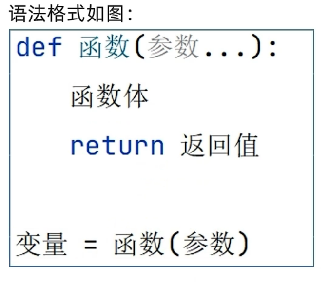

                                                                 HZMI-赫兹矩阵创新实验室
# python基础教学
## 1 python的介绍
### 1.1 python是什么
-
    - Python 是一种高级编程语言，由 Guido van Rossum 在 1989 年开始设计并在 1991 年首次发布。它以代码的可读性高和编写简洁明了的语法而著称，这使得它成为初学者和经验丰富的程序员都喜爱的语言。

    - Python 支持多种编程范式，包括面向对象、命令式、函数式和过程式编程。它具有一个庞大而活跃的社区，社区成员贡献了大量的第三方模块和库，覆盖了从网络开发到数据科学的各种应用。
    - 
### 1.2 python的特点介绍，为什么学习python？
-
    - Python 是一种高级编程语言,它强调代码的可读性和简洁性。Python 使用缩进来分隔代码块,而不是使用花括号或关键字。
    - Python 是一种动态类型语言,意味着你不需要提前声明变量的类型。Python 有几种基本的数据类型,如数字(整数、浮点数)、字符串、列表、元组和字典等。
    - Python 提供了大量的内置函数和模块,可以帮助你完成各种任务,如字符串操作、数学运算、文件读写等。你也可以通过 import 语句导入额外的模块来扩展 Python 的功能。
    - Python 支持面向对象编程(OOP),允许你定义类和对象。通过类,你可以封装数据和方法,并通过继承和多态等概念来组织和重用代码。
    - Python 有许多流行的第三方库和框架,如用于数据分析的 NumPy 和 Pandas,用于 Web 开发的 Django 和 Flask,以及用于机器学习的 TensorFlow 和 PyTorch 等。
    - Python 的应用领域非常广泛,包括 Web 开发、数据分析、机器学习、人工智能、科学计算、自动化脚本等。
    - Python 的学习资源非常丰富,你可以通过官方文档、在线教程、书籍、视频课程等方式来学习 Python。此外,Python 社区也非常活跃,你可以在论坛、博客和社交媒体上找到许多有用的信息和帮助。
  
### 1.3 python的常见用途
-
    - 网络和 web 开发
    - 科学计算和数据分析
    - 人工智能和机器学习
    - 脚本编写和自动化
    - 软件测试和原型开发

## 2 相关语法介绍
### 2.1 print()输出
- 在Python中，print()函数是用来输出信息到控制台的内置函数
#### 2.1.1 要点
- 输出文本：print()可以输出字符串和多种数据类型的表示形式。
- 多个参数：可以接受多个参数并默认用空格分隔它们。
- 分隔符：使用sep参数自定义参数间的分隔符。
- 结束字符：使用end参数自定义字符串的结尾，默认是换行符\n。
- 文件输出：使用file参数可以将输出重定向到一个文件或类文件对象。
- 刷新输出：flush参数决定输出是立即被刷新（True）还是缓冲（False）。
  
>示例
```python
# 基本输出
print("Hello, World!")

# 输出多个参数
print("The answer is", 42)

# 自定义分隔符
print("Python", "is", "awesome", sep="-")

# 自定义结束字符
print("Hello, World!", end="+++")

# 输出到文件
with open("output.txt", "w") as file:
    print("Hello, File!", file=file)

# 强制刷新
print("Processing...", flush=True)
```

#### 2.1.2 详细说明
- 输出文本
    - print()通常用来输出字符串：

```python
print("Hello, Python!")
```

- 多个参数
    - print()允许你输出多个值，用逗号分隔，这些值将由空格分隔：

```python
print("Value 1:", 10, "Value 2:", 20)
```

- 分隔符
  - 使用sep参数可以定义输出值之间的分隔符，默认是空格：

```python
print("2024", "03", "07", sep="-")
```

- 结束字符
  - 使用end参数可以定义字符串的结束字符，默认是换行符\n：

```python
print("There will be no new line", end="")
print(" because of the end parameter.")
```

- 文件输出
  - 使用file参数可以将输出重定向到一个文件：

```python
with open("example.txt", "w") as file:
    print("Hello, File!", file=file)
```    

- 刷新输出
  - 有时需要立即看到输出，特别是在写入缓冲区而不是直接写入控制台时。使用flush=True可以确保输出被立即刷新：

```python
import time
print("Starting...", flush=True)
time.sleep(2)
print("Done.")
```

- 结合使用参数
  - 你还可以结合使用多个这些参数：

```python

print("A", "B", "C", sep="->", end=".")
输出将是：

复制
A->B->C.
```

### 2.2 标识符
- Python 标识符是用来识别变量、函数、类、模块或其他对象的名称
#### 2.2.1 标识符命名规则
- 字母和下划线：标识符的第一个字符必须是字母（A-Z 或 a-z）或下划线（_）。
- 后续字符：标识符的其余部分可以由字母（A-Z 或 a-z）、下划线（_）或数字（0-9）组成。
- 区分大小写：标识符是区分大小写的，这意味着 variable, Variable, 和 VARIABLE 是三个不同的标识符。
- 避免关键字：不能使用 Python 中的关键字作为标识符。关键字是 Python 语言的保留字，它们有特殊的语法意义。
- 长度限制：理论上，标识符的长度没有限制，但为了代码的可读性和维护性，应该保持在合理的长度。

#### 2.2.2 命名惯例
- 变量：使用小写字母和下划线分隔，例如 my_variable。
- 常量：使用大写字母和下划线分隔，例如 MAX_OVERFLOW。
- 类：使用大写字母开头的驼峰命名法，例如 MyClass。
- 私有标识符：以一个下划线开头，表示不打算作为 API 的一部分，例如 _internal_use。
- 强制私有标识符：以两个下划线开头，会触发名称改写以避免子类的命名冲突，例如 __private_var。
- 特殊方法或属性：以两个下划线开头和结尾，例如 __init__ 和 __str__，这些是 Python 的魔法方法。

#### 2.2.3 关键字列表
要查看 Python 的保留关键字列表，可以使用以下代码：

    ```bash  
    import keyword
    print(keyword.kwlist)
    ```
#### 2.2.4 示例
- **有效的标识符**:
  - `username`: 一个普通的变量名。
  - `user_name`: 使用下划线分隔的变量名。
  - `_user`: 以下划线开头，通常用来表示私有变量。
  - `user2`: 包含数字，但不是开头。
  - `UserModel`: 类名，使用驼峰命名法。
  - `MAX_USERS`: 常量名，全部大写。
  - `国家`  # Python 3 允许非ASCII字符作为标识符
  - `for_`  # 有效，因为它后面跟了一个下划线
  - `print_`  # 同上，避免与内置函数 print 冲突
   
- **无效的标识符**:
  - `2users`: 开头不能为数字。
  - `user-name`: 包含破折号，不合法。
  - `for`: 是 Python 的关键字，不能作为标识符。
  - `global`: 又一个关键字，不能作为标识符名称。

- **Python 关键字**（部分）:
  - `False`
  - `True`
  - `None`
  - `and`
  - `as`
  - `assert`
  - `async`
  - `await`
  - `break`
  - `class`
  - `continue`
  - `def`
  - `del`
  - `elif`
  - `else`
  - `except`
  - `finally`
  - `for`
  - `from`
  - `global`
  - `if`
  - `import`
  - `in`
  - `is`
  - `lambda`
  - `nonlocal`
  - `not`
  - `or`
  - `pass`
  - `raise`
  - `return`
  - `try`
  - `while`
  - `with`
  - `yield`
   
- type（）可以查看数据类型

- 注：
- 1.不能以数字开头
- 2.大小写分别区分
- 3.不要占用标识符

- 定义三建议：简洁明了见名知意，下划线分割单词，英文字母全小写

### 2.3运算符
- 运算符定义：Python 中的运算符是用于执行变量和值之间操作的特殊符号

#### 2.3.1 算术运算符
- 用于执行基本的算术运算：
- +：加法
- -：减法
- *：乘法
- /：除法
- //：整除
- %：模（余数）
- **：幂（指数运算）

#### 2.3.2 比较（关系）运算符
- 用于比较两个值：
- ==：等于
- !=：不等于
- '>'：大于
- '<'：小于
- '>='：大于或等于
- '<='：小于或等于
 
#### 2.3.3赋值运算符
- 用于将值赋给变量：
- =：赋值
- +=：加后赋值
- -=：减后赋值
- *=：乘后赋值
- /=：除后赋值
- //=：整除后赋值
- %=：模后赋值
- **=：幂后赋值
  
#### 2.3.4逻辑运算符
-用于组合条件判断：
- and：逻辑与
- or：逻辑或
- not：逻辑非

#### 2.3.5身份运算符
- 用于比较两个对象的内存地址：
- is：判断两个标识符是不是引用自一个对象
- is not：判断两个标识符是不是引用自不同对象

#### 2.3.6成员运算符
- 用于测试序列中是否包含指定的成员：
- in：判断指定的值是否存在于序列中
- not in：判断指定的值是否不存在于序列中

#### 2.3.7位运算符
- 用于对二进制数执行位操作：
- '&'：按位与
- '|'：按位或
- '^'：按位异或
- '~'：按位取反
- '<<'：左移
- '>>'：右移

### 2.4字符串
- 字符串定义:在 Python 中，字符串是不可变的序列数据类型，用于存储文本信息。

#### 2.4.1 创建字符串
- 字符串可以通过将文本放入单引号（'）、双引号（"）或三引号（''' 或 """）来创建。三引号用于多行字符串。
>示例：创建字符串
- `'Hello, World!'`
- `"Python Programming"`
- `'''This is a
multi-line string'''`
- `"""Another
multi-line string"""`

#### 2.4.2 字符串操作
- 连接：可以使用 + 操作符来连接字符串。
- 重复：可以使用 * 操作符来重复字符串。
- 索引：使用方括号 [] 来访问字符串中的字符。
- 切片：使用切片语法来获取字符串的一部分。
  
>示例：字符串操作
- `'Hello, ' + 'World!'` → `'Hello, World!'`
- `'Echo' * 3` → `'EchoEchoEcho'`
- `'Python'[0]` → `'P'`
- `'Python'[-1]` → `'n'`
- `'Python'[0:2]` → `'Py'`
- `'Python'[::2]` → `'Pto'`
  
#### 2.4.3 转义字符
- 在字符串中，反斜杠 \ 是一个特殊字符，用于引入转义字符。

  - 换行符：\n
  - 制表符：\t
  - 反斜杠：\\
  - 单引号：\'
  - 双引号：\"

>示例：转义字符
- `'He said, "Python is awesome!"'`
- `"He said, \"Python is awesome!\""`
- `'First line\nSecond line'`
- `'C:\\Path\\to\\file'`
- `'She\'s a developer'`

#### 2.4.4 原始字符串
- 在字符串前添加 r 或 R 可以创建原始字符串，其中反斜杠不会被视为转义字符。
>示例：原始字符串
- `r'C:\Path\to\file'` → `'C:\\Path\\to\\file'`

#### 2.4.5 字符串方法
- Python 字符串具有大量的方法进行操作和查询，例如：
  - .upper()：将字符串转换为大写。
  - .lower()：将字符串转换为小写。
  - .strip()：删除字符串两端的空白字符。
  - .split()：按照指定的分隔符分割字符串。
  - .replace()：替换字符串中的某些部分。
  - .find()：查找子字符串的位置。
  
>示例：字符串方法
- `'Hello World!'.upper()` → `'HELLO WORLD!'`
- `'Python Programming'.lower()` → `'python programming'`
- `'   trim  '.strip()` → `'trim'`
- `'a,b,c'.split(',')` → `['a', 'b', 'c']`
- `'Python'.replace('y', 'i')` → `'Pithon'`
- `'Hello World!'.find('World')` → `6`
  
#### 2.4.6 格式化字符串
- 旧式格式化：使用 % 操作符。
- str.format()：使用 {} 作为占位符。
- f-string（格式化字符串字面量）：在字符串前加上 f，并在 {} 中直接引用变量。
>示例：格式化字符串
- `'Name: %s, Age: %d' % ('Alice', 24)` → `'Name: Alice, Age: 24'`
- `'Name: {}, Age: {}'.format('Alice', 24)` → `'Name: Alice, Age: 24'`
- `name = 'Alice'; age = 24; f'Name: {name}, Age: {age}'` → `'Name: Alice, Age: 24'`

#### 2.4.7字符串不可变性

- 字符串在 Python 中是不可变的，这意味着一旦创建，就不能改变字符串中的字符

>示例：字符串不可Python 中的字符串是由字符组成的不可变序列。这意味着一旦字符串被创建，它的内容就不能被改变。下面是关于 Python 字符串的一些重要要点和示例：

>字符串可以用单引号（`'`）、双引号（`"`）或三引号（`'''` 或 `"""`）来创建。单引号和双引号效果相同，而三引号用于创建多行字符串。

```python
# 使用单引号
single_quoted = 'Hello, World!'

# 使用双引号
double_quoted = "Hello, World!"

# 使用三引号
multi_line = '''This
is a multi-line
string'''

print(single_quoted)
print(double_quoted)
print(multi_line)
```

#### 2.4.8 字符串的基本操作
字符串支持多种操作，包括索引、切片、拼接和重复。
```bash
# 索引
first_char = single_quoted[0]  # 'H'

# 切片
first_three_chars = single_quoted[:3]  # 'Hel'

# 拼接
greeting = single_quoted + " It's a nice day!"  # 'Hello, World! It's a nice day!'

# 重复
echo = 'Echo! ' * 3  # 'Echo! Echo! Echo! '

print(first_char)
print(first_three_chars)
print(greeting)
print(echo)
```

#### 2.4.9 字符串的内置方法
- Python 字符串有许多内置方法用于常见的文本操作。
```python  
# 大小写转换
upper_case = single_quoted.upper()  # 'HELLO, WORLD!'
lower_case = single_quoted.lower()  # 'hello, world!'

# 查找和替换
position = single_quoted.find('World')  # 7
replaced = single_quoted.replace('World', 'Python')  # 'Hello, Python!'

# 分割和连接
split_string = single_quoted.split(',')  # ['Hello', ' World!']
joined_string = ', '.join(['Hello', 'World!'])  # 'Hello, World!'

print(upper_case)
print(lower_case)
print(position)
print(replaced)
print(split_string)
print(joined_string)
```

#### 2.4.10 字符串格式化
- 格式化是指将值插入字符串的过程。Python 提供了多种字符串格式化的方法。
```bash
# 旧式字符串格式化
formatted_old = 'Hello, %s!' % 'Alice'

# str.format 方法
formatted_new = 'Hello, {}!'.format('Alice')

# f-string (Python 3.6+)
name = 'Alice'
formatted_fstring = f'Hello, {name}!'

print(formatted_old)
print(formatted_new)
print(formatted_fstring)
```

#### 2.4.11 转义字符
- 在字符串中使用反斜线 \ 来表示转义字符
```python 
# 包含引号的字符串
quote_inside = 'She said, "Hello, World!"'
escaped_quote_inside = 'She said, \"Hello, World!\"'

# 换行符和制表符
with_newline = "Hello,\nWorld!"
with_tab = "Hello,\tWorld!"

print(quote_inside)
print(escaped_quote_inside)
print(with_newline)
print(with_tab)
```

#### 2.4.12 原始字符串
在字符串前加上 r 或 R 可以防止转义字符被解析。
```python
# 原始字符串
raw_string = r'C:\Users\Name\Folder'

print(raw_string)
```


### 2.5 input()数据输入
- 在Python中，获取用户的数据输入主要是通过内置函数 input() 完成的。

- 要点
    - 基本用法：input() 函数暂停程序执行，等待用户输入。
    - 返回值：默认情况下，input() 会将所有输入作为字符串返回。
    - 提示信息：input() 可以接受一个字符串作为参数，该字符串将作为提示信息显示给用户。
    - 类型转换：为了使用输入的数据进行数学运算或其他类型所需的操作，通常需要将输入的字符串转换为适当的数据类型（如 int 或 float）。
    - 异常处理：在转换输入类型时可能会遇到 ValueError，应当通过异常处理来解决。
    终端输入：input() 通常在终端或命令行界面中使用。

- 示例
```python
# 基本输入
user_input = input("Please enter something: ")
print("You entered:", user_input)

# 提示信息
name = input("Enter your name: ")
print("Hello, " + name + "!")

# 类型转换
age = int(input("Enter your age: "))
print("You are", age, "years old.")

# 处理异常
try:
    number = float(input("Enter a number: "))
    print("You entered the number:", number)
except ValueError:
    print("That was not a valid number.")

# 与用户进行交互
user_confirmation = input("Are you sure (yes/no)? ")
if user_confirmation.lower() in ("yes", "y"):
    print("You confirmed 'yes'.")
else:
    print("You confirmed 'no'.")
```

- 详细说明
- 基本用法
  - input() 函数用于获取用户的文本输入：

```python
user_input = input()
```
- 返回值
  - input() 函数将输入作为字符串返回：

```python
user_input = input("Enter a number: ")
print(type(user_input))  # Output: <class 'str'>
```

- 提示信息
  - 你可以为 input() 函数提供一个提示字符串，告诉用户应该输入什么：

```python
name = input("Enter your name: ")
```

- 类型转换
  - 由于 input() 返回的是字符串，进行数学运算前，你需要将字符串转换为数值类型：

```python
age = int(input("Enter your age: "))
```

- 异常处理
  - 当转换类型失败时，Python 会抛出 ValueError。你可以通过异常处理来捕获这个错误，从而提供更友好的用户体验：

```python
try:
    number = int(input("Enter a number: "))
except ValueError:
    print("That's not an integer!")
```

- 终端输入
  - input() 在命令行或终端中等待并接收用户输入，直到用户按下回车键。

- 注意事项
  - 当在IDE或代码编辑器中运行带有 input() 的脚本时，应确保有访问控制台的权限，以便能够输入。
  - 输入函数在一些异步编程环境或图形界面中可能需要替代方法来处理用户输入。

### 2.6 判断语句
- 在Python中，判断语句允许程序根据一个或多个条件的结果执行不同的代码路径。
- 要点
    - if语句：用来判断单个条件，如果条件为真，则执行缩进的代码块。
    - elif语句：跟在if语句后面，用于检查多个条件之一。仅当前面的条件不满足时，才会检查elif语句中的条件。
    - else语句：跟在if/elif语句后面，如果前面的所有条件都不满足，则执行else块中的代码。
    - 嵌套if语句：可以在if、elif或else代码块中嵌套其他if语句。
    - 条件表达式：可以使用布尔运算符（and, or, not）组合多个条件。
    - 真值测试：Python中的任何对象都可以用于条件测试，且许多对象（例如数值类型、序列等）都有一个定义良好的布尔值。
    - 短路运算：在使用and和or运算符时，Python会进行短路运算。如果第一个条件能够确定结果，则不会评估第二个条件。

>示例
  
```python
# 基本的if语句
a = 10
if a > 5:
    print("a is greater than 5")

# if-elif-else语句
b = 5
if b > 10:
    print("b is greater than 10")
elif b == 10:
    print("b is equal to 10")
else:
    print("b is less than 10")

# 嵌套if语句
c = 20
if c < 50:
    print("c is less than 50")
    if c % 2 == 0:
        print("c is an even number")

# 使用布尔运算符
d = 15
if d > 10 and d < 20:
    print("d is between 10 and 20")

# 条件表达式（三元操作符）
e = 30
f = "e is greater than 20" if e > 20 else "e is 20 or less"
print(f)

# 真值测试
g = [1, 2, 3]  # 非空列表
if g:
    print("g is not empty")

# 短路运算
h = None
i = h or "Default value"
print(i)  # 输出: Default value
```

- 详细说明
- if语句
- if 语句是最基本的条件语句，它根据条件的布尔值执行代码：

```python
if condition:
    # do something
```   

- elif语句
- elif 用于在原始 if 条件不满足时检查附加条件：

```python
if first_condition:
    # do something
elif second_condition:
    # do something else
```

- else语句
- else 用于捕获未被 if 或 elif 捕获的所有情况：

```python
if condition:
    # do something
else:
    # do something else
```

- 嵌套if语句
- 在 if、elif 或 else 块中可以包含另一个 if 语句：

```python
if outer_condition:
    # outer condition is true
    if inner_condition:
        # both outer and inner conditions are true
```
- 条件表达式
- 使用布尔运算符可以组合多个条件，例如：

```python
if condition1 and condition2:
    # both conditions are true
```

- 真值测试
- 在Python中，不仅布尔值可以用作条件测试，许多对象都有一个布尔值：

```python
if my_list:  # 如果列表非空
    # the list is not empty
```
- 短路运算
- Python中的 and 和 or 运算符支持短路逻辑：

```python
# 短路运算示例
x = 0
y = 10
if x != 0 and (y / x) > 2:  # 由于x为0，第一个条件为假，因此后面的(y/x)不会执行
    print("This won't be printed.")
```

> 注意事项

- 在使用 `if` 语句时，确保缩进正确，因为Python依赖缩进来定义代码块。
- 对于简单的条件赋值，可以考虑使用条件表达式（有时称为三元操作符）以简化代码。
- 不要忘记条件后面的冒号（`:`）。
- 适当地使用括号可以提高代码可读性，尤其是在处理复杂的条件表达式时。

### 2.7 循环语句
- Python提供了两种主要的循环语句：for 循环和 while 循环。
- 要点
- for循环：用于遍历任何序列类型（如列表、元组、字符串）或其他可迭代对象。
- while循环：根据一个条件表达式重复执行代码块，只要条件为真，循环就会继续。
- break语句：用于立即退出当前正在执行的循环体，无论是for还是while循环。
- continue语句：用于跳过当前循环的剩余部分，立即进入下一次循环迭代。
- else子句：可以在循环后添加一个else子句，如果循环没有被break语句退出，则会执行else块。
- 循环嵌套：可以在一个循环内部放置另一个循环，这称为循环嵌套。
- 迭代器和生成器：可以使用迭代器或生成器来创建自定义迭代逻辑。
- range函数：range()函数常用于for循环，生成一系列数字。

>示例
```python
### for循环
# 遍历列表
for item in [1, 2, 3, 4, 5]:
    print(item)

# 遍历字符串
for char in "Hello":
    print(char)

# 使用range函数
for i in range(5):  # 默认从0开始，到5（不包括5）
    print(i)

### while循环
# 基本的while循环
count = 0
while count < 5:
    print(count)
    count += 1

### break语句
# 使用break退出循环
for i in range(10):
    if i == 5:
        break
    print(i)

### continue语句
# 使用continue跳过某次循环迭代
for i in range(10):
    if i % 2 == 0:
        continue
    print(i)

### else子句
# for循环后的else子句
for i in range(3):
    print(i)
else:
    print("Loop is finished")

# while循环后的else子句
count = 0
while count < 3:
    print(count)
    count += 1
else:
    print("Loop is finished")

### 循环嵌套
# 在一个循环中嵌套另一个循环
for i in range(3):
    for j in range(2):
        print(f"i: {i}, j: {j}")

### 迭代器和生成器
# 使用迭代器
my_list = [1, 2, 3]
iterator = iter(my_list)
for item in iterator:
    print(item)

# 使用生成器
def my_generator():
    yield 1
    yield 2
    yield 3

for item in my_generator():
    print(item)

```

>详细说明
- for循环
    - for循环通常用于遍历集合中的元素：

```python
for element in iterable:
    # do something with element
```
  - 其中iterable可以是列表、元组、字典、集合、字符串，或任何迭代器。

- while循环
    -  while循环会一直执行，直到条件不再为真：

``` python
while condition:
    # do something while condition is true
```

- break语句
    - break 可以用于立即退出循环：

```python
while True:
    if some_condition:
        break
```
- continue语句
  - continue跳过当前循环的剩余代码并开始下一次迭代：

```python
for i in range(10):
    if i % 2 == 0:
        continue
    print(i)
```

- else子段在循环中
    - else 子句在循环结束时执行，但如果循环因 break 而终止，else 代码块不会执行：

```python
for i in range(3):
    print(i)
else:
    print("Loop finished without break")

# 如果循环中有 break 被执行，则 else 块不会执行
for i in range(3):
    if i == 1:
        break
    print(i)
else:
    print("This won't be printed because the loop was broken")
```
- 循环嵌套
  - 嵌套循环是在一个循环内部包含另一个循环，用于处理多维数据结构：

```python
for i in range(3):
    for j in range(2):
        print(f"i: {i}, j: {j}")
```
- 迭代器和生成器
  - 迭代器和生成器提供了一种创建自己的迭代逻辑的方法：

```python
# 迭代器示例
my_list = [1, 2, 3]
iterator = iter(my_list)
for item in iterator:
    print(item)

# 生成器示例
def my_generator():
    yield 1
    yield 2
    yield 3

for item in my_generator():
    print(item)
```
- 注意事项
    - Python 中的循环尤其强大，因为它们可以迭代任何可迭代对象，而不仅仅是数值范围。
    - 保持循环逻辑简单清晰，这有助于避免复杂和难以调试的代码。
    - 在处理大数据集或可能无限的循环时，要特别注意循环条件和退出策略，以避免无限循环。
    - 利用 else 子句可以在循环正常结束时执行代码，而不是在遇到 break 时。
    - 在处理嵌套循环时，注意每个循环的迭代变量应该是唯一的，以防止变量名冲突导致错误。
    - 生成器是一种非常有用的工具，用于创建只在需要时才计算其成员的迭代器。
    - 避免在循环中修改正在迭代的集合，这可能会导致不可预测的行为。如果需要修改集合，可以考虑先复制集合或创建一个新的集合以存储修改的结果。

### 2.8 函数
- Python中的函数是组织好的，可重用的，用来实现单一，或相关联功能的代码段。函数提供了代码模块化和代码复用的能力。
- 要点
- 定义函数：使用def关键字来定义一个函数。函数名称后面跟一对圆括号，其中可以包含参数。
- 参数：函数可以有参数，用于从函数外部接收值。
- 返回值：使用return语句从函数返回一个值。如果没有return语句，函数返回None。
- 默认参数：函数的参数可以有默认值。
- 关键字参数：在调用函数时，可以使用参数名来指定参数，使得调用更清晰。
- 可变参数：使用*args来接收任意数量的位置参数，使用**kwargs来接收任意数量的关键字参数。
- 文档字符串：函数的第一行可以是可选的文档字符串，用于存放函数的简短描述。
作用域：函数内部定义的变量只在函数内部有效。
-递归：函数可以调用自身，这称为递归。
- 匿名函数：使用lambda关键字创建匿名函数。


>示例
```python
###定义函数
def greet(name):
    """This function greets the person passed in as parameter"""
    print("Hello, " + name + "!")

greet('Alice')
```

- 参数和返回值
```python
def add(a, b):
    """This function returns the sum of two numbers"""
    return a + b

result = add(2, 3)
print(result)  # 输出: 5
```

- 默认参数
```python
def greet(name, msg="Good morning!"):
    """
    This function greets the person with the provided message.
    If the message is not provided, it defaults to "Good morning!"
    """
    print("Hello", name + ', ' + msg)

greet("Kate")  # 输出: Hello Kate, Good morning!
greet("Bruce", "How do you do?")  # 输出: Hello Bruce, How do you do?
```

- 关键字参数
```python
def greet(name, msg):
    """This function greets the person with the provided message."""
    print("Hello", name + ', ' + msg)

greet(msg="Good night!", name="John")  # 输出: Hello John, Good night!
```

- 可变参数
```python
def greet(*names):
    """This function greets all persons in the names tuple."""
    for name in names:
        print("Hello", name)

greet("Monica", "Luke", "Steve", "John")  # 依次问候每个人
```

- 递归函数
```python
def factorial(x):
    """This function returns the factorial of a number."""
    if x == 1:
        return 1
    else:
        return (x * factorial(x-1))

num = 3
print("The factorial of", num, "is", factorial(num))  # 输出: The factorial of 3 is 6
```

- 匿名函数
```python
# lambda函数
square = lambda x: x ** 2
print(square(5))  # 输出: 25
```

- 注意事项
    - 定义函数时，函数名后的括号内可添加参数，参数之间用逗号分隔。
    - 参数可以有默认值，指定默认值的参数必须放在参数列表的最后。
    - *args 和 **kwargs 允许你传递可变数量的参数到一个函数。
    - 文档字符串（docstring）是一个可选字符串，它说明了函数的接口。
    - 局部变量只在函数内部可见。
    - 函数可以返回多个值，通常是以元组的形式返回。
    - lambda 函数通常用于编写简单的函数，如在排序时使用自定义的比较函数。
    - 递归需要注意防止无限递归，应确保有一个明确的结束递归的条件。

### 2.8.1 函数的返回值
- 函数的返回值需要用一个变量来接收，即可使用该变量来使用函数返回值。

    

    - 特别注意：在函数定义里面，return后面的语句不会执行
    - 特殊函数返回值---none
    - None：表示空的，没有意义的类容，在函数中表示返回为空。在函数中，如果没有定义返回值，则返回值为none（空），若主动定义返回值为none则为return none
    - None在函数判断时执行值为布尔类型数据false，可以用 
    - If not来时代表假的none进入判断语句。
    - None同样可以用于定义一个暂时不想给初始值的变量，用none暂时代替一下
    - 函数嵌套的过程中，A函数中嵌套了B函数，那么在A函数中执行到B函数了之后，必须要把B函数全部执行完了才继续执行A函数后面部分。
>局部变量与全局变量：
    - 局部变量：在函数里面定义，定义域在函数里面，函数外无法使用，只能在函数里面修改或者调用的变量
    - 全部变量：在函数外面定义，函数外面和函数里面都可以使用的变量
    在函数里面修改全局变量并不能改变全局变量的值，只能在函数内重新定义一个新的局部变量。
    - Global语句：可以将函数内定义的局部变量声明全局变量，该变量在函数里面的改变即可在函数外部调用。

### 2.9 数据容器
- 数据容器：指一种可以存储多个元素的数据类型
- 五类数据容器分别有：list(列表)，tuple(元组)，str(字符串)，set(集合)，dict(字典)
- 用于存储、访问和操作数据。

- 要点
>列表（List）
  - 有序的集合
  - 可以包含任意类型的对象
  - 可以包含重复的元素
  - 可变：可以增加、删除、修改元素
  - 支持索引和切片操作
>元组（Tuple）
  - 有序的集合
  - 可以包含任意类型的对象
  - 可以包含重复的元素
  - 不可变：一旦创建，不能修改元素
  - 支持索引和切片操作
>集合（Set）
  - 无序的集合
  - 不可以包含重复的元素
  - 可变：可以增加和删除元素
  - 不支持索引和切片操作
  - 适用于成员关系测试和删除重复元素
> 字典（Dictionary）
  - 键值对集合
  - 键必须是不可变类型，且唯一
  - 值可以是任意类型的对象
  - 可变：可以增加、删除、修改键值对
  - 无序：Python 3.7+ 中字典是按插入顺序排- 列的，但应当视为无序
>字符串（String）
  - 文本表示
  - 不可变：一旦创建，不能修改字符
  - 支持索引和切片操作
  - 可以看作字符的序列

>示例
- 列表（List）
```python

# 创建列表
fruits = ["apple", "banana", "cherry"]

# 添加元素
fruits.append("orange")  # 在列表末尾添加元素
fruits.insert(1, "blueberry")  # 在指定位置插入元素

# 修改元素
fruits[1] = "blackberry"  # 修改指定位置的元素

# 删除元素
fruits.remove("banana")  # 删除指定的元素
del fruits[0]  # 删除指定索引的元素
popped_fruit = fruits.pop()  # 删除并返回列表的最后一个元素

# 其他操作
fruits.reverse()  # 列表反转
fruits.sort()  # 列表排序

```

- 元组（Tuple）
```python
# 创建元组
coordinates = (10.0, 20.0, 30.0)

# 访问元组
x = coordinates[0]
y = coordinates[1]
z = coordinates[2]

# 元组拆包
x, y, z = coordinates
->x=10.0,y=20.0,z=30.0
```

- 集合（Set）
```python
# 创建集合
unique_numbers = {1, 2, 3}

# 添加元素
unique_numbers.add(4)  # 添加单个元素

# 删除元素
unique_numbers.discard(2)  # 删除指定元素，如果元素不存在不会引发错误
unique_numbers.remove(3)  # 删除指定元素，如果元素不存在会引发错误

# 集合运算
another_set = {3, 4, 5}
union_set = unique_numbers.union(another_set)  # 并集
intersection_set = unique_numbers.intersection(another_set)  # 交集
difference_set = unique_numbers.difference(another_set)  # 差集
```

- 字典（Dictionary）
```python
# 创建字典
person_info = {"name": "Alice", "age": 25, "city": "New York"}

# 添加或修改键值对
person_info["age"] = 26  # 修改键的值
person_info["gender"] = "Female"  # 添加新的键值对

# 删除键值对
del person_info["city"]  # 删除键值对
removed_age = person_info.pop("age")  # 删除并返回键的值

# 获取字典中的值
name = person_info.get("name")  # 安全地获取键的值

# 其他操作
keys = person_info.keys()  # 获取所有键
values = person_info.values()  # 获取所有值
items = person_info.items()  # 获取所有键值对
```

字符串（String）
```python
# 创建字符串
greeting = "Hello, World!"

# 查找和替换
pos = greeting.find("World")  # 查找子字符串位置
new_greeting = greeting.replace("World", "Python")  # 替换子字符串

# 大小写转换
upper_greeting = greeting.upper()  # 转换为大写
lower_greeting = greeting.lower()  # 转换为小写

# 去除空白
user_input = "   some user input   "
stripped_input = user_input.strip()  # 去除两端空白

# 分割字符串
words = greeting.split(", ")  # 分割字符串成列表

# 字符串连接
joined_string = ", ".join(["Hello", "World"])  # 使用指定字符串连接列表中的元素
# 尝试修改会导致错误
# greeting[0] = "h"  # TypeError
```

>遍历使用方法
1. 列表（List）
列表遍历通常使用for循环进行。可以直接遍历列表元素，也可以通过索引进行遍历。
```python
# 创建列表
fruits = ["apple", "banana", "cherry"]

# 直接遍历列表元素
for fruit in fruits:
    print(fruit)

# 通过索引遍历列表元素
for i in range(len(fruits)):
    print(f"{i}: {fruits[i]}")
```

2. 元组（Tuple）
元组的遍历方法与列表类似，因为元组是不可变的，所以不能在遍历时修改元组的元素。

```python
# 创建元组
coordinates = (10.0, 20.0, 30.0)

# 遍历元组元素
for coordinate in coordinates:
    print(coordinate)

# 通过索引遍历元组元素
for i in range(len(coordinates)):
    print(f"{i}: {coordinates[i]}")
```

3. 集合（Set）
集合的遍历使用for循环，但由于集合是无序的，元素的遍历顺序是不确定的。

```python
# 创建集合
unique_numbers = {1, 2, 3, 4}

# 遍历集合元素
for number in unique_numbers:
    print(number)
```

4. 字典（Dictionary）
字典可以通过遍历键、值或键值对进行。字典的遍历可以使用keys(), values(), 和 items()方法。
```python
# 创建字典
person_info = {"name": "Alice", "age": 25, "city": "New York"}

# 遍历字典键
for key in person_info.keys():
    print(key)

# 遍历字典值
for value in person_info.values():
    print(value)

# 遍历字典键值对
for key, value in person_info.items():
    print(f"{key}: {value}")
```

5. 字符串（String）
字符串可以通过for循环遍历每一个字符，字符串也支持通过索引进行遍历。

```python
# 创建字符串
greeting = "Hello, World!"

# 遍历字符串中的每个字符
for char in greeting:
    print(char)

# 通过索引遍历字符串中的每个字符
for i in range(len(greeting)):
    print(f"{i}: {greeting[i]}")
```

>更多操作
- 列表（List）的更多操作
```python
# 创建列表
numbers = [1, 2, 3, 4, 5]

# 列表切片
sub_numbers = numbers[1:4]  # 获取索引1到3的元素，不包括索引4

# 列表推导式
squares = [x**2 for x in numbers]  # 创建一个新列表，包含numbers中每个元素的平方

# 列表长度
length = len(numbers)  # 获取列表元素个数

# 列表存在性检查
contains_four = 4 in numbers  # 检查列表中是否包含元素4

# 列表扩展
other_numbers = [6, 7, 8]
numbers.extend(other_numbers)  # 将other_numbers的元素添加到numbers列表中
```
元组（Tuple）的的更多操作
元组是不可变的，所以除了创建和访问元素，其他的操作都是不可行的。

```python
# 元组长度
length = len(coordinates)  # 获取元组的长度

# 元组存在性检查
contains_ten = 10.0 in coordinates  # 检查元组中是否包含10.0

# 元组计数
count_of_ten = coordinates.count(10.0)  # 计算元组中10.0出现的次数

# 元组索引
index_of_ten = coordinates.index(10.0)  # 找到元素10.0在元组中的索引
```
集合（Set）的更多操作
集合是无序且元素唯一的数据结构，它提供了丰富的数学集合操作：

```python
# 交集更新
unique_numbers.intersection_update(another_set)  # 更新集合为两个集合的交集

# 并集更新
unique_numbers.update(another_set)  # 更新集合为两个集合的并集

# 差集更新
unique_numbers.difference_update(another_set)  # 更新集合为两个集合的差集

# 对称差集
symmetric_difference_set = unique_numbers.symmetric_difference(another_set)  # 获取两个集合的对称差集
```
字典（Dictionary）的更多操作
字典是一种键值对集合，它提供了快速访问数据的方式：

```python
# 字典复制
person_info_copy = person_info.copy()  # 创建字典的浅拷贝

# 清空字典
person_info.clear()  # 删除字典中的所有元素

# 从键列表创建字典
keys = ['a', 'b', 'c']
default_value = 0
new_dict_from_keys = dict.fromkeys(keys, default_value)  # 创建一个新字典，用相同的值初始化键

# 合并字典
other_info = {"gender": "Female", "hobby": "Painting"}
person_info.update(other_info)  # 将other_info的键值对添加到person_info中
```
字符串（String）的更多操作
字符串是Python中用于文本处理的基本数据类型，具有许多有用的方法：

```python
# 字符串包含测试
is_hello_in_greeting = "Hello" in greeting  # 检查"Hello"是否在greeting字符串中

# 字符串格式化
formatted_string = "I am {} years old.".format(30)  # 使用format方法进行字符串格式化

# f-string格式化
name = "John"
age = 30
f_string = f"My name is {name} and I am {age} years old."  # 使用f-string进行字符串格式化

# 字符串是否为数字
numeric = "123".isdigit()  # 检查字符串是否只包含数字

# 字符串查找```python
# 查找字符串中子字符串首次出现的位置
index_of_world = greeting.index("World")  # 如果子字符串不存在，则会抛出ValueError

# 字符串分割
splitted_greeting = greeting.split(" ")  # 以空格为分隔符，分割字符串为列表

# 字符串的连接
hyphenated = "-".join(["join", "words", "with", "hyphen"])  # 将列表中的字符串用连字符连接起来

# 字符串的剥离
strip_left = user_input.lstrip()  # 去除字符串左侧的空格
strip_right = user_input.rstrip()  # 去除字符串右侧的空格

# 字符串长度
greeting_length = len(greeting)  # 获取字符串的长度

# 字符串的替代
safe_text = "Hello, User!".translate(str.maketrans({"User": "Admin", "Hello": "Welcome"}))  # 使用翻译表替换多个子字符串

# 字符串的切片
slice_of_greeting = greeting[7:]  # 从索引7开始到字符串末尾

# 是否以特定字符串开始或结束
starts_with_hello = greeting.startswith("Hello")  # 检查字符串是否以"Hello"开始
ends_with_exclamation = greeting.endswith("!")  # 检查字符串是否以"!"结束
```

### 2.10 类
在Python中，对象是类的实例，而类是创建这些实例的蓝图

#### 2.10.1 类的定义 (Class Definition)
类是对象的蓝图，它定义了对象的属性（称为实例变量）和可以对这些对象执行的操作（称为方法）。

要点:

类定义以关键字 class 开始。
类名通常采用驼峰命名法。
类可以有一个特殊的 __init__ 方法，当创建新实例时，该方法会被调用。
self 参数是对类实例的引用，必须是每个实例方法的第一个参数。
#### 2.10.2 定义类
类是通过关键字 class 定义的。
>类变量

类变量是属于类的变量，它们被类的所有实例共享。类变量用于定义类的属性和方法，并且它们不属于任何一个类实例。当任何一个对象实例改变类变量时，改变的内容会反映在所有的实例上。shi'li'biao
>实例变量

实例变量是属于对象实例的变量。每个对象实例都有自己独立的实例变量副本，因此它们的值是独立的，对象之间的实例变量不会相互影响。

要点:

通常在 __init__ 方法中初始化实例变量。
使用 self 关键字来引用实例变量。
##### 2.10.2.1 创建类
    ```python

    class MyClass:
        # 类变量
        class_variable = 'This is a class variable'

        # 初始化方法
        def __init__(self, instance_variable):
            # 实例变量
            self.instance_variable = instance_variable

        # 方法
        def my_method(self):
            return 'Calling my_method'
    ```

>类变量 vs 实例变量
- 类变量：对于类的所有实例共享。
- 实例变量：每个对象实例都有自己的副本。

#### 2.10.3 方法 (Methods)
方法是类中定义的函数，用于描述类的对象可以做什么，用于定义对象的行为。

要点:

实例方法至少有一个参数，即 self。
类方法有一个 cls 参数，并用 @classmethod 装饰器标记。
静态方法不需要特定的参数，用 @staticmethod 装饰器标记。

#### 2.10.4 创建对象 (Creating Objects)
创建类的实例称为实例化，并且可以访问其方法和属性。

要点:

使用类名和圆括号来创建一个新的对象实例。
可以在创建对象时传递参数，这些参数将被用来初始化对象。

##### 2.10.4.1 创建对象
您可以通过调用类来创建对象的实例。

```python
my_object = MyClass('This is an instance variable')
```
##### 2.10.4.2 访问属性和方法
您可以使用点符号来访问对象的属性和方法。


```python
# 访问实例变量
print(my_object.instance_variable)

# 访问类变量
print(MyClass.class_variable)

# 调用方法
print(my_object.my_method())

```
#### 2.10.5 继承 (Inheritance)
继承允许我们定义一个继承另一个类的所有方法和属性的新类。

要点:

父类（或基类）是被继承的类。
子类（或派生类）是继承另一个类的类。

##### 2.10.5.1 创建子类
子类继承自父类。

```python
class MySubClass(MyClass):
    def __init__(self, instance_variable):
        super().__init__(instance_variable)

    # 覆盖父类方法
    def my_method(self):
        return 'Calling my_method from MySubClass'
```

##### 2.10.5.2 使用子类
子类拥有父类的所有属性和方法。

```python
my_sub_object = MySubClass('This is an instance variable')
print(my_sub_object.my_method())  # 覆盖父类方法的输出
```
##### 2.10.6.1以上完整例子
```python
# 父类
class Car:
    def __init__(self, make, model):
        self.make = make
        self.model = model

    def describe(self):
        return f"{self.make} {self.model}"

    def honk(self):
        return "Honk!"

# 子类
class ElectricCar(Car):
    def __init__(self, make, model, battery_size):
        super().__init__(make, model)
        self.battery_size = battery_size

    def describe_battery(self):
        return f"A {self.battery_size}-kWh battery."

# 创建对象
my_car = Car('Toyota', 'Corolla')
my_tesla = ElectricCar('Tesla', 'Model S', 75)

# 打印
print(my_car.describe())         # "Toyota Corolla"
print(my_car.honk())             # "Honk!"
print(my_tesla.describe())       # "Tesla Model S"
print(my_tesla.describe_battery())  # "A 75-kWh battery."
```
>输出
- Toyota Corolla
- Honk!
- Tesla Model S
- A 75-kWh battery.


##### 2.10.6.2 例子一
让我们创建一个简单的 Car 类和一个继承自它的 ElectricCar 子类。

```python
# 父类
class Car:
    # 初始化方法
    def __init__(self, make, model):
        self.make = make
        self.model = model
    
    # 实例方法
    def describe(self):
        return f"This car is a {self.make} {self.model}."

    # 另一个实例方法
    def honk(self):
        return "Beep beep!"

# 子类
class ElectricCar(Car):
    # 子类的初始化方法
    def __init__(self, make, model, battery_size):
        # 调用父类的初始化方法
        super().__init__(make, model)
        # 新的实例变量
        self.battery_size = battery_size

    # 子类的新方法
    def describe_battery(self):
        return f"This car has a {self.battery_size}-kWh battery."

# 创建Car的一个实例
my_car = Car('Toyota', 'Corolla')

# 创建ElectricCar的一个实例
my_tesla = ElectricCar('Tesla', 'Model S', 85)

# 调用Car实例的方法
print(my_car.describe())
print(my_car.honk())

# 调用ElectricCar实例的方法
print(my_tesla.describe())
print(my_tesla.describe_battery())
当你运行这段代码时，它会输出：
```
>输出
-
  - This car is a Toyota Corolla.
  - Beep beep!
  - This car is a Tesla Model S.
  - This car has a 85-kWh battery.

- 在这个例子中，ElectricCar 类继承自 Car 类，并添加了一个新的实例变量 battery_size 以及一个新的方法 describe_battery()。当 ElectricCar 的实例 `my_tes`


##### 2.10.6.3 例子二(综合)
在这个更复杂的继承例子中，我们会看到不同类型的继承，包括多重继承、方法的覆盖（也称为重写），以及如何使用 super() 函数调用父类的方法。

- 假设我们有一个交通工具的类层次结构，其中有基类 Vehicle，还有几个子类，如 Car 和 Boat。我们还要创建一个 AmphibiousVehicle 类，它同时继承自 Car 和 Boat。

```python
# 抽象基类
class Vehicle(ABC):
    def __init__(self, brand, model):
        self.brand = brand
        self.model = model

    @abstractmethod
    def move(self):
        pass

    def __str__(self):
        return f"{self.brand} {self.model}"

# 汽车类
class Car(Vehicle):
    def move(self):
        return f"The car {self} drives on the road."

    def refuel(self):
        return f"The car {self} is refueled."

# 船类
class Boat(Vehicle):
    def move(self):
        return f"The boat {self} sails on the water."

    def dock(self):
        return f"The boat {self} is docked at the harbor."

# 两栖车类
class AmphibiousVehicle(Car, Boat):
    def __init__(self, brand, model, land_speed, water_speed):
        super().__init__(brand, model)
        self.land_speed = land_speed
        self.water_speed = water_speed

    # 覆盖move方法
    def move(self, terrain):
        if terrain == "land":
            return f"The amphibious vehicle {self} drives on land at {self.land_speed} mph."
        elif terrain == "water":
            return f"The amphibious vehicle {self} sails on water at {self.water_speed} knots."
        else:
            return "Unknown terrain, cannot move!"

# 创建Car和Boat的实例
my_car = Car("Toyota", "Corolla")
my_boat = Boat("Yamaha", "242X")

# 创建AmphibiousVehicle的实例
my_amphibious_vehicle = AmphibiousVehicle("Gibbs", "Quadski", 55, 30)

# 打印不同交通工具的移动方式
print(my_car.move())                       # 汽车移动
print(my_boat.move())                      # 船移动
print(my_amphibious_vehicle.move("land"))  # 两栖车在陆地上移动
print(my_amphibious_vehicle.move("water")) # 两栖车在水上移动

# 打印特殊操作
print(my_car.refuel())
print(my_boat.dock())
```

>输出
  - The car Toyota Corolla drives on the road.
  - The boat Yamaha 242X sails on the water.
  - The amphibious vehicle Gibbs Quadski drives on land```plaintext
   at 55 mph.
  - The amphibious vehicle Gibbs Quadski sails on water at 30 knots.
  - The car Toyota Corolla is refueled.
  - The boat Yamaha 242X is docked at the harbor.


这段代码中，Vehicle 是一个抽象基类，它定义了一个抽象方法 move。抽象方法是必须在子类中实现的方法。Car 和 Boat 是 Vehicle 的子类，分别重写了 move 方法来描述其移动方式。

AmphibiousVehicle 继承自 Car 和 Boat，这是一个多重继承的例子，它覆盖了 move 方法，并根据给定的地形参数来决定使用陆地还是水上的移动方式。我们还添加了 land_speed 和 water_speed 属性，以便为两栖车提供不同的速度。

在 AmphibiousVehicle 的 __init__ 方法中，我们使用了 super() 函数来调用第一个父类的构造器，即 Car 的构造器。在多重继承的情况下，super() 会根据方法解析顺序（MRO）调用父类方法。由于我们使用了两个父类，如果我们想显式地调用每个父类的方法，我们需要直接使用父类名字。

##### 2.10.6.4 例子三(多重继承)
以下是一个Python中多重继承的例子：

假设我们有一个关于图形的类结构，其中有两个基类：Shape 和 Paintable。Shape 类提供图形的基本属性和方法，而 Paintable 类提供绘制图形的方法。我们想要创建一个 ColoredShape 类，它同时继承自 Shape 和 Paintable。

```python
class Shape:
    def __init__(self, name):
        self.name = name

    def get_area(self):
        pass

    def get_perimeter(self):
        pass

class Paintable:
    def __init__(self, color):
        self.color = color

    def paint(self):
        return f"Painting the {self.color} color."

# 多重继承自Shape和Paintable
class ColoredShape(Shape, Paintable):
    def __init__(self, name, color):
        # 使用super()调用第一个父类的构造函数
        super().__init__(name)
        # 显式调用第二个父类的构造函数
        Paintable.__init__(self, color)

    # 重写get_area方法
    def get_area(self):
        # 假设ColoredShape是正方形，仅用于示例
        return "Area of square"

    # 重写get_perimeter方法
    def get_perimeter(self):
        # 假设ColoredShape是正方形，仅用于示例
        return "Perimeter of square"

# 创建ColoredShape实例
colored_square = ColoredShape("Square", "Red")

# 调用继承的方法
print(colored_square.paint())        # 使用继承自Paintable的方法
print(colored_square.get_area())     # 使用重写的方法
print(colored_square.get_perimeter())# 使用重写的方法
```
>输出
  - Painting the Red color.
  - Area of square
  - Perimeter of square

在这个例子中，ColoredShape 类通过多重继承结合了 Shape 和 Paintable 类的功能。在其构造函数中，我们使用 super() 调用了第一个父类 Shape 的构造函数，并且显式调用了第二个父类 Paintable 的构造函数来确保两个父类都被正确初始化。

当我们创建 ColoredShape 的实例 colored_square 并调用它的方法时，我们可以看到这个类同时具有绘制（paint）和图形（get_area 和 get_perimeter）的特性

这个例子展示了多重继承如何使得子类能够同时从多个父类中继承属性和方法。在实际应用中，多重继承需要谨慎使用，因为它可能导致复杂的继承结构和潜在的冲突，例如当多个父类有同名方法时。为了避免这种冲突，可以使用方法重写或更明确的父类方法调用。

##### 2.10.6.5 例子四(方法重写)
我们将创建一个基类 Animal 和一个继承自 Animal 的子类 Dog。在子类 Dog 中，我们将重写 speak 方法。

```python
class Animal:
    def speak(self):
        return "This animal makes a sound."

class Dog(Animal):
    def speak(self):
        # 重写speak方法
        return "Woof!"

# 创建Animal实例
generic_animal = Animal()

# 创建Dog实例
my_dog = Dog()

# 调用speak方法
print(generic_animal.speak())  # 调用父类方法
print(my_dog.speak())          # 调用重写后的方法
```
>输出
- This animal makes a sound.
- Woof!

在这个例子中，Animal 类定义了一个 speak 方法，它返回一个泛化的字符串。Dog 类继承自 Animal 类，并重写了 speak 方法，提供了一个特定于狗的实现，即返回字符串 "Woof!"。

当调用 generic_animal.speak() 时，我们得到基类 Animal 中定义的结果。而当调用 my_dog.speak() 时，我们得到子类 Dog 中重写后的结果。

这个例子演示了方法重写如何允许子类根据需要改变或扩展从父类继承的行为。这是实现多态的关键机制之一。在子类中重写方法时，通常会通过使用与父类相同的方法签名来保证接口的一致性，这使得子类对象可以被当作父类对象使用。

##### 2.10.6.6 例子五(类变量与实例变量)

>类变量（Class Variable）
- 类变量也称为静态变量，是属于类的变量，而不是类的某个特定实例。所有实例共享类变量，即类变量在所有实例中的值是相同的，除非你在类定义之外显式地为某个实例修改类变量。类变量通常用于存储类级别的状态信息。

```python
class MyClass:
    class_variable = "I am a class variable"

    def __init__(self, value):
        # 这里定义了一个实例变量
        self.instance_variable = value

# 实例化对象
obj1 = MyClass("Instance 1")
obj2 = MyClass("Instance 2")

# 访问类变量
print(obj1.class_variable)  # 输出: I am a class variable
print(obj2.class_variable)  # 输出: I am a class variable
print(MyClass.class_variable)  # 输出: I am a class variable

# 修改类变量
MyClass.class_variable = "I've been modified"

# 再次访问类变量
print(obj1.class_variable)  # 输出: I've been modified
print(obj2.class_variable)  # 输出: I've been modified
```

>实例变量（Instance Variable）
- 实例变量是属于对象实例的变量。每个对象实例都有自己独立的实例变量副本，因此它们的值是独立的，对象之间的实例变量不会相互影响。实例变量通常在类的构造器中（如Python中的 __init__ 方法）初始化。

```python
class MyClass:
    class_variable = "I am a class variable"

    def __init__(self, value):
        # 这里定义了一个实例变量
        self.instance_variable = value

# 实例化对象
obj1 = MyClass("Instance 1")
obj2 = MyClass("Instance 2")

# 访问实例变量
print(obj1.instance_variable)  # 输出: Instance 1
print(obj2.instance_variable)  # 输出: Instance 2

# 修改实例变量
obj1.instance_variable = "I am unique to obj1"

# 再次访问实例变量
print(obj1.instance_variable)  # 输出: I am unique to obj1
print(obj2.instance_variable)  # 输出: Instance 2
```

抽象类用来做顶层设计，真正实现功能的方法在抽象类下面的子类中。

##### 2.10.6.7 例子六(未完待续)


## 3 拓展使用方式
### 3.1 常用文件格式读取写入
#### 3.1.1 JSON读取和写入

>读取JSON文件
```python
import json

# 假设 `example.json` 文件内容如下：
# {
#     "name": "John",
#     "age": 30,
#     "city": "New York"
# }

# 读取JSON文件
with open('example.json', 'r') as file:
    data = json.load(file)

# 使用读取的数据
print(data)  # 输出: {'name': 'John', 'age': 30, 'city': 'New York'}
print(data['name'])  # 输出: John
```

- 我们首先导入了 json 模块。然后，我们使用 with 语句和 open 函数来打开文件，确保文件最终会被正确关闭。我们使用 json.load() 函数从文件中读取JSON数据，将其转换为Python字典。

>写入JSON文件
```python
import json

# 准备数据写入JSON文件
data = {
    'name': 'Jane',
    'age': 25,
    'city': 'Los Angeles'
}

# 写入JSON文件
with open('output.json', 'w') as file:
    json.dump(data, file, indent=4)
```

- 我们使用 json.dump() 函数将Python字典写入文件，转换为JSON格式的字符串。indent 参数用于设置输出的格式化，让JSON文件更易于阅读。

注意，上述例子假设你有一个名为 example.json 的文件在同一目录下，内容是一个JSON对象。当写入文件时，将创建（或覆盖）一个名为 output.json 的文件。

#### 3.1.2 .Docs读取和写入
>处理Word文档（.docx）
首先，你需要安装 python-docx 库：

```bash
pip install python-docx
```
>以下代码读取和编辑Word文档
```python
from docx import Document

# 读取Word文档
doc = Document('example.docx')

# 遍历文档中的每个段落并打印文本
for para in doc.paragraphs:
    print(para.text)

# 添加一个新段落
doc.add_paragraph('This is a new paragraph.')

# 保存文档
doc.save('example_modified.docx')
```

#### 3.1.3 .xlsx读取和写入
>处理Excel文档（.xlsx）
```bash
pip install openpyxl
```

>对于Excel文件，首先安装 openpyxl 库
```python
from openpyxl import Workbook, load_workbook

# 读取Excel文档
wb = load_workbook('example.xlsx')
sheet = wb.active

# 读取特定单元格的值
print(sheet['A1'].value)

# 遍历行
for row in sheet.iter_rows(values_only=True):
    print(row)

# 修改单元格的值
sheet['A2'] = 'New value'

# 添加一个新的行
sheet.append([1, 2, 3])

# 保存文档
wb.save('example_modified.xlsx')
```

#### 3.1.3 .csv读取和写入
>处理CSV文件
```bash
pip install pandas
```

>对于csv文件，首先安装 pandas 库

>读取CSV
```python
import pandas as pd

# 读取CSV文件
df = pd.read_csv('example.csv', encoding='utf-8')

df = pd.read_csv('example.csv', sep='\t')  # 制表符为分隔符

# 显示数据框（DataFrame）的前几行
print(df.head())
```
>写入CSV
```python
import pandas as pd

# 读取CSV文件
df = pd.read_csv('example.csv', encoding='utf-8')

# 假设`df`是一个pandas数据框
df.to_csv('output.csv', index=False, encoding='utf-8')

df.to_csv('output.csv', index=False, sep='\t')  # 使用制表符作为字段分隔符
```


#### 3.1.4 .txt读取和写入
>读取文件内容
```python
# 打开文件并读取内容
with open('example.txt', 'r', encoding='utf-8') as file:
    content = file.read()

print(content)
```

>写入文件内容
```python
# 写入内容到文件，覆盖现有内容
with open('example.txt', 'w', encoding='utf-8') as file:
    file.write('Hello, World!\n')

# 追加内容到文件
with open('example.txt', 'a', encoding='utf-8') as file:
    file.write('Another line.\n')
```

- 文件的其他操作模式
  - 'r'：读取（默认）。如果文件不存在，抛出FileNotFoundError。
  - 'w'：写入。如果文件存在，覆盖现有内容；如果文件不存在，创建新文件。
  - 'a'：追加。如果文件存在，从文件末尾追加内容；如果文件不存在，创建新文件。
  - 'r+'：读写。如果文件不存在，抛出FileNotFoundError。
  - 'w+'：读写。如果文件存在，覆盖现有内容；如果文件不存在，创建新文件。
  - 'a+'：追加和读取。如果文件存在，从文件末尾追加内容；如果文件不存在，创建新文件。

