                                                                  HZMI-赫兹矩阵创新实验室
# 服务器基础教学

## 1 简介

### 1.1 服务器是什么

(未完待续)
### 1.2 服务器具体连接方法(vscode版)

#### 1.2.1 下载SSH扩展
- 下载 Remote SSH
  
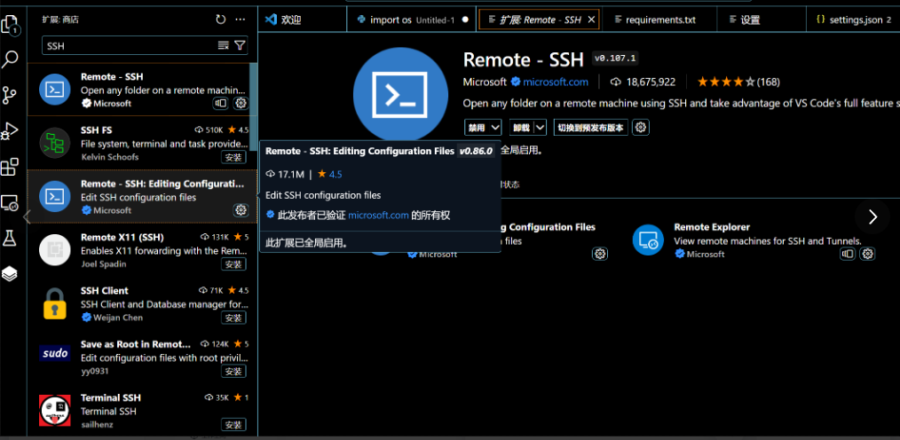

- 也可以直接下载 Remote Development（所有远程插件全部打包）
  


#### 1.2.2 找一个喜欢的服务器，以矩池云为例：

- 创建一个实例并启动
  
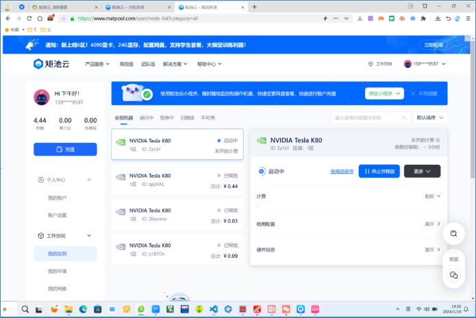

- 在"更多"处会出现SSH命令，点击复制

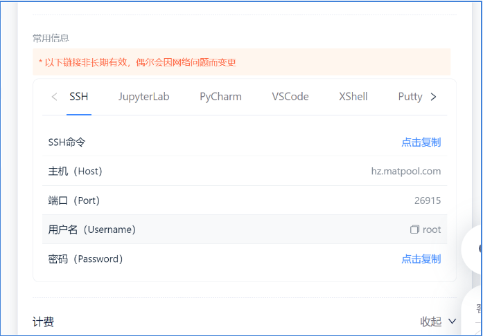

#### 1.2.3 重新启动vscode

- 点击左下角，再连接到主机
 
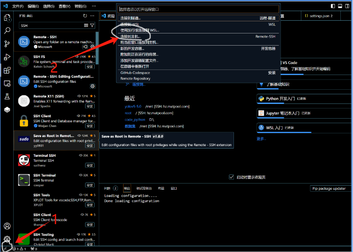

- 添加新的主机
 
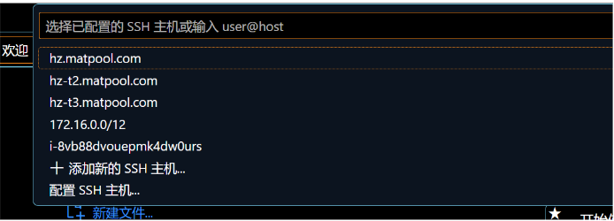

- 输入SSH命令

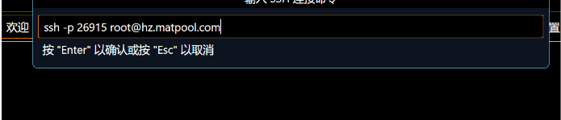

- 然后选择你自己系统的并更新配置文件：

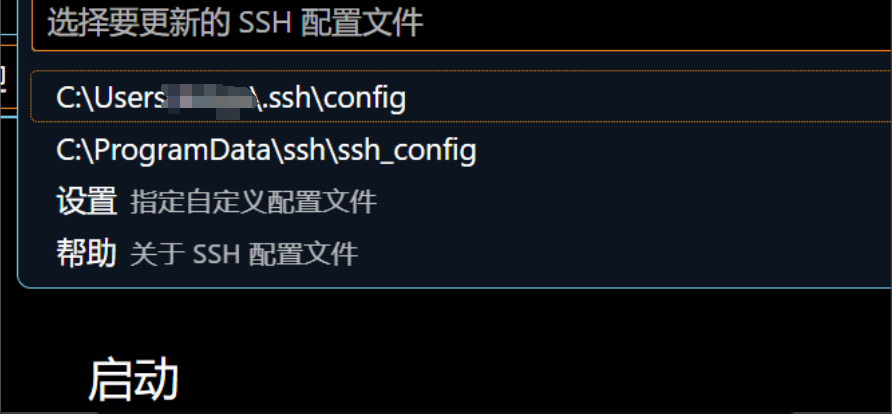

- 成功添加主机,点击连接
  
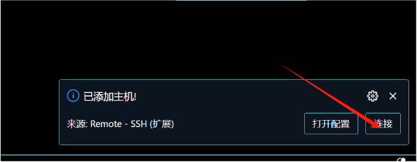

- 如出现以下注意：此处必须选择linux

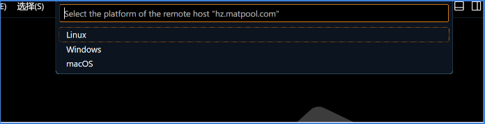

- 输入密码：

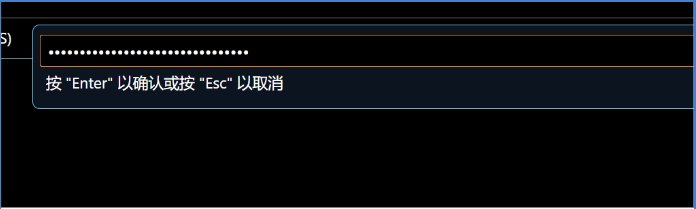

- 当你的左下角出现服务器名称：连接成功了

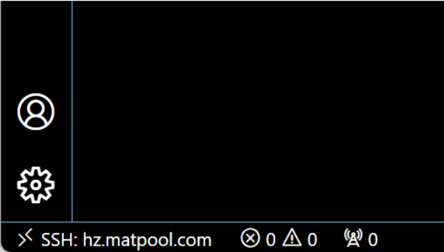


### 1.3服务器环境的配置方法(vscode版本)
(未完待续)


### 1.4 服务器的端口映射本地方法
- 以InternStudio为例子（上海人工智能实验室旗下AI大模型服务器）
 
    ```bash
        #上海人工智能实验室服务器平台，可参与他们的活动获得服务器使用权
    https://studio.intern-ai.org.cn/
    ```

- 由于服务器通常只暴露了用于安全远程登录的 SSH（Secure Shell）端口，如果需要访问服务器上运行的其他服务（如 web 应用）的特定端口，需要一种特殊的设置。我们可以通过使用SSH隧道的方法，将服务器上的这些特定端口映射到本地计算机的端口。这样做的步骤如下：

- 首先我们需要配置一下本地的 SSH Key ，我们这里以 Windows 为例。
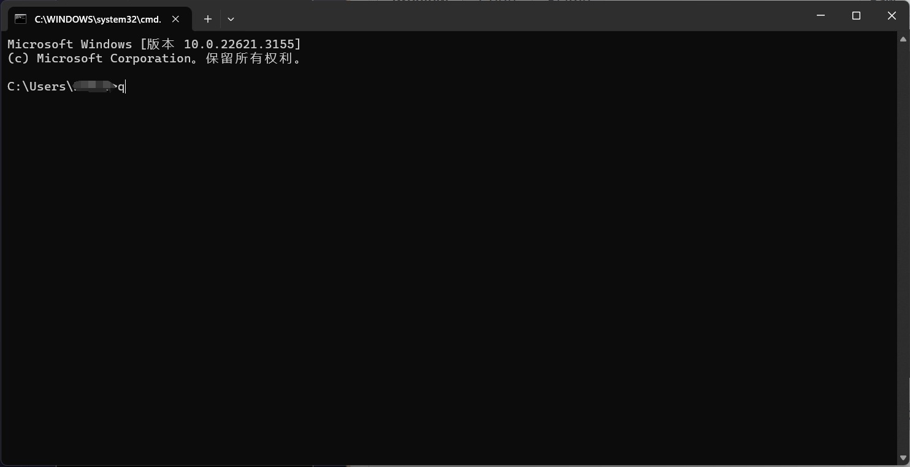
- 步骤①：在本地机器上打开 Power Shell 终端。在终端中，运行以下命令来生成 SSH 密钥对：（如下图所示）
    ```bash
    ssh-keygen -t rsa
    ```


- 步骤②： 您将被提示选择密钥文件的保存位置，默认情况下是在 /username/.ssh/ 目录中(这里的username指的是你的用户名称)。按 Enter 键接受默认值或输入自定义路径。

- 步骤③：公钥默认存储在 ~/.ssh/id_rsa.pub，私钥则储存在~/.ssh/id_rsa中，可以通过系统自带的 cat 工具查看文件内容：（如下图所示）
    ```bash
    cat ~\.ssh\id_rsa.pub
    ```

    ```bash
    #私钥不要给出去，一定要保密
    cat ~\.ssh\id_rsa
    ```
    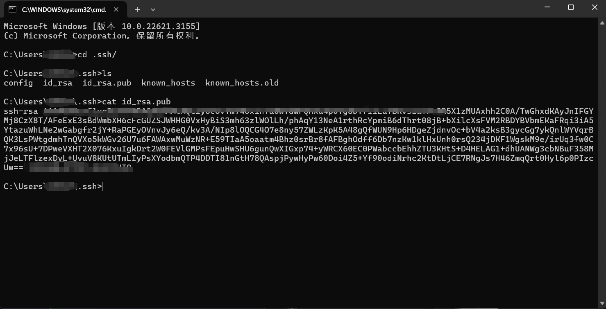

     ~ 是用户主目录的简写(同username)，.ssh 是SSH配置文件的默认存储目录，id_rsa.pub 是 SSH 公钥文件的默认名称。所以，cat ~\.ssh\id_rsa.pub 的意思是查看用户主目录下的 .ssh 目录中的 id_rsa.pub 文件的内容。

- 步骤④：将公钥复制到剪贴板中，然后回到 InternStudio 控制台，点击配置 SSH Key。(其他服务器也可以同样的道理)如下图所示：
  
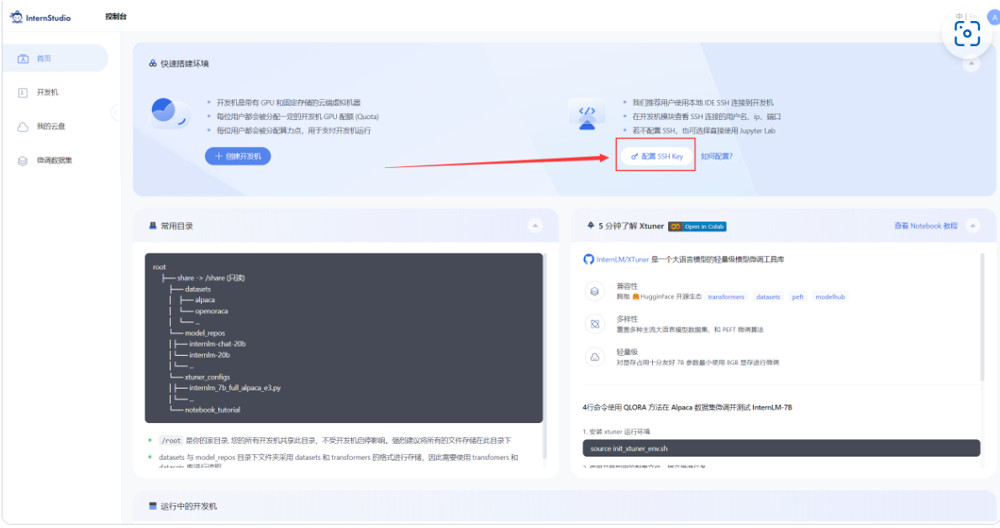

-步骤⑤：将刚刚复制的公钥添加进入即可。

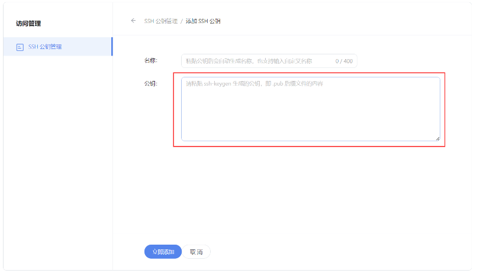

- 步骤⑥：在本地终端输入以下指令 .6006 是在服务器中打开的端口，而 33090 是根据开发机的端口进行更改。如下图所示：

ssh -CNg -L 6006:127.0.0.1:6006 root@ssh.intern-ai.org.cn -p 33090

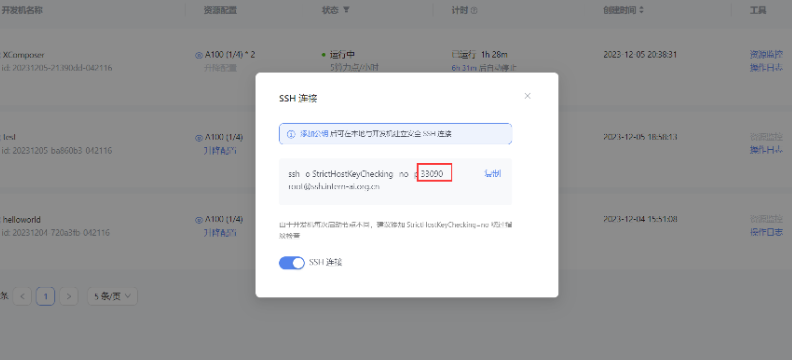