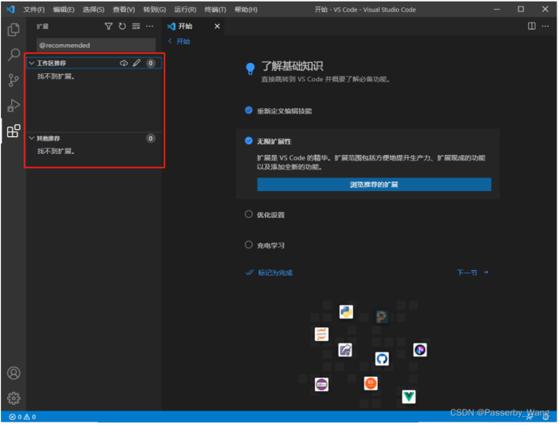

                                                                  HZMI-赫兹矩阵创新实验室
# 目录：
#致谢CSDN博主，因为他写的太好了，就直接拿来用了放给大家学习用，有需要的可以去CSDN找
## 一、下载

- 1、点击Download for Windows 下载Windows版本或者点击Download选择下载其他版本

- 2、根据自己的系统选择对应的版本。

## ​二、安装

- 1、在下载目录找到VSCode，双击开始安装，可能会出现安全警告，点击运行；

- 2、阅读协议后，点击我同意此协议，点击下一步；

- 3、点击浏览，选择安装路径，默认在C盘，博主这里选择“D:\Programs\Microsoft VS Code”，点击下一步；

- 4、添加到开始菜单，这里默认即可，点击下一步；

- 5、勾选如图，点击下一步；

- 6、确认信息，点击安装；

- 7、安装中

- 8、点击完成安装。

## 三、初始化设置

- 1、安装中文语言包并将显示语言改为中文，点击安装并重启；

- 2、点击选择颜色主题，选择后蓝色对勾自动勾选；

- 3、同步到其他设备或从其他设备同步；

  - 1）点击启动设置同步；

  - 2）支持microsoft账号、GIthub账号登录，设置后蓝色对勾自动勾选。

- 4、访问所有内容只需要一个快捷方式；

  - 1）点击打开命令面板；

  - 2）输入问号可以查看命令，使用命令可以提高效率，节省时间，设置后蓝色对勾自动勾选。

- 5、点击浏览语言拓展，可以按需安装语言插件；

- 6、选择项目文件夹；

  - 1）点击选取文件夹；

  - 2）选择，这里博主新建了一个名为“VS Code”的文件夹；

  - 3)是否信任作者，点击是。

- 7、点击下一节；

- 8、重新定义编辑技能；

  - 1）点击打开编辑器操场；

    - 2）英文部分介绍编辑器的各项功能特色。

- 9、便利的内置终端；

  - 1）点击显示终端面板；

  - 2）下方会弹出终端。

- 10、无限扩展性；

  - 1）点击浏览推荐的扩展； ​

  - 2）左侧显示（网络原因可能会不显示）。

- 11、优化设置；

  - 1）点击调整我的设置；

  - 2）左侧显示常用设置，按需修改。

- 12、充电学习；

  - 1）点击观看教程；

  - 2）自动跳转到浏览器播放。

- 13、点击下一节；

- 14、并行编辑；

  - 1）点击拆分编辑器；

  - 2)可以看到右侧多出一个编辑器，可以并行编辑。

- 15、在操作中查看代码；

  - 1）点击运行项目；

  - 2）可以选择chrome、Edge、Node.js或安装其他拓展调试代码。

- 16、使用Git跟踪代码；

  - 1）点击初始化Git存储库；

  - 2）点击之前放置项目的文件夹，回车确认初始化。

- 17、自动执行项目任务；

  - 1）点击运行自动检测到的任务；

  - 2）如果你的项目或者文件夹里有 typescript、npm、grunt、gulp、jake这几个脚本工具的配置文件的话，VS Code 会自动读取当前文件夹下的配置。

- 18、自定义快捷方式；

  - 1）点击键盘快捷方式；

  - 2）左侧出现快捷方式，可以点击按照个人习惯自定义键位。

- 19、完成

# 实操
## 一、下载
官网下载地址 https://code.visualstudio.com/
### 1、点击Download for Windows 下载Windows版本或者点击Download选择下载其他版本；

### 2、根据自己的系统选择对应的版本。

## 二、安装
### 1、在下载目录找到VSCode，双击开始安装，可能会出现安全警告，点击运行；

### 2、阅读协议后，点击我同意此协议，点击下一步；

                                                

### 3、点击浏览，选择安装路径，默认在C盘，博主这里选择“D:\Programs\Microsoft VS Code”，点击下一步；

### 4、添加到开始菜单，这里默认即可，点击下一步；

### 5、勾选如图，点击下一步；

- 注：
    - 1：在桌面创建快捷方式：勾选
    - 2：将VSCode添加到右键菜单，支持打开文件：勾选
    - 3：将VSCode添加到右键菜单，支持打开目录：勾选
    - 4：勾选后会把很多文本格式改为用VSCode打开，例如.txt文件：不勾选
    - 5：添加到PATH（环境变量），自动添加，无需手动配置：勾选

### 6、确认信息，点击安装；

### 7、安装中；

### 8、点击完成安装。

## 三、初始化设置
### 1、安装中文语言包并将显示语言改为中文，点击安装并重启；

### 2、点击选择颜色主题，选择后蓝色对勾自动勾选；

### 3、同步到其他设备或从其他设备同步；
- 1）点击启动设置同步；

- 2）支持microsoft账号、Github账号登录，设置后蓝色对勾自动勾选。

### 4、访问所有内容只需要一个快捷方式；
- 1）点击打开命令面板；

- 2）输入问号可以查看命令，使用命令可以提高效率，节省时间，设置后蓝色对勾自动勾选。

### 5、点击浏览语言拓展，可以按需安装语言插件；

### 6、选择项目文件夹；
- 1）点击选取文件夹；

- 2）选择，这里博主新建了一个名为“VS Code”的文件夹；

- 3)是否信任作者，点击是。

- 7、点击下一节；

### 8、重新定义编辑技能；
- 1）点击打开编辑器操场；

- 2）英文部分介绍编辑器的各项功能特色。

### 9、便利的内置终端；
- 1）点击显示终端面板；

- 2）下方会弹出终端。

### 10、无限扩展性；
- 1）点击浏览推荐的扩展； 

- 2）左侧显示（网络原因可能会不显示）。

### 11、优化设置；
- 1）点击调整我的设置；

- 2）左侧显示常用设置，按需修改。

### 12、充电学习；
- 1）点击观看教程；

- 2）自动跳转到浏览器播放。

### 13、点击下一节；

### 14、并行编辑；
- 1）点击拆分编辑器；

- 2)可以看到右侧多出一个编辑器，可以并行编辑。

### 15、在操作中查看代码；
- 1）点击运行项目；

- 2）可以选择chrome、Edge、Node.js或安装其他拓展调试代码。

### 16、使用Git跟踪代码；
- 1）点击初始化Git存储库；

- 2）点击之前放置项目的文件夹，回车确认初始化。

### 17、自动执行项目任务；
- 1）点击运行自动检测到的任务；

- 2）如果你的项目或者文件夹里有 typescript、npm、grunt、gulp、jake这几个脚本工具的配置文件的话，VS Code 会自动读取当前文件夹下的配置。

### 18、自定义快捷方式；
- 1）点击键盘快捷方式；

- 2）左侧出现快捷方式，可以点击按照个人习惯自定义键位。
    

### 19、完成

