                                                                 HZMI-赫兹矩阵创新实验室
# Miniconda基础教学教程

## 1 简介

### 1.1什么是conda,anaconda，miniconda？
- Conda:

    - Conda 是一个开源的包管理和环境管理系统，最初是为 Python 而设计的，但现在也可以用于其他语言和平台。
    它允许用户轻松地安装、更新、卸载和管理软件包及其依赖项，而无需担心版本冲突或依赖关系问题。
    - Conda 使用一个特殊的文件格式来描述软件包，称为 Conda 包，这些包可以包含任何类型的文件，包括二进制文件、源代码、数据文件等。
- Anaconda:

    - Anaconda 是一个基于 Python 的科学计算平台，旨在简化数据科学和机器学习工作流程。
    它包含了大量常用的数据科学工具、库和软件包，例如 NumPy、Pandas、Matplotlib、Scikit-learn 等，以及 Jupyter Notebook 等工具。
    - Anaconda 除了提供了丰富的数据科学生态系统外，还集成了 Conda 包管理系统和环境管理功能，使用户可以轻松地安装、管理和切换不同的 Python 环境和依赖关系。
- Miniconda:

    - Miniconda 是 Anaconda 的精简版本，它仅包含 Conda 包管理系统和 Python 解释器，而不包括 Anaconda 中预安装的数据科学工具和库。
    - Miniconda 的优势在于其轻量级和灵活性，用户可以根据自己的需求选择要安装的软件包，从而减少系统上的存储空间和资源消耗。
    - 用户可以通过 Miniconda 安装需要的软件包，并根据需要创建自定义的 Python 环境，以满足特定项目或任务的需求。


### 1.2 为什么要用conda来管理包和运行环境？
- 便捷的包管理：
    - Conda 提供了简单易用的包管理功能，使用户可以轻松地安装、更新、卸载和管理软件包及其依赖项。这极大地简化了软件包的安装和维护过程，避免了手动处理依赖关系和版本冲突的麻烦。
- 环境隔离：
    - Conda 具有环境管理功能，可以创建和管理多个独立的 Python 环境。每个环境都拥有自己的包安装目录和依赖关系，因此可以隔离不同项目或任务所需的软件包和版本，避免了版本冲突和不兼容性问题。
- 跨平台支持：
    - Conda 可以在不同的操作系统上运行，包括 Windows、MacOS 和 Linux 等，因此适用于各种开发环境和部署场景。用户可以在不同平台上保持一致的开发和部署体验，而无需担心平台差异带来的问题。
- 多语言支持：
    - 虽然 Conda 最初是为 Python 设计的，但它也支持其他语言和工具，例如 R、Julia、C/C++ 等。这使得 Conda 成为一个通用的包管理和环境管理工具，适用于多种编程语言和应用场景。
- 社区支持和生态系统：
    - Conda 拥有一个庞大的用户社区和生态系统，提供了丰富的软件包和资源，涵盖了各种领域和用途。用户可以从社区中获取支持和帮助，解决各种问题和挑战。

### 1.3 anaconda，miniconda下载链接
- Anaconda下载链接
- https://www.anaconda.com/download/
- Miniconda下载链接
- https://docs.anaconda.com/free/miniconda/index.html

## 2 指令介绍
### 2.1 conda常用指令
#### 2.1.1 创建虚拟环境

```bash
- conda  create  --name  env_name
- conda  create  --name  env_name python=3.5 # 创建指定python版本
- conda  create  --name  env_name python=3.5 numpy scipy # 创建指定python版本下包含某些包
```

#### 2.1.2 激活/使用/进入某个虚拟环境

```bash
activate  env_name
```

#### 2.1.3 退出当前环境

```bash
deactivate
```

#### 2.1.4 复制某个虚拟环境

```bash
conda  create  --name  new_env_name  --clone  old_env_name
```

#### 2.1.5 删除某个环境

```bash
conda  remove  --name  env_name  --all
```

#### 2.1.6 查看当前所有环境

```bash
conda  info  --envs   或者  conda  env  list
```

#### 2.1.7 查看当前虚拟环境下的所有安装包

```bash
conda  list  需进入该虚拟环境
conda  list  -n  env_name
```

#### 2.1.8 安装或卸载包(进入虚拟环境之后)

```bash
conda  install  xxx
conda  install  xxx=版本号  # 指定版本号
conda  install  xxx -i 源名称或链接 # 指定下载源
conda  uninstall  xxx
```

#### 2.1.9 分享虚拟环境

```bash
conda env export > environment.yml  # 导出当前虚拟环境
conda env create -f environment.yml  # 创建保存的虚拟环境
```

#### 2.1.10 源服务器管理

```bash
conda当前的源设置在$HOME/.condarc中，可通过文本查看器查看或者使用命令>conda config --show-sources查看。
conda config --show-sources #查看当前使用源
conda config --remove channels 源名称或链接 #删除指定源
conda config --add channels 源名称或链接 #添加指定源
```

#### 2.1.11 配置清华源

```bash
conda config --add channels https://mirrors.tuna.tsinghua.edu.cn/anaconda/pkgs/free/
conda config --add channels https://mirrors.tuna.tsinghua.edu.cn/anaconda/pkgs/main/
conda config --set show_channel_urls yes
conda config --show channels
```
## 3 不同系统配置 
### 3.1 Linux

#### 3.1.1 找到linux版本的miniconda (此处我要安装Python3.7版本的Linux下的miniconda)
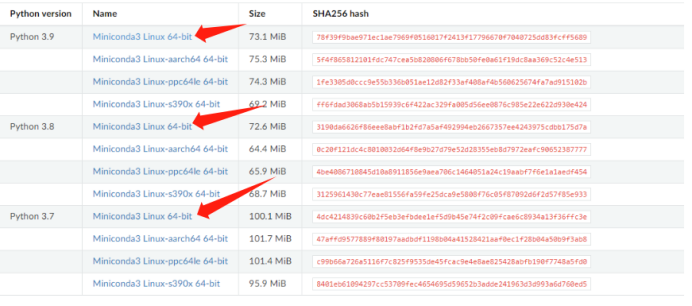
#### 3.1.2 复制下载链接 如下 	https://repo.anaconda.com/miniconda/Miniconda3-py37_4.12.0-Linux-x86_64.sh
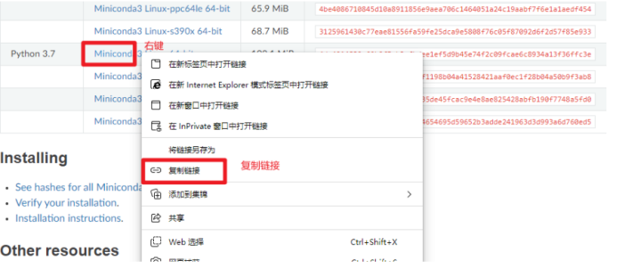
#### 3.1.3 在Linux下 使用如下命令下载
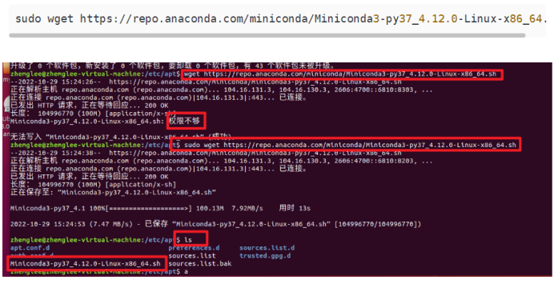
#### 3.1.4 使用如下命令查询是否下载到当前目录下
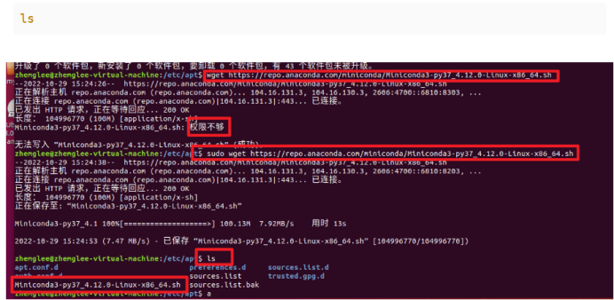

#### 3.1.5 使用如下命令安装miniconda,安装全程要选yes，中间某一步(conda 初始化)默认是 no，一定要选yes
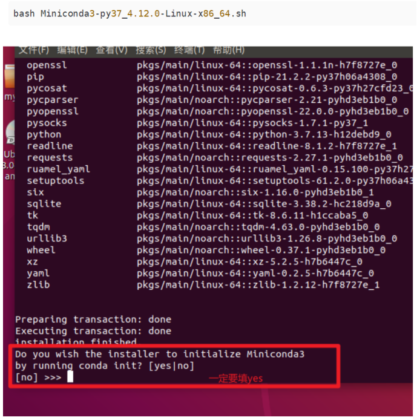

#### 3.1.6 安装好之后，输入 bash，即可切换至base环境
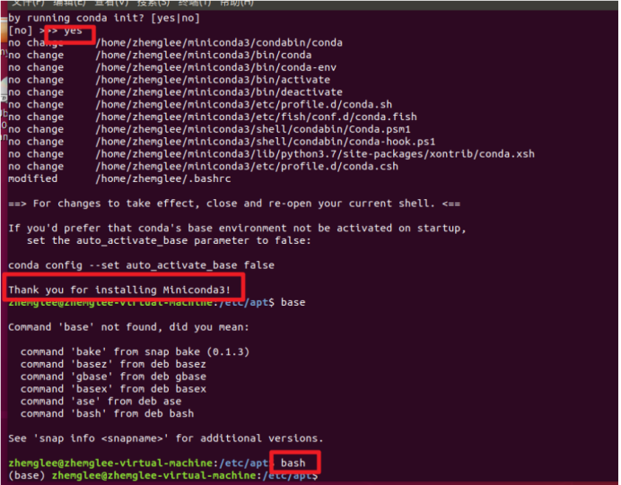

#### 3.1.7 miniconda的换源(为了后面安装其他库或者包更快)：
##### 3.1.7.1 在你的终端(桌面里进行终端)中输入命令
    ```bash
    conda config --add channels https://mirrors.tuna.tsinghua.edu.cn/anaconda/pkgs/free/
    conda config --set show_channel_urls yes
    ```
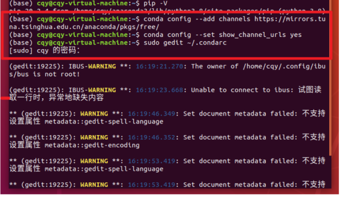
##### 3.1.7.2 打开~/.condarc文件(sudo gedit ~/.condarc)或(sudo nano  ~/.condarc), 应该是如下内容

- channels:
    -  -https://mirrors.tuna.tsinghua.edu.cn/anaconda/pkgs/free/
    -  -defaults
- show_channel_url: true
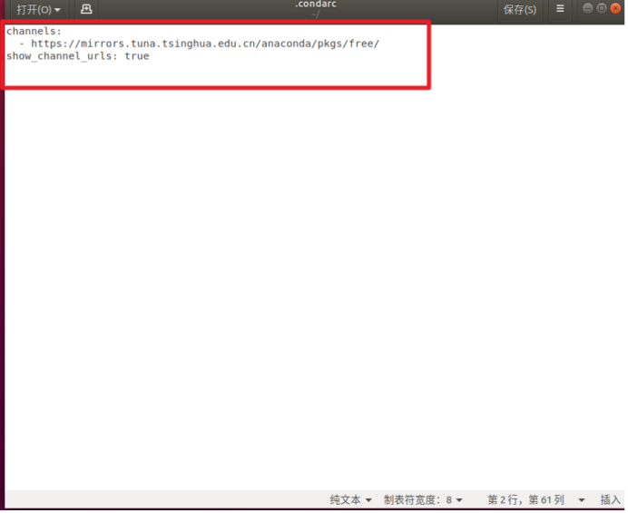

##### 3.1.7.3 重点来了！！！！！删除第三行“- defaults”。(如需在境外源中寻找可不删)

- defaults指的是conda在境外的默认源，如果不删除的话，conda install时仍会在境外源中查找。最终修改完成后的文件如下所示：
```
    channels:
        - https://mirrors.tuna.tsinghua.edu.cn/anaconda/pkgs/free/
    show_channel_urls: true
```
- 使用命令conda info可以查询修改的相关信息

### 3.2 Windows
#### 3.2.1 下载miniconda
- 网址：https://docs.conda.io/en/latest/miniconda.html（选择适合自己电脑配置的进行下载）
    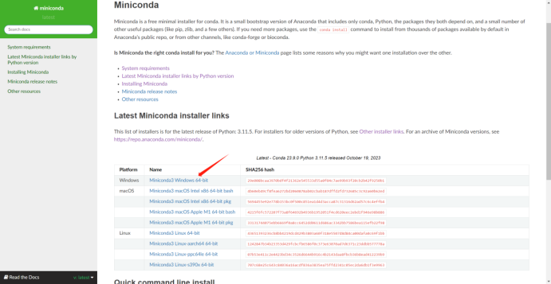


#### 3.2.2 安装
##### 3.2.2.1 点击.exe

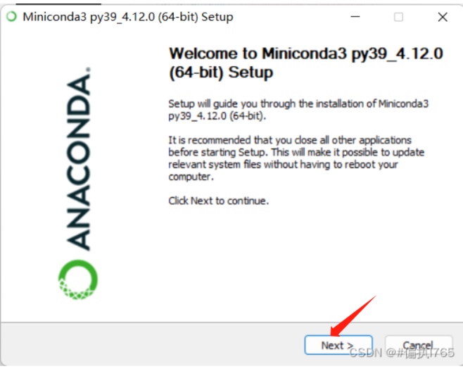    
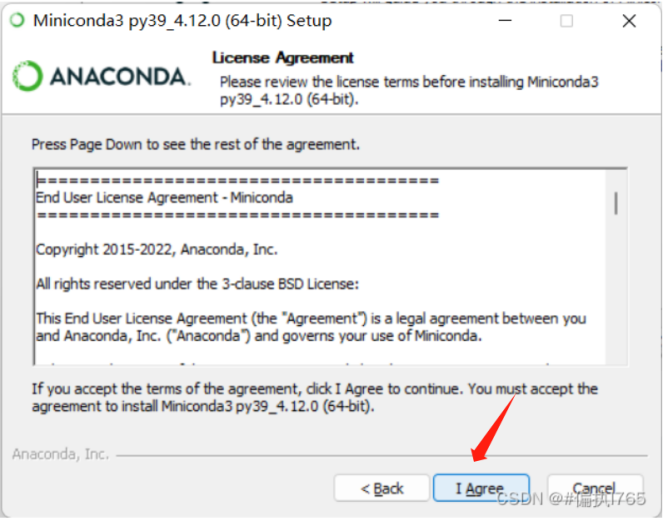

- 如果没有特殊的需求，建议选择”Just Me”，若选择”All Users”，安装过程中可能需要管理员权限。


##### 3.2.2.2 选择路径安装（没有英文字符，不然可能会报错）
- 请注意：记住这个的安装路径，在以后的步骤中将会使用到这个路径
- 一般都不要安装在C盘，安装在D盘
  
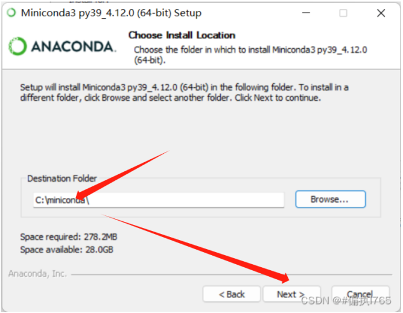

- 勾选第二项，并不建议勾选第一项，点击”Next”,等待几分钟，直到安装成功

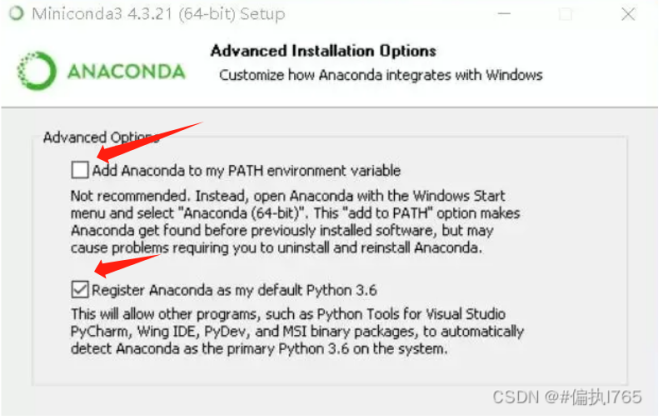

#### 3.2.3 环境变量配置
- 直接在搜索中查找“查看高级系统设置”，也可右键选择电脑-属性查看

    - 点击“环境变量”
    - 选择“系统变量”里面的Path，并“编辑”

    - 添加如下三个：（前面的路径C:\miniconda应该设置为自己上文中提到的下载路径）
    - C:\miniconda\Library\bin
    - C:\miniconda\Scripts
    - C:\miniconda

- 添加完后，点击 确定！确定！确定！
- 如果没有点击确定，而是直接关闭，会有极大可能出现后续配置的各种bug。

## 4 感谢
- CSDN@#I765博主的图
- 讲解文档由chatgpt生成
