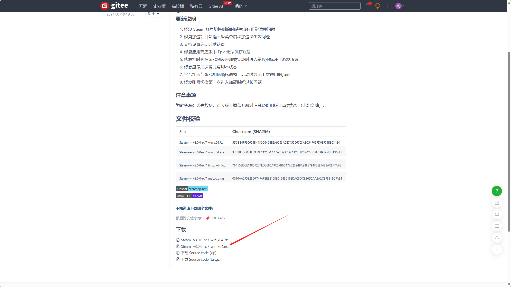
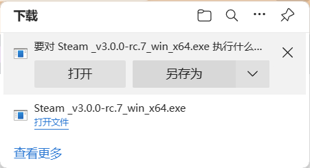
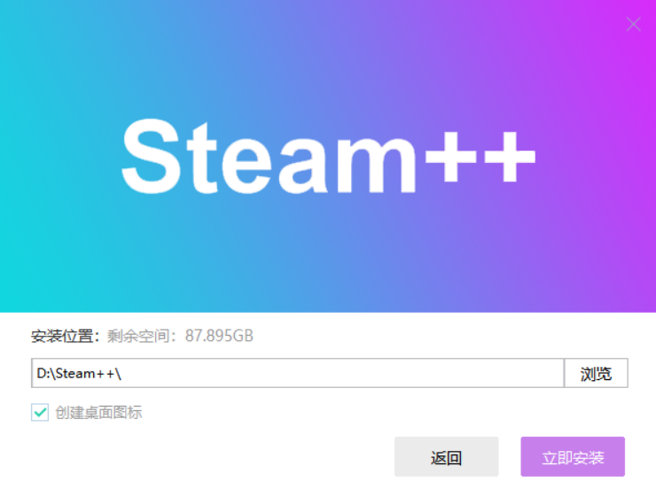
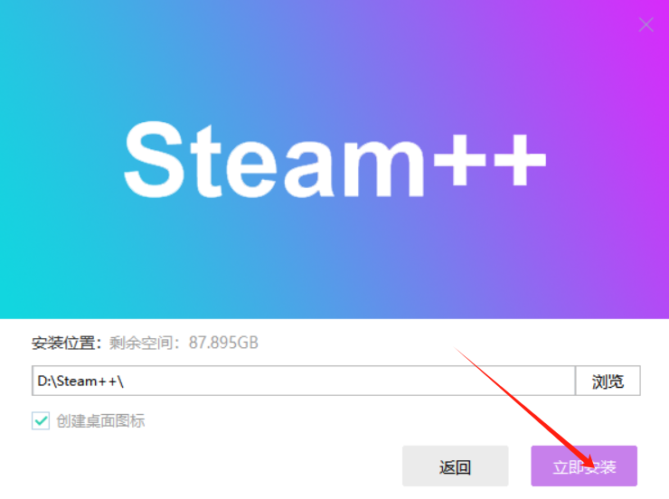
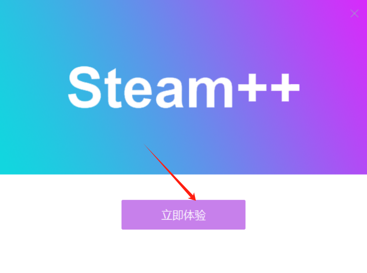
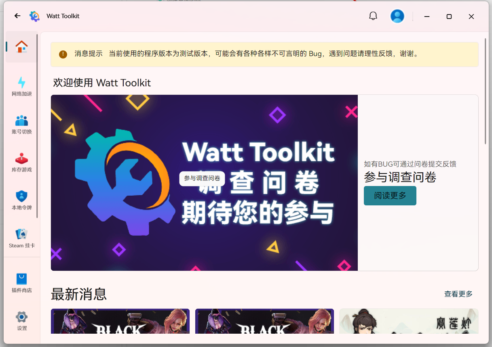
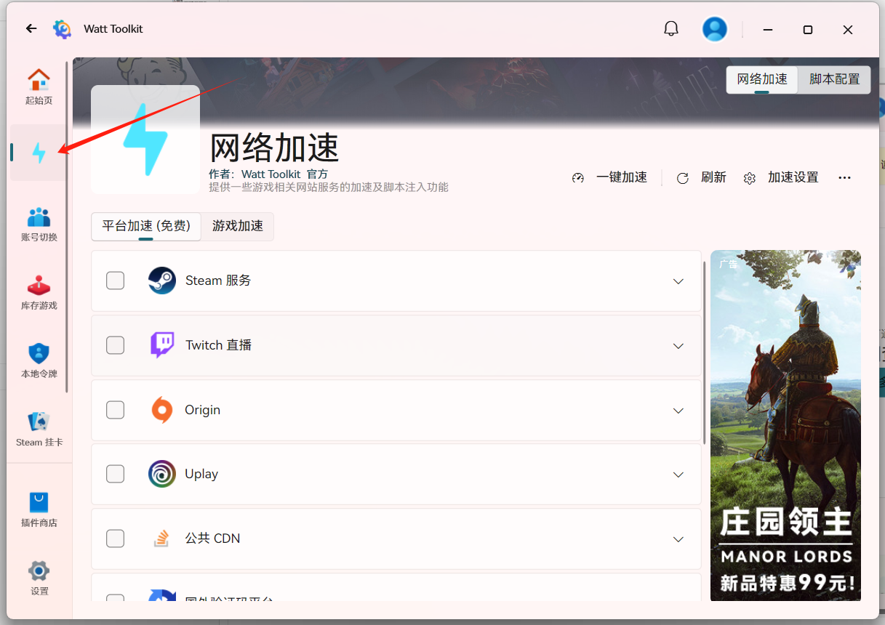
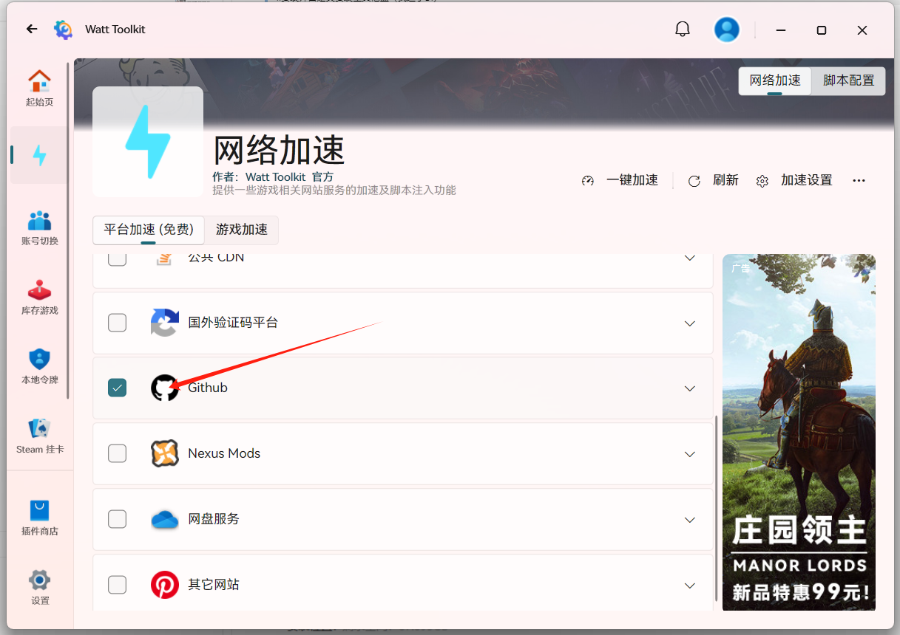
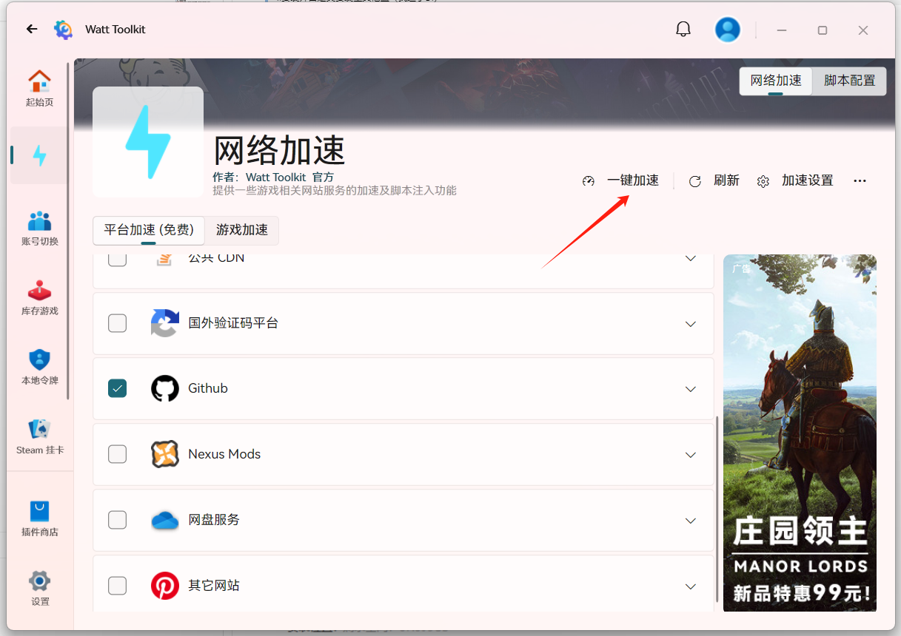
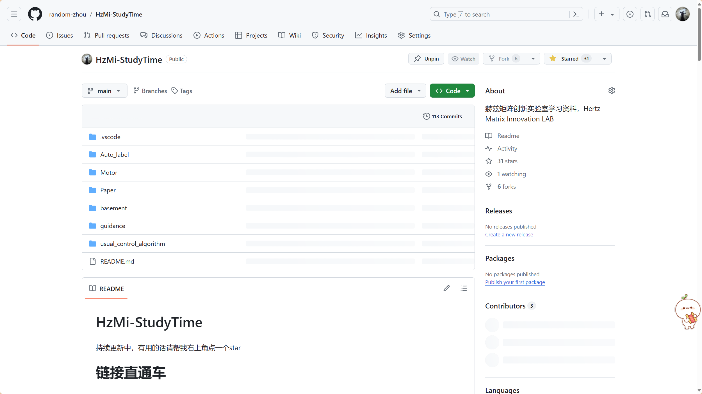

                                                             HZMI-赫兹矩阵创新实验室
# Steam++加速器使用方法
            
## github由于是国外网站我们常常需要加速器方可访问

### 使用方法
>1.点击网址[https://gitee.com/rmbgame/SteamTools/releases/tag/3.0.0-rc.7](https://gitee.com/rmbgame/SteamTools/releases/tag/3.0.0-rc.7)
 
- 跳转后如图所示
  

> 2.点击箭头下载

 

> 3.点击安装包安装

> 4.安装并自定义安装至其他盘（我选了D:）

> 5.进入起始页

> 6.点击网络加速

>7.选择github加速

> 8.点击一键加速即可

>最后,便可稳定访问github了

